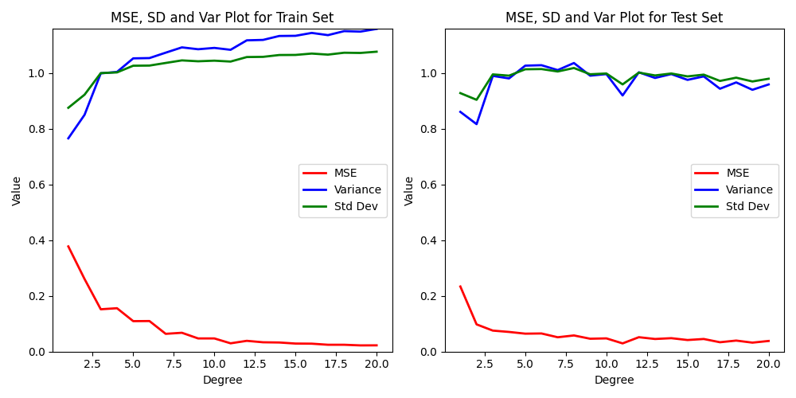

# Assignment 1 Report

# Analysis Report

## <h2 style="color: cyan;">A. Overview of Plots</h2>

1. **Correlation Heatmap**: This plot was used to understand which features are related to each other. Helps in choosing important features for our task.
2. **Pair Plot (Scatterplot Matrix)**: This plot was used to see how features are distributed and identify any patterns or clusters (pairwise relationships of features).
3. **Average Features by Genre Plot**: This plot shows how different audio features vary across different music genres. It's useful to understand which features might be most important for distinguishing between genres.
4. **Distribution of Track Popularity**: This plot shows how popularity is distributed across tracks. It helps in understanding the overall popularity trend in the dataset.
5. **Box Plot of Audio Features**: This plot displays the distribution and spread of various audio features. It shows the median, quartiles, and outliers for each feature.
6. **Histograms of Audio Features**: This set of histograms shows the frequency distribution of different audio features. It helps in identifying patterns and outliers in each feature.
7. **Genre Distribution**: This plot shows the count of tracks across different genres. It highlights the balance or imbalance in the dataset regarding genre representation.

### <h3 style="color: orange;">1. Correlation Heatmap</h3>

**Key Observations:**
- **High Positive Correlation**:
  - `Energy` and `Loudness` (0.76): Energetic songs are often louder.
  - `Danceability` and `Valence` (0.5): Danceable songs are generally happier.
- **High Negative Correlation**:
  - `Energy` and `Acousticness` (-0.73): Energetic songs are less likely to be acoustic.
  - `Loudness` and `Acousticness` (-0.58): Louder songs tend to be less acoustic.

**Analysis:**
- Some features are strongly related (e.g., `Energy` and `Loudness`). **We might not need both for classification.**
- Features with low correlation to others may not be as important.

### <h3 style="color: orange;">2. Pair Plot</h3>
### <h3 style="color: orange;">3. Average Features by Genre Plot</h3>

**Key Observations:**
- **Distributions**:
  - `Energy` and `Loudness` are slightly skewed; most songs are moderately loud and energetic.
  - `Tempo` is more normally distributed.
- **Scatterplots**:
  - Clear linear relationship between `Energy` and `Loudness`.
  - Possible clusters in `Danceability` vs. `Valence`.
  - We can see the relationship between `danceability` and `tempo`, initially (till middle) both are positively correlated and after the mid point, both the features become negatively correlated.

**Analysis:**
- Some features show clear patterns that can help in classifying genres (e.g., high danceability with high valence might indicate pop songs).
- Outliers and skewed data suggest the need for scaling or normalization.

### <h3 style="color: orange;">4. Average Features by Genre Plot</h3>

**Key Observations:**
- **Distinct Patterns by Genre**:
  - **Popularity**: Some genres (e.g., `pop`, `rock`) have consistently higher popularity scores, while others like `classical` and `jazz` show more variability.
  - **Danceability**: Genres like `disco` and `pop` have higher danceability, while `classical` and `ambient` are lower.
  - **Energy and Loudness**: High in `metal` and `rock` genres; lower in `ambient` and `classical`.
  - **Acousticness**: High in `classical` and `acoustic`, low in `electronic` and `metal`.
  - **Instrumentalness**: Genres like `ambient` and `classical` show higher instrumentalness, indicating fewer vocals.
- **Less Variation in Some Features**:
  - `Key`, `Liveness`, and `Speechiness` show less variation across genres, suggesting these may be less important for genre classification.

**Analysis:**
- **Important Features for Classification**:
  - Features like `Energy`, `Danceability`, `Loudness`, `Acousticness`, and `Instrumentalness` vary significantly across genres and are likely to be important for the classification task.
  - Features with less variation across genres (like `Key` and `Liveness`) may be less useful for distinguishing between genres.
- **Outliers and Distribution Skews**:
  - Some genres show significant outliers (e.g., extreme values in `Instrumentalness` for genres like `ambient`). These could affect model performance if not handled properly.

### <h3 style="color: orange;">5. Distribution of Track Popularity</h3>

**Key Observations:**
- **Skewed Distribution**: Most tracks have a popularity score below 0, with a sharp decline as popularity increases.
- **Multiple Peaks**: The plot shows several peaks, indicating clusters of tracks with similar popularity scores.

**Analysis:**
- **Target for Normalization**: The skewness suggests that popularity might need normalization to improve model performance.
- **Popularity Clusters**: The multiple peaks might represent different categories of track popularity (e.g., niche, mainstream).

### <h3 style="color: orange;">6. Box Plot of Audio Features</h3>

**Key Observations:**
- **Outliers**: Features like `duration_ms`, `loudness`, and `instrumentalness` have significant outliers, indicating some  tracks that are very different from the rest in terms of these feautures.
- **Wide Variation**: Features such as `energy`, `danceability`, and `valence` show wide interquartile ranges, indicating high variability in these features.
- **Balanced vs. Skewed**: Some features like `tempo` are more normally distributed, while others like `speechiness` are heavily skewed.

**Analysis:**
- **Handling Outliers**: The presence of many outliers suggests the need for careful outlier treatment to avoid skewing model predictions.
- **Feature Importance**: Features with wide variation may be more useful for genre classification, while those with little variation might contribute less.

### <h3 style="color: orange;">7. Histograms of Audio Features</h3>

**Key Observations:**
- **Skewed Distributions**: Many features, like `acousticness` and `instrumentalness`, are highly skewed, with most tracks having low values and a few having extremely high values.
- **Distinct Peaks**: Features like `tempo` and `danceability` show more uniform distributions with distinct peaks, indicating common values across tracks.

**Analysis:**
- **Potential for Feature Engineering**: Skewed features might benefit from transformations (e.g., log or square root) to make them more useful for classification.
- **Clusters**: The presence of distinct peaks in some features might indicate the existence of subgroups within genres that could be worth exploring further.

### <h3 style="color: orange;">8. Genre Distribution</h3>

**Key Observations:**
- **Imbalanced Dataset**: The distribution of genres is not uniform; some genres have many tracks, while others have very few.
- **Dominant Genres**: A few genres (e.g., `pop`, `rock`) dominate the dataset, which might lead to biased model predictions if not addressed.

**Analysis:**
- **Need for Balancing**: The imbalanced genre distribution suggests the need for strategies like oversampling, undersampling, or using weighted classes to improve classification accuracy.
- **Feature Interaction**: The dominance of certain genres might influence the distribution of audio features, making it essential to consider genre-specific patterns in feature analysis.

## <h2 style="color: cyan;">B. Hierarchy of Feature Importance for Genre Classification</h2>

1. **Energy**: Strong correlation with `Loudness`, differentiates high-energy genres like `rock` from low-energy genres like `classical`.
2. **Danceability**: High in `pop` and `disco`, helping classify dance-oriented genres.
3. **Loudness**: Important for distinguishing loud genres like `rock`, correlates with `Energy`.
4. **Acousticness**: High in `classical` and `folk`, low in electronic genres.
5. **Instrumentalness**: Helps classify genres with minimal vocals, such as `ambient` and `classical`.
6. **Valence**: Associated with mood, helps identify upbeat genres like `pop`.
7. **Tempo**: Differentiates fast genres like `techno` from slower ones like `ambient`.
8. **Speechiness**: Useful for speech-heavy genres like `hip-hop` and `rap` (heavily skewed towards low values but with significant outliers).
9. **Liveness**: Less variation across genres but can help identify live recordings.
10. **Duration**: Limited importance but can separate long-form genres.
11. **Popularity**: Does not seem to have a huge correlation with genre.
12. **Key**: Minimal variation, not essential for genre classification.

## <h2 style="color: cyan;">C. Key Analysis and Conclusions</h2>

1. **Feature Correlation**:
   - `Energy` and `Loudness` are highly correlated.
   - `Danceability` and `Valence` show a moderate correlation, helping classify upbeat genres.

2. **Feature Distribution**:
   - Features like `Acousticness` and `Instrumentalness` are skewed, suggesting the need for normalization.
   - Clusters in features like `Danceability` and `Tempo` indicate genre-specific patterns.
   - Overlapping feature distributions may cause misclassification.

3. **Genre-Specific Patterns**:
   - `Pop` and `dance` genres have high `Danceability` and `Valence`.
   - `EDM` has high `Danceability` and `Energy`
   - `Rock` and `metal` are characterized by high `Energy` and `Loudness`.
   - `Classical` and `ambient` have high `Acousticness` and `Instrumentalness`; low `Danceability` and `Energy`
   - `Hip Hop` and `rap` have `Speechiness`

4. **Target (Genre) Relationships**:
   - Important features vary significantly across genres, making them useful for classification.
   - Imbalanced genre distribution may require class-balancing techniques for accurate model training. Some genres (e.g., `pop`, `rock`) dominate, while others are underrepresented. Uneven genre representation could lead to classification bias.

## <h2 style="color: cyan;">D. KNN</h2>

> Note: Saved all the output printed on the terminal, till where I was able to run to the file (before submission last time) output_log.txt (saved using output redirection)

- My optimised model is the same as best model, I directly wrote vectorised code. To find out model without optimisation just replace all vectorisation with nested for loops.
- Was not able to run the whole code due to time constraints.
- Have written code to be run for all possible combinations of columns possible but have not run it (time constraints).
- For training the sklearn KNN model, I have used my best model's hyperparameters (k and distance metric)
- Have saved all the printed output in the output_log file, till where I was able to run before submitting the assignment.
- Got the best k = 20, at Manhattan distance

## <h2 style="color: cyan;">E. Regression</h2>
- If want to observe, overfitting and effect of regularisation clearly, try to use small training data set size (4-5%)
- Metrics for the data split are:

- In my case the k which minimises the error on the test set, in 80:20:20 split is k = 20

## <h2 style="color: cyan;">F. References</h2>
- https://scikit-learn.org/stable/modules/generated/sklearn.neighbors.KNeighborsClassifier.html
- https://pandas.pydata.org/docs/reference/api/pandas.read_csv.html
- https://chatgpt.com/
- https://matplotlib.org/3.5.3/api/_as_gen/matplotlib.pyplot.html