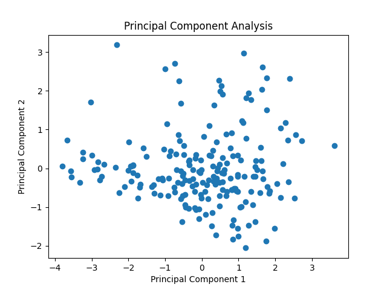
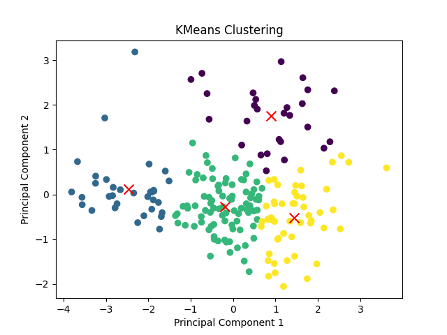
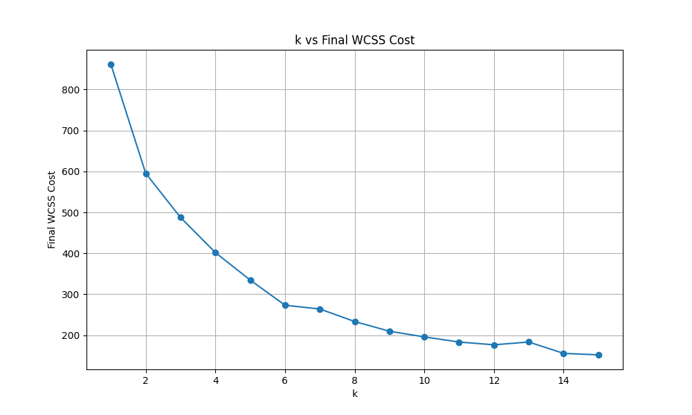
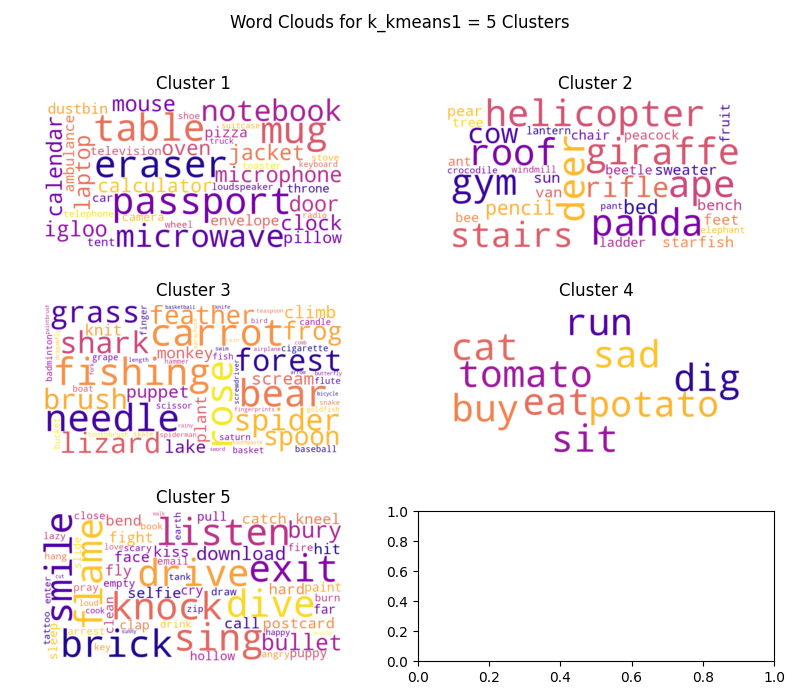
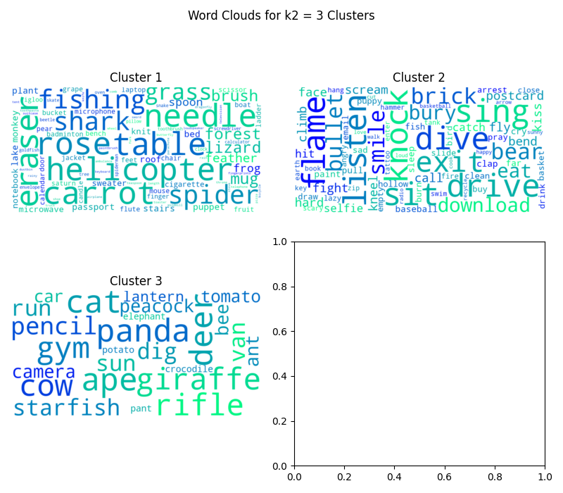
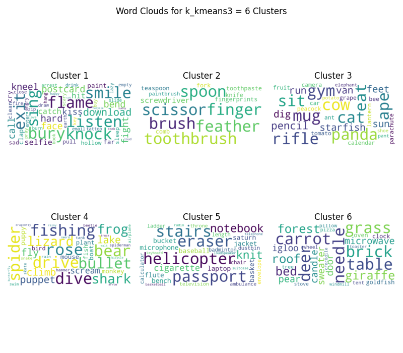
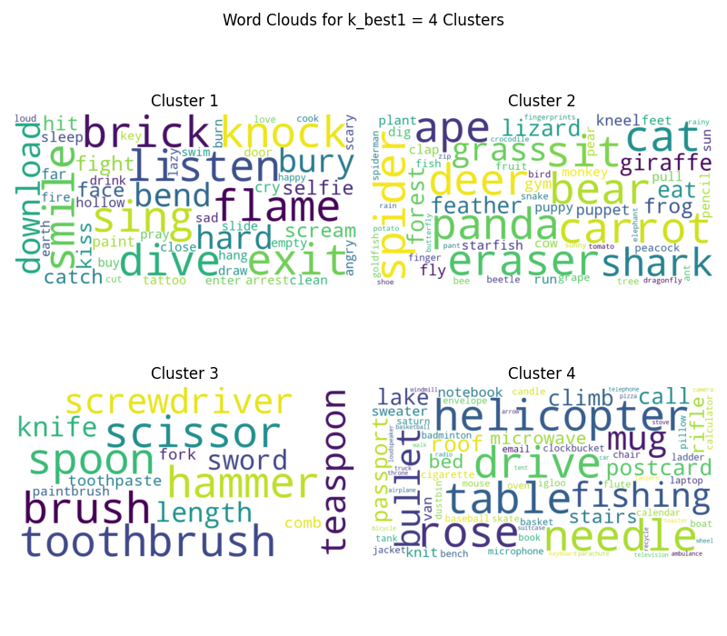
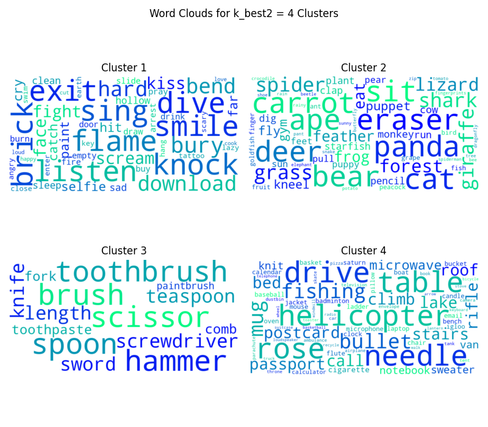

<center>

# **Assignment 2 Report**

</center>

## **Table of Contents**
3. [K-Means](#KMeans)
  - [Elbow Plot 512 dim](#ElbowPlot512)
  - [K-Means clustering using k = k_means1](#KMeansKMeans1)
4. [GMM](#GMM)
  - [Optimal Number of Clusters for 512 dimensions using GMM](#GMM512)
  - [AIC and BIC in GMM](#AICBIC)
  - [GMM clustering using k = k_gmm1](#GMMKGMM1)
5. [PCA](#PCA)
  - [Visualising Dimensionality Reduction](#VisualisingReducedDataset)
  - [Data Analysis](#DataAnalysis)
  - [K-Means using k=k_2](#KMeansK2)
6. [PCA + K-Means](#PCAKMeans)
  - [Scree Plot for determining optimal number of dimensions](#ScreePlotFullDataset)
  - [Elbow plot for reduced Dataset](#ElbowPlotReducedDataset)
  - [K-Means using k=k_kmeans3](#KMeansKMeans3)
  - [GMM using k_2](#GMMK2)
  - [PCA + GMM](#PCAGMM)
  - [GMM using k_gmm3](#GMMGMM3)
7. [Cluster Analysis](#ClusterAnalysis)
  - [K-Means Cluster Analysis](#KMeansClusterAnalysis)
  - [GMM Cluster Analysis](#GMMClusterAnalysis)
  - [GMM and K-Means Comparison](#GMMKMeans)
8. [Hierarchical Clustering](#HC)
  - [Dendrogram Plots](#Dendrograms)
  - [Comparing GMM, K-Means and HC](#GMMKMeansHC)
9. [Nearest Neighbor Search - Spotify Dataset](#Spotify)
  - [PCA + KNN](#PCAKNN)
  - [KNN on reduced dataset using the best_k and best_metric obtained in A1](#Evaluation)

> <span style="color: green;"> Everywhere in the assignment K-Means algorithm has been initialised as K-Means++</span>

---

<p id = "KMeans"> </p>

<p id = "ElbowPlot512"> </p>

## **3.2 Optimal Number of Clusters for 512 dimensions using K-Means**

<center>


*Figure 1: Elbow plot for the original 512 dimensional dataset for k upto 15*

</center>

An **elbow plot** helps determine the optimal number of clusters for K-means clustering by plotting the within-cluster sum of squares (WCSS) against the number of clusters. The optimal `K` is typically found at the "elbow" point, where adding more clusters yields only marginal improvements.

$$ \text{WCSS} = \sum_{i=1}^K \sum_{x \in C_i} \| x - \mu_i \|^2 $$

where:
- $ K $ is the number of clusters,
- $ C_i $ is the set of points in cluster $ i $,
- $ \mu_i $ is the centroid of cluster $ i $,
- $ x $ is a data point in cluster $ i $.

> From the plot we can see that the elbow comes around $k = 5$ hence $k_{kmeans1} = 5$

> Note: Not always the best method: The elbow method might <span style="color: red;"><u>not be suitable</u></span> for all datasets, especially for those with <span style="color: red;"><u>high dimensionality</u></span> or clusters of irregular shapes. Hence if you see the graph it is very difficult to identify the elbow point. Source: https://www.analyticsvidhya.com/blog/2021/01/in-depth-intuition-of-k-means-clustering-algorithm-in-machine-learning/

<p id="KMeansKMeans1"></p>

### K-Means clustering using $k = k_{kmeans1}$
Output:
```
KMeans with k = 5

        Time taken to fit: 0.01569 s
        Epochs taken to fit: 11
        Final Cost: 3960.34965
```
---

<p id="GMM"></p>

<p id="GMM512"></p>

## **4.2 Optimal Number of Clusters for 512 dimensions using GMM**

### Issue Summary with Custom GMM Implementation

My custom Gaussian Mixture Model (GMM) class encountered several issues during implementation:

1. **Singular Covariance Matrix**: Initially, the model produced a singular covariance matrix. I addressed this by setting `allow_singular=True`.

2. **Exploding Covariance/Responsibility Matrix**: Following the singular covariance issue, the covariance matrix and responsibility matrix started to become infinitely large. To counteract this, I introduced a small epsilon ($\epsilon$) value $1 × 10^{-10}$ to avoid division by zero errors.

3. **Division by Zero and Stalling**: Even after these adjustments, the responsibility for many clusters approached zero, leading to division by zero errors. The model stalls after just two epochs, and the Within-Cluster Sum of Squares (WCSS) remains constant regardless of the number of epochs or initialization.

To compare, I have used sklearn's GMM implementation, which provided expected results and highlighted the issues in my custom implementation.

I solved the above issue by initialising the covariance matrices to identity, and whenever division by 0 error was encountered, I have just set the value to 0 instead of dividing it by epsilon (explode).

My GMM class still does not work for high dimension data because the sklearn GMM class applies some sophesticated techniques/algorithms to handle the case when covariance matrix leads to singular matrix but we can't apply those right now in this assignment - but my model works well and in parallel to the sklearn's model for lower dimentional data.

<p id="AICBIC"></p>

### **AIC and BIC in Gaussian Mixture Models (GMM)**

<center>


*Figure 2: k vs AIC BIC plot for original datset with 512 dimensions for k upto 15*

</center>

**Akaike Information Criterion (AIC)** and **Bayesian Information Criterion (BIC)** are used for model selection in Gaussian Mixture Models (GMMs) to <span style="color: green;">balance goodness of fit</span> with <span style="color: red;">model complexity</span>.

- **AIC**: Measures the relative quality of a statistical model, <u>penalizing for the number of parameters</u> to <span style="color: green;">avoid overfitting</span>.
  $$
  \text{AIC} = 2k - 2 \ln(\hat{L})
  $$
  where $k$ is the number of parameters and $\hat{L}$ is the maximum likelihood of the model.

- **BIC**: Similar to AIC but with a <u>stronger penalty for model complexity</u>, suitable for larger sample sizes.
  $$
  \text{BIC} = \ln(n)k - 2 \ln(\hat{L})
  $$
  where $n$ is the number of observations and $k$ is the number of parameters.

Both criteria help in selecting the model with the best trade-off between fit and complexity. For selecting the suitable value of $k$ we want to <span style="color: green;">minimise both AIC and BIC.</span>

> From the plot we can see that both AIC and BIC are minimum for $k = 1$, hence $k_{gmm1} = 1$

<p id="GMMKGMM1"></p>

### GMM clustering using $k = k_{gmm1}$
Output:
```
GMM with k = 1

        Time taken to fit: 0.01748 s
        Final Log Likelihood: 375255.27444
```

---

<p id="PCA"></p>

<p id="VisualisingReducedDataset"></p>

## **5.2 Visualising Dimensionality Reduction**

<div style="display: flex; align-items: center; justify-content: space-between;">
  <div style="flex: 1; padding: 10px;">
    
    <p style="text-align: center;">Figure 3: Data reduced to 2 principle components</p>
  </div>
  <div style="flex: 1; padding: 10px;">
    
    <p style="text-align: center;">Figure 4: Data reduced to 3 principle components</p>
  </div>
</div>

---

<p id="DataAnalysis"></p>

## **5.3 Data Analysis**

<div style="display: flex; align-items: center; justify-content: space-between;">
  <div style="flex: 1; padding: 10px;">
    
    <p style="text-align: center;">Figure 5: Distribution of labels on each of the 2 principle component</p>
  </div>
  <div style="flex: 1; padding: 10px;">
    
    <p style="text-align: center;">Figure 6: Distribution of labels on each of the 3 principle component</p>
  </div>
</div>

By looking the the distribution of lables on each of the principle components we can identify what quality/property does each of the principle components signify based on the inference of the distribution of the words(labels) and their shared characteristics.

- **PC 1**: Represents a spectrum between tangible physical objects (positive values) and abstract concepts or emotional states/actions (negative values).
- **PC 2**: Highlights the contrast between natural/animate elements and synthetic/inanimate objects or controlled actions.
- **PC 3**: Positive values (e.g., "pencil", "mug", "chair") cluster everyday objects, while negative values (e.g., "spider", "shark", "monkey") group animals, possibly associated with danger or fear. Neutral values (e.g., "knock", "smile", "paint") fall between these extremes, possibly representing abstract or ambiguous categories.

### Examining 2D and 3D plot to identify approximate number of clusters

From mere visualisation of fig. 3 and fig. 4 I can say there are either 3 or 4 clusters. To further strengthen my claim I tried running K-Means on the reduced dataset with once $k=3$ and once with $k=4$ and here are the results:

#### For $k = 3$
<div style="display: flex; align-items: center; justify-content: space-between;">
  <div style="flex: 1; padding: 10px;">
    
    <p style="text-align: center;">Figure 7: k = 3 and n_components = 2</p>
  </div>
  <div style="flex: 1; padding: 10px;">
    
    <p style="text-align: center;">Figure 8: k = 3 and n_components = 3</p>
  </div>
</div>

#### For $k = 4$
<div style="display: flex; align-items: center; justify-content: space-between;">
  <div style="flex: 1; padding: 10px;">
    
    <p style="text-align: center;">Figure 9: k = 4 and n_components = 2</p>
  </div>
  <div style="flex: 1; padding: 10px;">
    
    <p style="text-align: center;">Figure 10: k = 4 and n_components = 3</p>
  </div>
</div>

> After examining the clusters with K-Means, I deduce from visualisation that there are 3 clusters in the data and hence $k_2=3$

---

<p id="KMeansK2"></p>

## **6.1 K-Means using $k=k_2$**
Output:
```
KMeans with k = 3

        Time taken to fit: 0.01064 s
        Epochs taken to fit: 7
        Final Cost: 4142.84074
```

---

<p id="PCAKMeans"></p>

## **6.2 PCA + K-Means**

<p id="ScreePlotFullDataset"></p>

### Scree Plot for determining optimal number of dimensions

<center>


*Figure 11: Principle component vs Eigenvalue plot upto top 21 eigenvalues*

</center>

> From fig 11 (left) we can see that the graph flattens out starting from PC 5 hence we take optimal number of dimensions to be 4

<p id="ElbowPlotReducedDataset"></p>

### Elbow plot for reduced Dataset

<center>



*Figure 12: Elbow plot for reduced dataset for k values upto 15*

</center>

> From fig 12 we can see that the elbow point comes at 6 for the reduced dataset hence $k_{kmeans3}=6$

<p id="KMeansKMeans3"></p>

### K-Means using $k=k_{kmeans3}$
Output:
```
KMeans with k = 6

        Time taken to fit: 0.0109 s
        Epochs taken to fit: 11
        Final Cost: 270.88563
```

---

<p id="GMMK2"></p>

## 6.3 GMM using $k_2$
Output:
```
GMM using k = 3

        Time taken to fit: 0.05756 s
        Final Log Likelihood: 522696.84323
```

---

<p id="PCAGMM"></p>

## 6.4 PCA + GMM
<center>


*Figure 13: AIC BIC plot for reduced Dataset with dimensions = 4*

</center>

> From the plot we can see that both AIC and BIC are minimum (almost) for $k = 4$, hence $k_{gmm3} = 4$

<p id="GMMGMM3"></p>

### GMM using $k_{gmm3}$
Output:
```
GMM with k = 4

        Time taken to fit: 0.00355 s
        Final Log Likelihood: -967.78703
```

---

<p id="ClusterAnalysis"></p>

<p id="KMeansClusterAnalysis"></p>

## 7.1 K-Means Cluster Analysis
<div style="display: flex; justify-content: center; margin-bottom: 20px;">
  <div style="margin-right: 10px;">
    
    <p style="text-align: center;">Figure 14: Word Clouds in the form of clusters for k = k_kmeans1</p>
  </div>
  <div>
  
    <p style="text-align: center;">Figure 15: Word Clouds in the form of clusters for k = k_2</p>
  </div>
</div>

<div style="text-align: center;">

    <p style="text-align: center;">Figure 16: Word Clouds in the form of clusters for k = k_kmeans3</p>
</div>

<div style="text-align: center;">

    <p style="text-align: center;">Figure 17: k vs Inertia Score (left) and k vs Silhouette Score (right) plots for K-Means</p>
</div>

> On manual inspection of word clouds of clusters for different values of k as well as on inspecting the inertial (WCSS) and silhouette scores for K-Means clustering we can conclude that $k_{kmeans}=3$ since there is not much difference in inertia (considering 512 dimensions) and also it gives the highest silhouette score

---

<p id="GMMClusterAnalysis"></p>

## 7.2 GMM Cluster Analysis
<div style="display: flex; justify-content: center; margin-bottom: 20px;">
  <div style="margin-right: 10px;">
    
    <p style="text-align: center;">Figure 18: Word Clouds in the form of clusters for k = k_gmm1</p>
  </div>
  <div>
  
    <p style="text-align: center;">Figure 19: Word Clouds in the form of clusters for k = k_2</p>
  </div>
</div>

<div style="text-align: center;">

    <p style="text-align: center;">Figure 20: Word Clouds in the form of clusters for k = k_gmm3</p>
</div>

<div style="text-align: center;">

    <p style="text-align: center;">Figure 21: k vs Inertia Score (left) and k vs Silhouette Score (right) plots for GMM</p>
</div>

> On manual inspection of word clouds of clusters for different values of k as well as on inspecting the inertial (WCSS) and silhouette scores for GMM clustering we can conclude that $k_{gmm}=4$ since it gives the lowest inertial and highest silhouette score.

<p id="GMMKMeans"></p>

## 7.3 GMM and K-Means Comparison
<div style="display: flex; justify-content: center; margin-bottom: 20px;">
  <div style="margin-right: 10px;">
    
    <p style="text-align: center;">Figure 22: Clusters Formed using K-Means for k = k_kmeans</p>
  </div>
  <div>
  
    <p style="text-align: center;">Figure 23: Clusters formed using GMM for k = k_gmm</p>
  </div>
</div>

> On manual inspection of word clouds of clusters formed for k_kmeans and k_gmm and by visually inspecting the clusters formed (fig 22 and 23) we see that K-Means produces better clusters (based on similarity between clusters and distance betweeen individual clusters)

---

<p id="HC"> </p>

## 8 Hierarchical Clustering

Linkage Methods in Hierarchical Clustering:
- Single Linkage: Minimum distance between points in two clusters.

$$d_{single}(C_i, C_j) = \min_{x \in C_i, y \in C_j} d(x, y)$$

- Complete Linkage: Maximum distance between points in two clusters.

$$d_{complete}(C_i, C_j) = \max_{x \in C_i, y \in C_j} d(x, y)$$

- Median Linkage: Distance between median points of two clusters.

$$d_{median}(C_i, C_j) = \|\tilde{x}_i - \tilde{x}_j\|^2$$

where $\tilde{x}_i$ is the median of cluster $C_i$

- Average Linkage: Average distance between all pairs of points in two clusters.

$$d_{average}(C_i, C_j) = \frac{1}{|C_i||C_j|} \sum_{x \in C_i} \sum_{y \in C_j} d(x, y)$$

- Ward's Method: Minimizes the increase in total within-cluster variance after merging.

$$d_{ward}(C_i, C_j) = \sqrt{\frac{2|C_i||C_j|}{|C_i|+|C_j|}} \|\bar{x}_i - \bar{x}_j\|$$

where $\bar{x}_i$ is the centroid of cluster $C_i$

- Centroid Linkage: Distance between centroids of two clusters.

$$d_{centroid}(C_i, C_j) = \|\bar{x}_i - \bar{x}_j\|^2$$

where $\bar{x}_i$ is the centroid of cluster $C_i$

<p id="Dendrograms"> </p>

#### <u>Below are all the dendrograms produced:</u>

<center>


*Figure 24: Linkage: Single, Metric = Euclidean dendrogram*


*Figure 25: Linkage: Complete, Metric = Euclidean dendrogram*


*Figure 26: Linkage: Average, Metric = Euclidean dendrogram*


*Figure 27: Linkage: Median, Metric = Euclidean dendrogram*


*Figure 28: Linkage: Centroid, Metric = Euclidean dendrogram*


*Figure 29: Linkage: Ward, Metric = Euclidean dendrogram*


*Figure 30: Linkage: Single, Metric = Cityblock(Manhattan) dendrogram*


*Figure 31: Linkage: Complete, Metric = Cityblock(Manhattan) dendrogram*


*Figure 32: Linkage: Average, Metric = Cityblock(Manhattan) dendrogram*


*Figure 33: Linkage: Single, Metric = Cosine dendrogram*


*Figure 34: Linkage: Complete, Metric = Cosine dendrogram*


*Figure 35: Linkage: Average, Metric = Cosine dendrogram*

</center>

> On inspecting all the above dendrograms we can see that the best linkage method is `ward`

<p id="GMMKMeansHC"> </p>

### Further Visualising the clusters form using $k_{best1}$ and $k_{best2}$

#### For k = k_best1
<div style="display: flex; justify-content: center; margin-bottom: 20px;">
  <div style="margin-right: 10px;">
    
    <p style="text-align: center;">Figure 36: Word Cloud for k_best1</p>
  </div>
</div>

<div style="display: flex; justify-content: center; margin-bottom: 20px;">
  <div style="margin-right: 10px;">
    
    <p style="text-align: center;">Figure 37: PCA 2 Visualisation of Hierarchical Clustering for k_best1</p>
  </div>
  <div>
  
    <p style="text-align: center;">Figure 38: PCA 3 Visualisation of Hierarchical Clusteringfor k_best1</p>
  </div>
</div>

#### For k = k_best2
<div style="display: flex; justify-content: center; margin-bottom: 20px;">
  <div style="margin-right: 10px;">
    
    <p style="text-align: center;">Figure 39: Word Cloud for k_best2</p>
  </div>
</div>

<div style="display: flex; justify-content: center; margin-bottom: 20px;">
  <div style="margin-right: 10px;">
    
    <p style="text-align: center;">Figure 40: PCA 2 Visualisation of Hierarchical Clustering for k_best2</p>
  </div>
  <div>
  
    <p style="text-align: center;">Figure 41: PCA 3 Visualisation of Hierarchical Clustering for k_best2</p>
  </div>
</div>

> We can clearly see that these clusters differ significantly from the K-Means or GMM clusters since it has too much overalap.

---

<p id="Spotify"></p>

## Nearest Neighbor Search - Spotify Dataset

<p id="PCAKNN"></p>

<center>


*Figure 42: Scree plot of the complete original Spotify Dataset*

</center>

> From the Scree plot we can clearly see that the plot flattens out after k = 4, hence we take the optimal number of dimensions to reduce to as 3

<p id="Evaluation"></p>

### KNN on reduced dataset using the best_k and best_metric obtained in A1

In A1 we obtained $best_k$ = 50 and $best_{metric}$ = Manhattan

Metrics obtained for the complete spotify dataset in A1 are as follows:
```
k = 50, Distance Metric = manhattan
Validation Metrics for Dataset 1
Combination index used: 0

            Accuracy:        30.223%

            Precision
                    Macro:  0.2550008511054787    
                    Micro:  0.30222765552838493

            Recall 
                    Macro:   0.24679235851898834
                    Micro:   0.30222765552838493

            F1 Score
                    Macro:   0.23129256332131554
                    Micro:   0.3022276554783849

Time taken: 140.7332 seconds
```

On running KNN with $best_k$ and $best_{metric}$, we get the following metrics:
```
k = 50, Distance Metric = manhattan
Validation Metrics for Reduced Spotify Dataset

            Accuracy:        11.913%

            Precision
                    Macro:  0.09577378269523396    
                    Micro:  0.11912523770714317

            Recall 
                    Macro:   0.07898379417975336
                    Micro:   0.11912523770714317

            F1 Score
                    Macro:   0.08156311217681901
                    Micro:   0.11912523765714317

Time taken: 140.2929 seconds
```

Hence if we plot them on a graph we get the following:

<center>


*Plot depicting the change in metrics values of reduced dataset wrt original dataset*

</center>

Note that here on x-axis 1 represents original dataset and 2 represents reduced dataset.