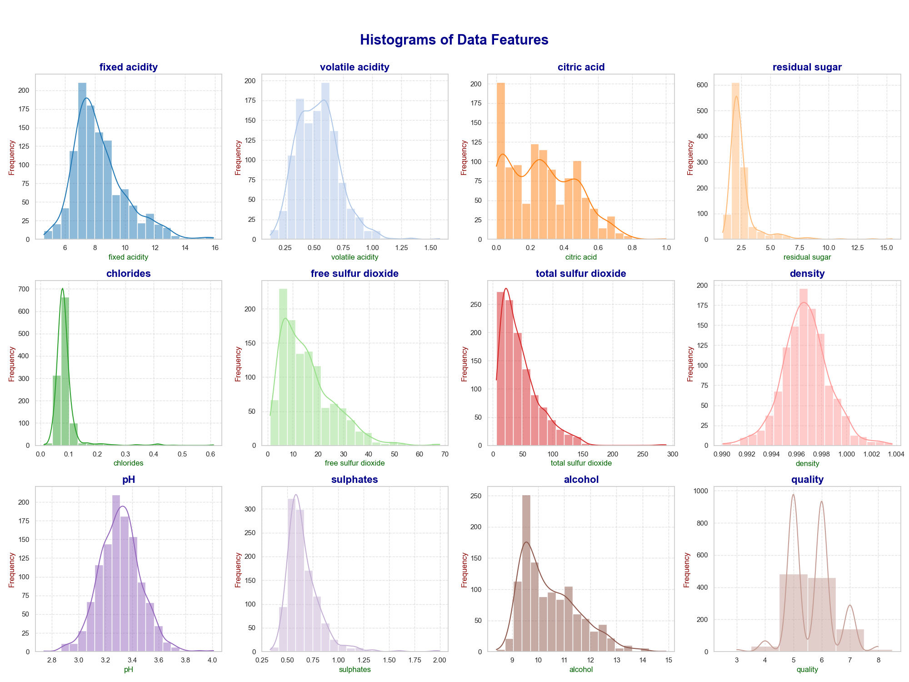
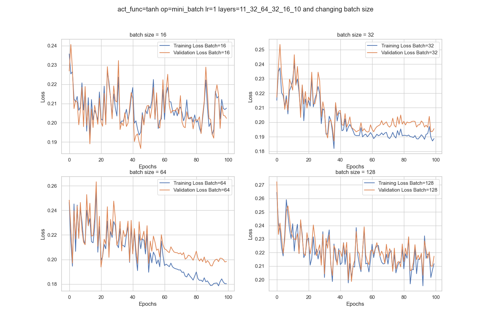
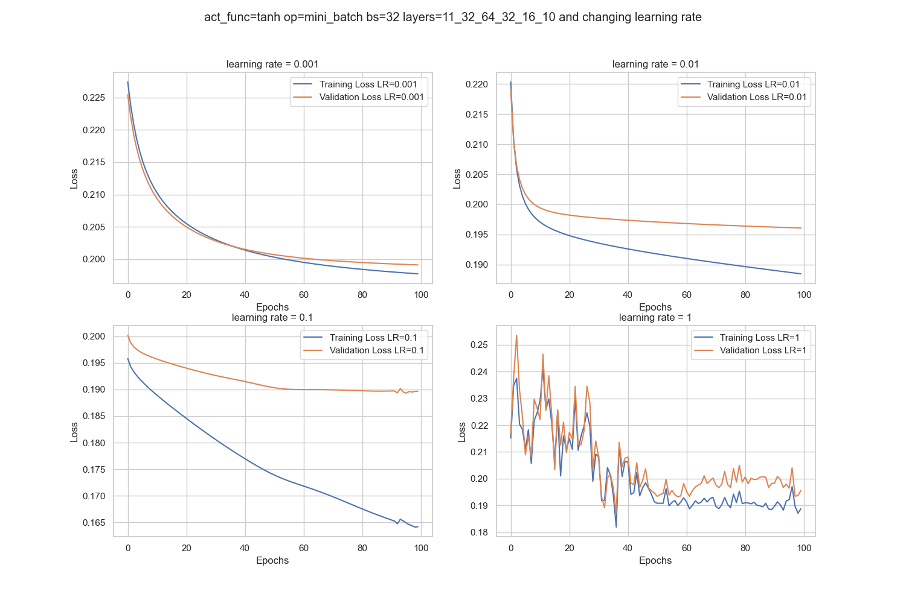
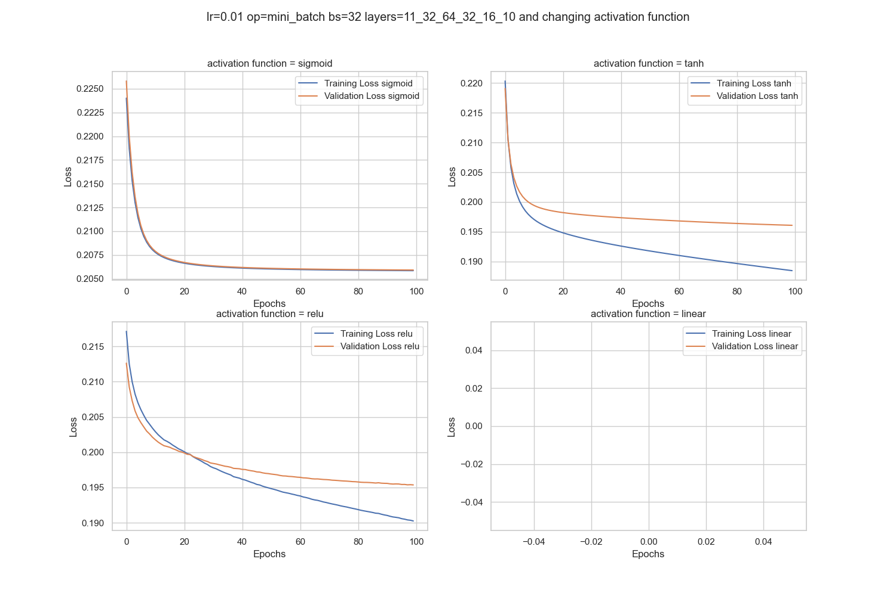
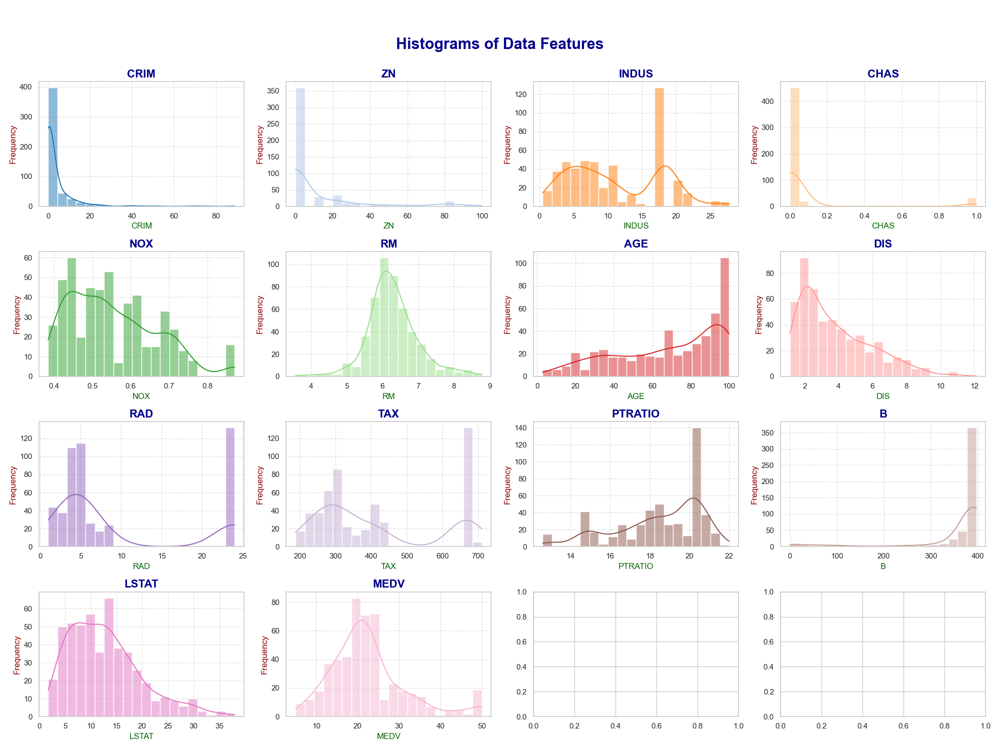
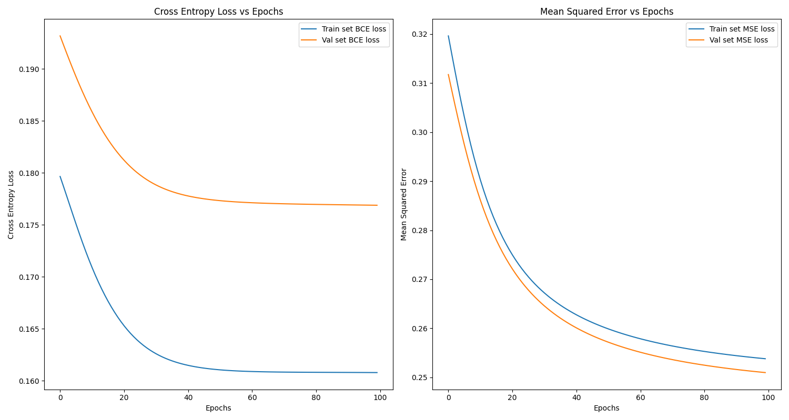

<center>

# **Assignment 3 Report**

</center>

## **Table of Contents**
2. [MLP Classification](#MLPClassifier)
  - [WineQT Dataset Analysis](#WineQT)
  - [Single Class Classifier](#SingleClassClassifier)
    - [Hyperparameter Tuning using W&B](#HyperparameterTuningSingleClassClassifier)
    - [Single-label Classification Model Evaluation](#EvaluatingSingleLabelClassifier)
    - [Analysing hyperparameter effects on Single-Label Classifier](#HyperparameterEffectsSingleClass)
  - [Multi Class Classifier](#MultiClassClassifier)
    - [Hyperparameter Tuning using W&B](#HyperparameterTuningMultiClassClassifier)
    - [Multi-label Classification Model Evaluation](#EvaluatingMultiLabelClassifier)
3. [MLP Regression](#MLPRegressor)
  - [Housing Dataset Analysis](#Housing)
  - [Hyperparameter Tuning using W&B](#HyperparamTuningRegressor)
  - [MLP Regressor Evaluation](#EvaluatingMLPRegressor)
  - [Mean Squared Error vs Binary Cross Entropy](#MSEvsBCE)
4. [AutoEncoder](#AutoEncoder)
  - [KNN on Reduced Dataset](#AutoEncoderKNN)
  - [MLP Classifier on Spotify Dataset](#MLPSpotify)

---

<p id = "MLPClassifier"> </p>

<p id = "WineQT"> </p>

## **2.1 WineQT Dataset Analysis**

<center>



*Figure 1: Distribution of various features in WineQT Dataset*

</center>

Dataset Descripton:
```
Mean, Standard Deviation, Min, Max values of the dataset features:
+----------------------+---------------------+----------------------+---------+---------+
|      Attribute       |         Mean        |  Standard Deviation  |   Min   |   Max   |
+----------------------+---------------------+----------------------+---------+---------+
|    fixed acidity     |  8.311111111111112  |  1.7468303726275016  |   4.6   |   15.9  |
|   volatile acidity   |  0.5313385826771653 | 0.17955459612835617  |   0.12  |   1.58  |
|     citric acid      |  0.2683639545056868 | 0.19659979421574741  |   0.0   |   1.0   |
|    residual sugar    |  2.5321522309711284 |  1.355324197143589   |   0.9   |   15.5  |
|      chlorides       | 0.08693263342082239 | 0.04724665655215518  |  0.012  |  0.611  |
| free sulfur dioxide  |  15.615485564304462 |  10.246001115067605  |   1.0   |   68.0  |
| total sulfur dioxide |  45.91469816272966  |  32.76778677994138   |   6.0   |  289.0  |
|       density        |  0.9967304111986001 | 0.001924224834379527 | 0.99007 | 1.00369 |
|          pH          |  3.3110148731408575 | 0.15659551281704315  |   2.74  |   4.01  |
|      sulphates       |  0.6577077865266842 |  0.1703241580362606  |   0.33  |   2.0   |
|       alcohol        |  10.442111402741325 |  1.0817221048833654  |   8.4   |   14.9  |
|       quality        |  5.657042869641295  |  0.805471666920189   |   3.0   |   8.0   |
+----------------------+---------------------+----------------------+---------+---------+
```
---

<p id="SingleClassClassifier"></p>

## **2.2 Single Class Classifier**

<p id="HyperparameterTuningSingleClassClassifier"></p>

### **2.3 Hyperparameter Tuning using W&B**
Trend of accuracy scores with changing hyperparameters using W&B:
<center>


*Figure 2: Hyperparameter tuning sweep graph W&B for single class classifier*

</center>

Hyperparameters - Metrics Table for Single Class Classifier:
```
Hyperparameters Table:
+---------+---------+------------+---------+---------+--------------------------+---------+---------+---------+----------+
|    LR   |    AF   |     OP     |  Epochs |    BS   |          Layers          |   Acc   | Macro P | Macro R | Macro F1 |
+---------+---------+------------+---------+---------+--------------------------+---------+---------+---------+----------+
|  0.001  | sigmoid |   batch    |   100   |   None  |     [11, 32, 32, 10]     |   1.17  |  6.667  |  0.119  |  0.002   |
|  0.001  | sigmoid |    sgd     |   100   |   None  |     [11, 32, 32, 10]     |  46.784 |   10.0  |  4.734  |  0.064   |
|  0.001  | sigmoid | mini_batch |   100   |    16   |     [11, 32, 32, 10]     |  53.216 |  12.309 |  10.507 |  0.109   |
|  0.001  | sigmoid | mini_batch |   100   |    32   |     [11, 32, 32, 10]     |  51.462 |  12.068 |  9.825  |  0.107   |
|  0.001  | sigmoid | mini_batch |   100   |    64   |     [11, 32, 32, 10]     |  42.69  |  9.347  |  6.914  |  0.072   |
|  0.001  | sigmoid | mini_batch |   100   |   128   |     [11, 32, 32, 10]     |  46.784 |   10.0  |  4.678  |  0.064   |
|  0.001  | sigmoid |    None    |   100   |   None  |     [11, 32, 32, 10]     |  59.649 |  14.396 |  11.768 |  0.129   |
|  0.001  |   tanh  |   batch    |   100   |   None  |     [11, 32, 32, 10]     |  16.959 |   5.45  |  16.711 |  0.082   |
|  0.001  |   tanh  |    sgd     |   100   |   None  |     [11, 32, 32, 10]     |  15.205 |  6.896  |  14.333 |  0.079   |
|  0.001  |   tanh  | mini_batch |   100   |    16   |     [11, 32, 32, 10]     |  54.386 |  13.828 |  16.061 |  0.137   |
|  0.001  |   tanh  | mini_batch |   100   |    32   |     [11, 32, 32, 10]     |  50.292 |  13.553 |  15.558 |   0.14   |
|  0.001  |   tanh  | mini_batch |   100   |    64   |     [11, 32, 32, 10]     |  51.462 |  23.419 |  17.336 |  0.162   |
|  0.001  |   tanh  | mini_batch |   100   |   128   |     [11, 32, 32, 10]     |  33.918 |  9.386  |  13.881 |  0.112   |
|  0.001  |   tanh  |    None    |   100   |   None  |     [11, 32, 32, 10]     |  62.573 |  17.662 |  20.399 |  0.181   |
|  0.001  |   relu  |   batch    |   100   |   None  |     [11, 32, 32, 10]     |  8.187  |  7.634  |  4.494  |  0.037   |
|  0.001  |   relu  |    sgd     |   100   |   None  |     [11, 32, 32, 10]     |  17.544 |  12.941 |  11.66  |  0.074   |
|  0.001  |   relu  | mini_batch |   100   |    16   |     [11, 32, 32, 10]     |  50.877 |  13.241 |  13.558 |  0.131   |
|  0.001  |   relu  | mini_batch |   100   |    32   |     [11, 32, 32, 10]     |  51.462 |  14.145 |  15.279 |  0.144   |
|  0.001  |   relu  | mini_batch |   100   |    64   |     [11, 32, 32, 10]     |  42.69  |  11.832 |  12.704 |  0.121   |
|  0.001  |   relu  | mini_batch |   100   |   128   |     [11, 32, 32, 10]     |  45.029 |  11.605 |  13.61  |  0.123   |
|  0.001  |   relu  |    None    |   100   |   None  |     [11, 32, 32, 10]     |  60.234 |  17.199 |  17.518 |  0.173   |
|  0.001  |  linear |   batch    |   100   |   None  |     [11, 32, 32, 10]     |  24.561 |  7.468  |  13.923 |   0.09   |
|  0.001  |  linear |    sgd     |   100   |   None  |     [11, 32, 32, 10]     |  17.544 |  9.374  |  16.743 |  0.082   |
|  0.001  |  linear | mini_batch |   100   |    16   |     [11, 32, 32, 10]     |  59.064 |  14.227 |  11.916 |  0.129   |
|  0.001  |  linear | mini_batch |   100   |    32   |     [11, 32, 32, 10]     |  59.064 |  14.531 |  15.171 |  0.135   |
|  0.001  |  linear | mini_batch |   100   |    64   |     [11, 32, 32, 10]     |  56.725 |  14.632 |  15.851 |  0.144   |
|  0.001  |  linear | mini_batch |   100   |   128   |     [11, 32, 32, 10]     |  59.064 |  14.182 |  11.627 |  0.128   |
|  0.001  |  linear |    None    |   100   |   None  |     [11, 32, 32, 10]     |  57.31  |  14.282 |  15.363 |  0.136   |
|   0.01  | sigmoid |   batch    |   100   |   None  |     [11, 32, 32, 10]     |  39.181 |  8.775  |  6.881  |  0.073   |
|   0.01  | sigmoid |    sgd     |   100   |   None  |     [11, 32, 32, 10]     |  46.784 |   10.0  |  4.678  |  0.064   |
|   0.01  | sigmoid | mini_batch |   100   |    16   |     [11, 32, 32, 10]     |  59.064 |  14.093 |  11.47  |  0.126   |
|   0.01  | sigmoid | mini_batch |   100   |    32   |     [11, 32, 32, 10]     |  59.064 |  13.96  |  11.313 |  0.125   |
|   0.01  | sigmoid | mini_batch |   100   |    64   |     [11, 32, 32, 10]     |  55.556 |  13.032 |  10.516 |  0.116   |
|   0.01  | sigmoid | mini_batch |   100   |   128   |     [11, 32, 32, 10]     |  50.292 |  11.284 |  9.248  |  0.094   |
|   0.01  | sigmoid |    None    |   100   |   None  |     [11, 32, 32, 10]     |  59.649 |  16.896 |  17.929 |  0.171   |
|   0.01  |   tanh  |   batch    |   100   |   None  |     [11, 32, 32, 10]     |  42.105 |  11.314 |  12.983 |  0.121   |
|   0.01  |   tanh  |    sgd     |   100   |   None  |     [11, 32, 32, 10]     |  36.842 |  14.767 |  15.464 |  0.132   |
|   0.01  |   tanh  | mini_batch |   100   |    16   |     [11, 32, 32, 10]     |  60.819 |  16.805 |  17.89  |   0.17   |
|   0.01  |   tanh  | mini_batch |   100   |    32   |     [11, 32, 32, 10]     |  60.819 |  16.59  |  17.698 |  0.167   |
|   0.01  |   tanh  | mini_batch |   100   |    64   |     [11, 32, 32, 10]     |  57.895 |  15.312 |  16.365 |  0.153   |
|   0.01  |   tanh  | mini_batch |   100   |   128   |     [11, 32, 32, 10]     |  54.386 |  13.175 |  12.251 |  0.125   |
|   0.01  |   tanh  |    None    |   100   |   None  |     [11, 32, 32, 10]     |  54.386 |  16.201 |  16.175 |  0.162   |
|   0.01  |   relu  |   batch    |   100   |   None  |     [11, 32, 32, 10]     |  57.895 |  21.611 |  20.149 |  0.204   |
|   0.01  |   relu  |    sgd     |   100   |   None  |     [11, 32, 32, 10]     |  41.52  |  14.842 |  14.763 |  0.138   |
|   0.01  |   relu  | mini_batch |   100   |    16   |     [11, 32, 32, 10]     |  62.573 |  17.743 |  17.95  |  0.177   |
|   0.01  |   relu  | mini_batch |   100   |    32   |     [11, 32, 32, 10]     |  54.971 |  15.162 |  15.761 |  0.152   |
|   0.01  |   relu  | mini_batch |   100   |    64   |     [11, 32, 32, 10]     |  59.649 |  16.377 |  16.485 |  0.164   |
|   0.01  |   relu  | mini_batch |   100   |   128   |     [11, 32, 32, 10]     |  60.234 |  16.672 |  16.829 |  0.166   |
|   0.01  |   relu  |    None    |   100   |   None  |     [11, 32, 32, 10]     |  56.14  |  15.931 |  17.605 |  0.165   |
|   0.01  |  linear |   batch    |   100   |   None  |     [11, 32, 32, 10]     |  59.649 |  14.567 |  14.379 |  0.136   |
|   0.01  |  linear |    sgd     |   100   |   None  |     [11, 32, 32, 10]     |   0.0   |   0.0   |   0.0   |   0.0    |
|   0.01  |  linear | mini_batch |   100   |    16   |     [11, 32, 32, 10]     |  57.31  |  14.282 |  14.399 |  0.136   |
|   0.01  |  linear | mini_batch |   100   |    32   |     [11, 32, 32, 10]     |  57.31  |  14.326 |  14.885 |  0.137   |
|   0.01  |  linear | mini_batch |   100   |    64   |     [11, 32, 32, 10]     |  60.234 |  14.692 |  15.221 |  0.137   |
|   0.01  |  linear | mini_batch |   100   |   128   |     [11, 32, 32, 10]     |  61.404 |  14.942 |  16.993 |  0.139   |
|   0.01  |  linear |    None    |   100   |   None  |     [11, 32, 32, 10]     |   0.0   |   0.0   |   0.0   |   0.0    |
|   0.1   | sigmoid |   batch    |   100   |   None  |     [11, 32, 32, 10]     |  55.556 |  13.076 |  10.567 |  0.117   |
|   0.1   | sigmoid |    sgd     |   100   |   None  |     [11, 32, 32, 10]     |  46.784 |   10.0  |  4.678  |  0.064   |
|   0.1   | sigmoid | mini_batch |   100   |    16   |     [11, 32, 32, 10]     |  58.48  |  16.127 |  16.711 |  0.162   |
|   0.1   | sigmoid | mini_batch |   100   |    32   |     [11, 32, 32, 10]     |  61.404 |  17.316 |  17.367 |  0.173   |
|   0.1   | sigmoid | mini_batch |   100   |    64   |     [11, 32, 32, 10]     |  59.064 |  14.828 |  15.89  |  0.144   |
|   0.1   | sigmoid | mini_batch |   100   |   128   |     [11, 32, 32, 10]     |  57.895 |  13.843 |  11.289 |  0.124   |
|   0.1   | sigmoid |    None    |   100   |   None  |     [11, 32, 32, 10]     |  54.386 |  16.632 |  16.588 |  0.166   |
|   0.1   |   tanh  |   batch    |   100   |   None  |     [11, 32, 32, 10]     |  59.064 |  16.734 |  18.192 |   0.17   |
|   0.1   |   tanh  |    sgd     |   100   |   None  |     [11, 32, 32, 10]     |  29.825 |  7.829  |  7.506  |  0.076   |
|   0.1   |   tanh  | mini_batch |   100   |    16   |     [11, 32, 32, 10]     |  58.48  |  17.343 |  17.898 |  0.175   |
|   0.1   |   tanh  | mini_batch |   100   |    32   |     [11, 32, 32, 10]     |  54.971 |  15.933 |  17.281 |  0.163   |
|   0.1   |   tanh  | mini_batch |   100   |    64   |     [11, 32, 32, 10]     |  60.819 |  17.969 |  18.89  |  0.182   |
|   0.1   |   tanh  | mini_batch |   100   |   128   |     [11, 32, 32, 10]     |  56.725 |  15.967 |  17.11  |  0.162   |
|   0.1   |   tanh  |    None    |   100   |   None  |     [11, 32, 32, 10]     |  35.088 |  9.569  |  11.838 |  0.103   |
|   0.1   |   relu  |   batch    |   100   |   None  |     [11, 32, 32, 10]     |  60.234 |  16.813 |  17.894 |   0.17   |
|   0.1   |   relu  |    sgd     |   100   |   None  |     [11, 32, 32, 10]     |  44.444 |  11.629 |  10.85  |  0.105   |
|   0.1   |   relu  | mini_batch |   100   |    16   |     [11, 32, 32, 10]     |  60.234 |  16.116 |  17.908 |  0.165   |
|   0.1   |   relu  | mini_batch |   100   |    32   |     [11, 32, 32, 10]     |  57.31  |  16.225 |  16.804 |  0.163   |
|   0.1   |   relu  | mini_batch |   100   |    64   |     [11, 32, 32, 10]     |  59.064 |   16.6  |  18.216 |   0.17   |
|   0.1   |   relu  | mini_batch |   100   |   128   |     [11, 32, 32, 10]     |  57.31  |  19.167 |  20.064 |  0.194   |
|   0.1   |   relu  |    None    |   100   |   None  |     [11, 32, 32, 10]     |  52.632 |  13.163 |  11.326 |  0.117   |
|   0.1   |  linear |   batch    |   100   |   None  |     [11, 32, 32, 10]     |   0.0   |   0.0   |   0.0   |   0.0    |
|   0.1   |  linear |    sgd     |   100   |   None  |     [11, 32, 32, 10]     |   0.0   |   0.0   |   0.0   |   0.0    |
|   0.1   |  linear | mini_batch |   100   |    16   |     [11, 32, 32, 10]     |   0.0   |   0.0   |   0.0   |   0.0    |
|   0.1   |  linear | mini_batch |   100   |    32   |     [11, 32, 32, 10]     |   0.0   |   0.0   |   0.0   |   0.0    |
|   0.1   |  linear | mini_batch |   100   |    64   |     [11, 32, 32, 10]     |   0.0   |   0.0   |   0.0   |   0.0    |
|   0.1   |  linear | mini_batch |   100   |   128   |     [11, 32, 32, 10]     |   0.0   |   0.0   |   0.0   |   0.0    |
|   0.1   |  linear |    None    |   100   |   None  |     [11, 32, 32, 10]     |   0.0   |   0.0   |   0.0   |   0.0    |
|    1    | sigmoid |   batch    |   100   |   None  |     [11, 32, 32, 10]     |  62.573 |  16.394 |  17.786 |  0.164   |
|    1    | sigmoid |    sgd     |   100   |   None  |     [11, 32, 32, 10]     |  37.427 |  10.581 |  12.108 |  0.066   |
|    1    | sigmoid | mini_batch |   100   |    16   |     [11, 32, 32, 10]     |  59.064 |  16.259 |  18.617 |  0.169   |
|    1    | sigmoid | mini_batch |   100   |    32   |     [11, 32, 32, 10]     |  56.725 |  15.485 |  16.769 |  0.157   |
|    1    | sigmoid | mini_batch |   100   |    64   |     [11, 32, 32, 10]     |  60.819 |  17.228 |  18.832 |  0.175   |
|    1    | sigmoid | mini_batch |   100   |   128   |     [11, 32, 32, 10]     |  60.234 |  16.672 |  17.458 |  0.168   |
|    1    | sigmoid |    None    |   100   |   None  |     [11, 32, 32, 10]     |  52.632 |  13.074 |  11.001 |  0.116   |
|    1    |   tanh  |   batch    |   100   |   None  |     [11, 32, 32, 10]     |  7.018  |   2.85  |  16.541 |   0.04   |
|    1    |   tanh  |    sgd     |   100   |   None  |     [11, 32, 32, 10]     |  19.883 |  4.831  |  20.719 |  0.072   |
|    1    |   tanh  | mini_batch |   100   |    16   |     [11, 32, 32, 10]     |  29.825 |  8.348  |  13.546 |  0.103   |
|    1    |   tanh  | mini_batch |   100   |    32   |     [11, 32, 32, 10]     |  49.708 |  11.826 |  10.182 |  0.108   |
|    1    |   tanh  | mini_batch |   100   |    64   |     [11, 32, 32, 10]     |  51.462 |  13.418 |  14.087 |  0.133   |
|    1    |   tanh  | mini_batch |   100   |   128   |     [11, 32, 32, 10]     |  46.199 |  12.76  |  13.974 |  0.133   |
|    1    |   tanh  |    None    |   100   |   None  |     [11, 32, 32, 10]     |  24.561 |  7.128  |  14.134 |  0.094   |
|    1    |   relu  |   batch    |   100   |   None  |     [11, 32, 32, 10]     |  57.31  |  16.67  |  18.167 |  0.168   |
|    1    |   relu  |    sgd     |   100   |   None  |     [11, 32, 32, 10]     |   0.0   |   0.0   |   0.0   |   0.0    |
|    1    |   relu  | mini_batch |   100   |    16   |     [11, 32, 32, 10]     |  46.784 |   10.0  |  4.678  |  0.064   |
|    1    |   relu  | mini_batch |   100   |    32   |     [11, 32, 32, 10]     |  46.784 |   10.0  |  4.678  |  0.064   |
|    1    |   relu  | mini_batch |   100   |    64   |     [11, 32, 32, 10]     |   0.0   |   0.0   |   0.0   |   0.0    |
|    1    |   relu  | mini_batch |   100   |   128   |     [11, 32, 32, 10]     |  59.649 |  16.718 |  17.173 |  0.167   |
|    1    |   relu  |    None    |   100   |   None  |     [11, 32, 32, 10]     |   0.0   |   0.0   |   0.0   |   0.0    |
|    1    |  linear |   batch    |   100   |   None  |     [11, 32, 32, 10]     |   0.0   |   0.0   |   0.0   |   0.0    |
|    1    |  linear |    sgd     |   100   |   None  |     [11, 32, 32, 10]     |   0.0   |   0.0   |   0.0   |   0.0    |
|    1    |  linear | mini_batch |   100   |    16   |     [11, 32, 32, 10]     |   0.0   |   0.0   |   0.0   |   0.0    |
|    1    |  linear | mini_batch |   100   |    32   |     [11, 32, 32, 10]     |   0.0   |   0.0   |   0.0   |   0.0    |
|    1    |  linear | mini_batch |   100   |    64   |     [11, 32, 32, 10]     |   0.0   |   0.0   |   0.0   |   0.0    |
|    1    |  linear | mini_batch |   100   |   128   |     [11, 32, 32, 10]     |   0.0   |   0.0   |   0.0   |   0.0    |
|    1    |  linear |    None    |   100   |   None  |     [11, 32, 32, 10]     |   0.0   |   0.0   |   0.0   |   0.0    |
|  0.001  | sigmoid |   batch    |   100   |   None  | [11, 32, 64, 32, 16, 10] |  1.754  |   10.0  |  0.175  |  0.003   |
|  0.001  | sigmoid |    sgd     |   100   |   None  | [11, 32, 64, 32, 16, 10] |  1.754  |   10.0  |  0.175  |  0.003   |
|  0.001  | sigmoid | mini_batch |   100   |    16   | [11, 32, 64, 32, 16, 10] |  46.784 |   10.0  |  4.678  |  0.064   |
|  0.001  | sigmoid | mini_batch |   100   |    32   | [11, 32, 64, 32, 16, 10] |  46.784 |   10.0  |  4.678  |  0.064   |
|  0.001  | sigmoid | mini_batch |   100   |    64   | [11, 32, 64, 32, 16, 10] |  46.784 |   10.0  |  4.678  |  0.064   |
|  0.001  | sigmoid | mini_batch |   100   |   128   | [11, 32, 64, 32, 16, 10] |  46.784 |   10.0  |  4.678  |  0.064   |
|  0.001  | sigmoid |    None    |   100   |   None  | [11, 32, 64, 32, 16, 10] |  46.784 |   10.0  |  4.678  |  0.064   |
|  0.001  |   tanh  |   batch    |   100   |   None  | [11, 32, 64, 32, 16, 10] |  15.789 |  5.593  |  9.375  |  0.063   |
|  0.001  |   tanh  |    sgd     |   100   |   None  | [11, 32, 64, 32, 16, 10] |  13.45  |   8.65  |  14.29  |  0.073   |
|  0.001  |   tanh  | mini_batch |   100   |    16   | [11, 32, 64, 32, 16, 10] |  60.819 |   15.9  |  19.167 |  0.159   |
|  0.001  |   tanh  | mini_batch |   100   |    32   | [11, 32, 64, 32, 16, 10] |  60.234 |  16.509 |  19.029 |  0.171   |
|  0.001  |   tanh  | mini_batch |   100   |    64   | [11, 32, 64, 32, 16, 10] |  47.953 |  12.453 |  13.83  |  0.126   |
|  0.001  |   tanh  | mini_batch |   100   |   128   | [11, 32, 64, 32, 16, 10] |  41.52  |  14.494 |  16.09  |  0.147   |
|  0.001  |   tanh  |    None    |   100   |   None  | [11, 32, 64, 32, 16, 10] |  58.48  |  16.179 |  18.12  |  0.164   |
|  0.001  |   relu  |   batch    |   100   |   None  | [11, 32, 64, 32, 16, 10] |  26.901 |  6.277  |  9.268  |  0.068   |
|  0.001  |   relu  |    sgd     |   100   |   None  | [11, 32, 64, 32, 16, 10] |  39.181 |  9.354  |  9.608  |  0.095   |
|  0.001  |   relu  | mini_batch |   100   |    16   | [11, 32, 64, 32, 16, 10] |  51.462 |  12.468 |  10.396 |  0.113   |
|  0.001  |   relu  | mini_batch |   100   |    32   | [11, 32, 64, 32, 16, 10] |  47.368 |  11.46  |  9.451  |  0.103   |
|  0.001  |   relu  | mini_batch |   100   |    64   | [11, 32, 64, 32, 16, 10] |  47.368 |  13.277 |  14.143 |  0.134   |
|  0.001  |   relu  | mini_batch |   100   |   128   | [11, 32, 64, 32, 16, 10] |  40.936 |  9.462  |  7.928  |  0.085   |
|  0.001  |   relu  |    None    |   100   |   None  | [11, 32, 64, 32, 16, 10] |  56.14  |  13.55  |  13.429 |  0.126   |
|  0.001  |  linear |   batch    |   100   |   None  | [11, 32, 64, 32, 16, 10] |  51.462 |  13.017 |  16.749 |  0.139   |
|  0.001  |  linear |    sgd     |   100   |   None  | [11, 32, 64, 32, 16, 10] |   0.0   |   0.0   |   0.0   |   0.0    |
|  0.001  |  linear | mini_batch |   100   |    16   | [11, 32, 64, 32, 16, 10] |  60.234 |  14.736 |  14.531 |  0.137   |
|  0.001  |  linear | mini_batch |   100   |    32   | [11, 32, 64, 32, 16, 10] |  56.725 |  13.897 |  13.18  |   0.13   |
|  0.001  |  linear | mini_batch |   100   |    64   | [11, 32, 64, 32, 16, 10] |  55.556 |  13.21  |  11.024 |   0.12   |
|  0.001  |  linear | mini_batch |   100   |   128   | [11, 32, 64, 32, 16, 10] |  59.649 |  14.745 |  21.916 |  0.137   |
|  0.001  |  linear |    None    |   100   |   None  | [11, 32, 64, 32, 16, 10] |   0.0   |   0.0   |   0.0   |   0.0    |
|   0.01  | sigmoid |   batch    |   100   |   None  | [11, 32, 64, 32, 16, 10] |  46.784 |   10.0  |  4.678  |  0.064   |
|   0.01  | sigmoid |    sgd     |   100   |   None  | [11, 32, 64, 32, 16, 10] |  46.784 |   10.0  |  4.678  |  0.064   |
|   0.01  | sigmoid | mini_batch |   100   |    16   | [11, 32, 64, 32, 16, 10] |  46.784 |   10.0  |  4.678  |  0.064   |
|   0.01  | sigmoid | mini_batch |   100   |    32   | [11, 32, 64, 32, 16, 10] |  46.784 |   10.0  |  4.678  |  0.064   |
|   0.01  | sigmoid | mini_batch |   100   |    64   | [11, 32, 64, 32, 16, 10] |  46.784 |   10.0  |  4.678  |  0.064   |
|   0.01  | sigmoid | mini_batch |   100   |   128   | [11, 32, 64, 32, 16, 10] |  46.784 |   10.0  |  4.678  |  0.064   |
|   0.01  | sigmoid |    None    |   100   |   None  | [11, 32, 64, 32, 16, 10] |  59.649 |  17.163 |  17.929 |  0.173   |
|   0.01  |   tanh  |   batch    |   100   |   None  | [11, 32, 64, 32, 16, 10] |  48.538 |  12.096 |   14.1  |  0.125   |
|   0.01  |   tanh  |    sgd     |   100   |   None  | [11, 32, 64, 32, 16, 10] |  32.749 |  9.811  |  13.538 |  0.101   |
|   0.01  |   tanh  | mini_batch |   100   |    16   | [11, 32, 64, 32, 16, 10] |  61.404 |  17.367 |  18.366 |  0.175   |
|   0.01  |   tanh  | mini_batch |   100   |    32   | [11, 32, 64, 32, 16, 10] |  64.912 |  18.599 |  20.609 |  0.189   |
|   0.01  |   tanh  | mini_batch |   100   |    64   | [11, 32, 64, 32, 16, 10] |  61.404 |  16.203 |  21.997 |  0.162   |
|   0.01  |   tanh  | mini_batch |   100   |   128   | [11, 32, 64, 32, 16, 10] |  58.48  |  15.355 |  15.56  |  0.152   |
|   0.01  |   tanh  |    None    |   100   |   None  | [11, 32, 64, 32, 16, 10] |  59.064 |  18.121 |  18.015 |   0.18   |
|   0.01  |   relu  |   batch    |   100   |   None  | [11, 32, 64, 32, 16, 10] |  41.52  |  10.425 |  10.861 |   0.1    |
|   0.01  |   relu  |    sgd     |   100   |   None  | [11, 32, 64, 32, 16, 10] |  42.69  |  15.147 |  16.088 |  0.135   |
|   0.01  |   relu  | mini_batch |   100   |    16   | [11, 32, 64, 32, 16, 10] |  58.48  |  16.564 |  17.59  |  0.168   |
|   0.01  |   relu  | mini_batch |   100   |    32   | [11, 32, 64, 32, 16, 10] |  60.234 |  15.908 |  16.829 |  0.157   |
|   0.01  |   relu  | mini_batch |   100   |    64   | [11, 32, 64, 32, 16, 10] |  57.31  |  13.852 |  11.282 |  0.124   |
|   0.01  |   relu  | mini_batch |   100   |   128   | [11, 32, 64, 32, 16, 10] |  56.725 |  13.949 |  11.545 |  0.125   |
|   0.01  |   relu  |    None    |   100   |   None  | [11, 32, 64, 32, 16, 10] |  58.48  |  16.861 |  17.581 |  0.171   |
|   0.01  |  linear |   batch    |   100   |   None  | [11, 32, 64, 32, 16, 10] |   0.0   |   0.0   |   0.0   |   0.0    |
|   0.01  |  linear |    sgd     |   100   |   None  | [11, 32, 64, 32, 16, 10] |   0.0   |   0.0   |   0.0   |   0.0    |
|   0.01  |  linear | mini_batch |   100   |    16   | [11, 32, 64, 32, 16, 10] |   0.0   |   0.0   |   0.0   |   0.0    |
|   0.01  |  linear | mini_batch |   100   |    32   | [11, 32, 64, 32, 16, 10] |   0.0   |   0.0   |   0.0   |   0.0    |
|   0.01  |  linear | mini_batch |   100   |    64   | [11, 32, 64, 32, 16, 10] |   0.0   |   0.0   |   0.0   |   0.0    |
|   0.01  |  linear | mini_batch |   100   |   128   | [11, 32, 64, 32, 16, 10] |   0.0   |   0.0   |   0.0   |   0.0    |
|   0.01  |  linear |    None    |   100   |   None  | [11, 32, 64, 32, 16, 10] |   0.0   |   0.0   |   0.0   |   0.0    |
|   0.1   | sigmoid |   batch    |   100   |   None  | [11, 32, 64, 32, 16, 10] |  46.784 |   10.0  |  4.678  |  0.064   |
|   0.1   | sigmoid |    sgd     |   100   |   None  | [11, 32, 64, 32, 16, 10] |  34.503 |   10.0  |   3.45  |  0.051   |
|   0.1   | sigmoid | mini_batch |   100   |    16   | [11, 32, 64, 32, 16, 10] |  64.912 |  17.294 |  19.049 |  0.174   |
|   0.1   | sigmoid | mini_batch |   100   |    32   | [11, 32, 64, 32, 16, 10] |  58.48  |  13.879 |  11.26  |  0.124   |
|   0.1   | sigmoid | mini_batch |   100   |    64   | [11, 32, 64, 32, 16, 10] |  46.784 |   10.0  |  4.678  |  0.064   |
|   0.1   | sigmoid | mini_batch |   100   |   128   | [11, 32, 64, 32, 16, 10] |  46.784 |   10.0  |  4.678  |  0.064   |
|   0.1   | sigmoid |    None    |   100   |   None  | [11, 32, 64, 32, 16, 10] |  53.801 |  15.602 |  16.417 |  0.159   |
|   0.1   |   tanh  |   batch    |   100   |   None  | [11, 32, 64, 32, 16, 10] |  60.234 |  15.901 |  17.311 |  0.159   |
|   0.1   |   tanh  |    sgd     |   100   |   None  | [11, 32, 64, 32, 16, 10] |  49.123 |  11.701 |  9.505  |  0.105   |
|   0.1   |   tanh  | mini_batch |   100   |    16   | [11, 32, 64, 32, 16, 10] |  64.327 |  19.335 |  20.269 |  0.196   |
|   0.1   |   tanh  | mini_batch |   100   |    32   | [11, 32, 64, 32, 16, 10] |  61.404 |  18.354 |  19.416 |  0.187   |
|   0.1   |   tanh  | mini_batch |   100   |    64   | [11, 32, 64, 32, 16, 10] |  59.064 |  16.816 |  17.311 |  0.169   |
|   0.1   |   tanh  | mini_batch |   100   |   128   | [11, 32, 64, 32, 16, 10] |  60.234 |  16.376 |  17.856 |  0.165   |
|   0.1   |   tanh  |    None    |   100   |   None  | [11, 32, 64, 32, 16, 10] |  49.123 |  12.814 |  11.65  |  0.108   |
|   0.1   |   relu  |   batch    |   100   |   None  | [11, 32, 64, 32, 16, 10] |  47.368 |  10.436 |  9.713  |  0.082   |
|   0.1   |   relu  |    sgd     |   100   |   None  | [11, 32, 64, 32, 16, 10] |  34.503 |   10.0  |   3.45  |  0.051   |
|   0.1   |   relu  | mini_batch |   100   |    16   | [11, 32, 64, 32, 16, 10] |  61.404 |  18.154 |  19.41  |  0.183   |
|   0.1   |   relu  | mini_batch |   100   |    32   | [11, 32, 64, 32, 16, 10] |  64.912 |  18.548 |  18.949 |  0.186   |
|   0.1   |   relu  | mini_batch |   100   |    64   | [11, 32, 64, 32, 16, 10] |  57.895 |  16.016 |  18.205 |  0.161   |
|   0.1   |   relu  | mini_batch |   100   |   128   | [11, 32, 64, 32, 16, 10] |  58.48  |  14.146 |  11.617 |  0.127   |
|   0.1   |   relu  |    None    |   100   |   None  | [11, 32, 64, 32, 16, 10] |   0.0   |   0.0   |   0.0   |   0.0    |
|   0.1   |  linear |   batch    |   100   |   None  | [11, 32, 64, 32, 16, 10] |   0.0   |   0.0   |   0.0   |   0.0    |
|   0.1   |  linear |    sgd     |   100   |   None  | [11, 32, 64, 32, 16, 10] |   0.0   |   0.0   |   0.0   |   0.0    |
|   0.1   |  linear | mini_batch |   100   |    16   | [11, 32, 64, 32, 16, 10] |   0.0   |   0.0   |   0.0   |   0.0    |
|   0.1   |  linear | mini_batch |   100   |    32   | [11, 32, 64, 32, 16, 10] |   0.0   |   0.0   |   0.0   |   0.0    |
|   0.1   |  linear | mini_batch |   100   |    64   | [11, 32, 64, 32, 16, 10] |   0.0   |   0.0   |   0.0   |   0.0    |
|   0.1   |  linear | mini_batch |   100   |   128   | [11, 32, 64, 32, 16, 10] |   0.0   |   0.0   |   0.0   |   0.0    |
|   0.1   |  linear |    None    |   100   |   None  | [11, 32, 64, 32, 16, 10] |   0.0   |   0.0   |   0.0   |   0.0    |
|    1    | sigmoid |   batch    |   100   |   None  | [11, 32, 64, 32, 16, 10] |  46.784 |   10.0  |  4.678  |  0.064   |
|    1    | sigmoid |    sgd     |   100   |   None  | [11, 32, 64, 32, 16, 10] |  46.784 |   10.0  |  4.678  |  0.064   |
|    1    | sigmoid | mini_batch |   100   |    16   | [11, 32, 64, 32, 16, 10] |  59.649 |  17.883 |  17.401 |  0.175   |
|    1    | sigmoid | mini_batch |   100   |    32   | [11, 32, 64, 32, 16, 10] |  60.234 |  18.623 |  17.963 |  0.183   |
|    1    | sigmoid | mini_batch |   100   |    64   | [11, 32, 64, 32, 16, 10] |  61.988 |  18.575 |  19.148 |  0.187   |
|    1    | sigmoid | mini_batch |   100   |   128   | [11, 32, 64, 32, 16, 10] |  60.819 |  15.974 |  16.708 |  0.159   |
|    1    | sigmoid |    None    |   100   |   None  | [11, 32, 64, 32, 16, 10] |  34.503 |   10.0  |   3.45  |  0.051   |
|    1    |   tanh  |   batch    |   100   |   None  | [11, 32, 64, 32, 16, 10] |  30.994 |  8.004  |  8.039  |  0.074   |
|    1    |   tanh  |    sgd     |   100   |   None  | [11, 32, 64, 32, 16, 10] |  5.848  |  11.125 |  2.274  |  0.026   |
|    1    |   tanh  | mini_batch |   100   |    16   | [11, 32, 64, 32, 16, 10] |  48.538 |  12.14  |  12.324 |  0.117   |
|    1    |   tanh  | mini_batch |   100   |    32   | [11, 32, 64, 32, 16, 10] |  43.86  |  11.711 |  11.93  |  0.114   |
|    1    |   tanh  | mini_batch |   100   |    64   | [11, 32, 64, 32, 16, 10] |  60.234 |  21.332 |   27.3  |  0.232   |
|    1    |   tanh  | mini_batch |   100   |   128   | [11, 32, 64, 32, 16, 10] |  36.842 |  14.189 |  11.814 |   0.12   |
|    1    |   tanh  |    None    |   100   |   None  | [11, 32, 64, 32, 16, 10] |  32.164 |  9.819  |  13.036 |  0.096   |
|    1    |   relu  |   batch    |   100   |   None  | [11, 32, 64, 32, 16, 10] |   0.0   |   0.0   |   0.0   |   0.0    |
|    1    |   relu  |    sgd     |   100   |   None  | [11, 32, 64, 32, 16, 10] |   0.0   |   0.0   |   0.0   |   0.0    |
|    1    |   relu  | mini_batch |   100   |    16   | [11, 32, 64, 32, 16, 10] |   0.0   |   0.0   |   0.0   |   0.0    |
|    1    |   relu  | mini_batch |   100   |    32   | [11, 32, 64, 32, 16, 10] |   0.0   |   0.0   |   0.0   |   0.0    |
|    1    |   relu  | mini_batch |   100   |    64   | [11, 32, 64, 32, 16, 10] |  34.503 |   10.0  |   3.45  |  0.051   |
|    1    |   relu  | mini_batch |   100   |   128   | [11, 32, 64, 32, 16, 10] |   0.0   |   0.0   |   0.0   |   0.0    |
|    1    |   relu  |    None    |   100   |   None  | [11, 32, 64, 32, 16, 10] |   0.0   |   0.0   |   0.0   |   0.0    |
|    1    |  linear |   batch    |   100   |   None  | [11, 32, 64, 32, 16, 10] |   0.0   |   0.0   |   0.0   |   0.0    |
|    1    |  linear |    sgd     |   100   |   None  | [11, 32, 64, 32, 16, 10] |   0.0   |   0.0   |   0.0   |   0.0    |
|    1    |  linear | mini_batch |   100   |    16   | [11, 32, 64, 32, 16, 10] |   0.0   |   0.0   |   0.0   |   0.0    |
|    1    |  linear | mini_batch |   100   |    32   | [11, 32, 64, 32, 16, 10] |   0.0   |   0.0   |   0.0   |   0.0    |
|    1    |  linear | mini_batch |   100   |    64   | [11, 32, 64, 32, 16, 10] |   0.0   |   0.0   |   0.0   |   0.0    |
|    1    |  linear | mini_batch |   100   |   128   | [11, 32, 64, 32, 16, 10] |   0.0   |   0.0   |   0.0   |   0.0    |
|    1    |  linear |    None    |   100   |   None  | [11, 32, 64, 32, 16, 10] |   0.0   |   0.0   |   0.0   |   0.0    |
|  0.001  | sigmoid |   batch    |   100   |   None  |      [11, 128, 10]       |  23.977 |  9.312  |  9.867  |  0.073   |
|  0.001  | sigmoid |    sgd     |   100   |   None  |      [11, 128, 10]       |  30.994 |  7.604  |  6.425  |  0.069   |
|  0.001  | sigmoid | mini_batch |   100   |    16   |      [11, 128, 10]       |  58.48  |  13.968 |  11.395 |  0.125   |
|  0.001  | sigmoid | mini_batch |   100   |    32   |      [11, 128, 10]       |  57.895 |  13.843 |  11.25  |  0.124   |
|  0.001  | sigmoid | mini_batch |   100   |    64   |      [11, 128, 10]       |  55.556 |  13.21  |  10.742 |  0.118   |
|  0.001  | sigmoid | mini_batch |   100   |   128   |      [11, 128, 10]       |  49.123 |  11.657 |  9.483  |  0.104   |
|  0.001  | sigmoid |    None    |   100   |   None  |      [11, 128, 10]       |  62.573 |  17.224 |  17.968 |  0.173   |
|  0.001  |   tanh  |   batch    |   100   |   None  |      [11, 128, 10]       |  11.111 |  3.035  |  7.984  |  0.042   |
|  0.001  |   tanh  |    sgd     |   100   |   None  |      [11, 128, 10]       |  11.111 |  2.724  |  10.714 |  0.042   |
|  0.001  |   tanh  | mini_batch |   100   |    16   |      [11, 128, 10]       |  56.725 |  15.833 |  16.869 |  0.162   |
|  0.001  |   tanh  | mini_batch |   100   |    32   |      [11, 128, 10]       |  51.462 |  13.247 |  15.131 |  0.135   |
|  0.001  |   tanh  | mini_batch |   100   |    64   |      [11, 128, 10]       |  53.801 |  14.177 |  15.043 |  0.145   |
|  0.001  |   tanh  | mini_batch |   100   |   128   |      [11, 128, 10]       |  44.444 |  21.734 |  17.975 |  0.179   |
|  0.001  |   tanh  |    None    |   100   |   None  |      [11, 128, 10]       |  61.988 |  17.923 |  19.441 |  0.183   |
|  0.001  |   relu  |   batch    |   100   |   None  |      [11, 128, 10]       |  29.825 |  10.288 |  11.671 |  0.102   |
|  0.001  |   relu  |    sgd     |   100   |   None  |      [11, 128, 10]       |  28.655 |  7.052  |  12.321 |  0.088   |
|  0.001  |   relu  | mini_batch |   100   |    16   |      [11, 128, 10]       |  55.556 |  15.85  |  17.202 |  0.162   |
|  0.001  |   relu  | mini_batch |   100   |    32   |      [11, 128, 10]       |  56.14  |  15.753 |  16.481 |   0.16   |
|  0.001  |   relu  | mini_batch |   100   |    64   |      [11, 128, 10]       |  46.784 |  12.625 |  12.929 |  0.127   |
|  0.001  |   relu  | mini_batch |   100   |   128   |      [11, 128, 10]       |  53.216 |  15.039 |  15.782 |  0.153   |
|  0.001  |   relu  |    None    |   100   |   None  |      [11, 128, 10]       |  54.971 |  15.503 |  16.762 |  0.159   |
|  0.001  |  linear |   batch    |   100   |   None  |      [11, 128, 10]       |  25.731 |  8.363  |  14.068 |  0.099   |
|  0.001  |  linear |    sgd     |   100   |   None  |      [11, 128, 10]       |  19.883 |  10.994 |  11.223 |  0.078   |
|  0.001  |  linear | mini_batch |   100   |    16   |      [11, 128, 10]       |  57.31  |  13.807 |  11.562 |  0.125   |
|  0.001  |  linear | mini_batch |   100   |    32   |      [11, 128, 10]       |  58.48  |  14.102 |  11.832 |  0.128   |
|  0.001  |  linear | mini_batch |   100   |    64   |      [11, 128, 10]       |  58.48  |  14.102 |  11.717 |  0.128   |
|  0.001  |  linear | mini_batch |   100   |   128   |      [11, 128, 10]       |  57.895 |  15.312 |  15.272 |  0.151   |
|  0.001  |  linear |    None    |   100   |   None  |      [11, 128, 10]       |  56.725 |  15.195 |  15.278 |   0.15   |
|   0.01  | sigmoid |   batch    |   100   |   None  |      [11, 128, 10]       |  50.292 |  11.907 |  9.654  |  0.106   |
|   0.01  | sigmoid |    sgd     |   100   |   None  |      [11, 128, 10]       |  38.596 |  10.875 |  13.598 |  0.069   |
|   0.01  | sigmoid | mini_batch |   100   |    16   |      [11, 128, 10]       |  60.819 |  16.286 |  17.358 |  0.163   |
|   0.01  | sigmoid | mini_batch |   100   |    32   |      [11, 128, 10]       |  60.819 |  15.507 |  16.441 |  0.152   |
|   0.01  | sigmoid | mini_batch |   100   |    64   |      [11, 128, 10]       |  61.404 |  14.986 |  17.067 |  0.139   |
|   0.01  | sigmoid | mini_batch |   100   |   128   |      [11, 128, 10]       |  60.234 |  14.343 |  11.663 |  0.129   |
|   0.01  | sigmoid |    None    |   100   |   None  |      [11, 128, 10]       |  57.895 |  16.654 |  18.02  |   0.17   |
|   0.01  |   tanh  |   batch    |   100   |   None  |      [11, 128, 10]       |  55.556 |  16.971 |  19.804 |  0.183   |
|   0.01  |   tanh  |    sgd     |   100   |   None  |      [11, 128, 10]       |  42.105 |  11.27  |  13.883 |  0.124   |
|   0.01  |   tanh  | mini_batch |   100   |    16   |      [11, 128, 10]       |  64.912 |  18.466 |  19.313 |  0.186   |
|   0.01  |   tanh  | mini_batch |   100   |    32   |      [11, 128, 10]       |  60.819 |  17.584 |  19.63  |  0.181   |
|   0.01  |   tanh  | mini_batch |   100   |    64   |      [11, 128, 10]       |  59.064 |  16.689 |  17.712 |   0.17   |
|   0.01  |   tanh  | mini_batch |   100   |   128   |      [11, 128, 10]       |  52.632 |  13.104 |  13.212 |  0.128   |
|   0.01  |   tanh  |    None    |   100   |   None  |      [11, 128, 10]       |  53.801 |  15.646 |  16.03  |  0.157   |
|   0.01  |   relu  |   batch    |   100   |   None  |      [11, 128, 10]       |  55.556 |  14.856 |  16.874 |  0.154   |
|   0.01  |   relu  |    sgd     |   100   |   None  |      [11, 128, 10]       |  50.292 |  16.001 |  14.944 |  0.148   |
|   0.01  |   relu  | mini_batch |   100   |    16   |      [11, 128, 10]       |  54.971 |  15.288 |  17.025 |  0.157   |
|   0.01  |   relu  | mini_batch |   100   |    32   |      [11, 128, 10]       |  54.971 |  15.332 |  16.404 |  0.156   |
|   0.01  |   relu  | mini_batch |   100   |    64   |      [11, 128, 10]       |  55.556 |  15.583 |  16.503 |  0.158   |
|   0.01  |   relu  | mini_batch |   100   |   128   |      [11, 128, 10]       |  59.064 |  16.86  |   18.5  |  0.173   |
|   0.01  |   relu  |    None    |   100   |   None  |      [11, 128, 10]       |  53.216 |  15.61  |  17.614 |  0.164   |
|   0.01  |  linear |   batch    |   100   |   None  |      [11, 128, 10]       |  57.895 |  14.192 |  16.454 |  0.132   |
|   0.01  |  linear |    sgd     |   100   |   None  |      [11, 128, 10]       |   0.0   |   0.0   |   0.0   |   0.0    |
|   0.01  |  linear | mini_batch |   100   |    16   |      [11, 128, 10]       |  57.895 |  16.091 |  16.319 |  0.161   |
|   0.01  |  linear | mini_batch |   100   |    32   |      [11, 128, 10]       |  56.725 |  14.157 |  14.035 |  0.135   |
|   0.01  |  linear | mini_batch |   100   |    64   |      [11, 128, 10]       |  57.31  |  14.497 |  15.219 |  0.141   |
|   0.01  |  linear | mini_batch |   100   |   128   |      [11, 128, 10]       |  57.895 |  14.489 |  14.778 |   0.14   |
|   0.01  |  linear |    None    |   100   |   None  |      [11, 128, 10]       |   0.0   |   0.0   |   0.0   |   0.0    |
|   0.1   | sigmoid |   batch    |   100   |   None  |      [11, 128, 10]       |  58.48  |  14.272 |  16.502 |  0.133   |
|   0.1   | sigmoid |    sgd     |   100   |   None  |      [11, 128, 10]       |  57.31  |  15.009 |  16.159 |   0.15   |
|   0.1   | sigmoid | mini_batch |   100   |    16   |      [11, 128, 10]       |  59.649 |  16.592 |  17.413 |  0.167   |
|   0.1   | sigmoid | mini_batch |   100   |    32   |      [11, 128, 10]       |  61.404 |  16.922 |  17.481 |  0.169   |
|   0.1   | sigmoid | mini_batch |   100   |    64   |      [11, 128, 10]       |  59.064 |  15.903 |  17.036 |   0.16   |
|   0.1   | sigmoid | mini_batch |   100   |   128   |      [11, 128, 10]       |  57.31  |  14.964 |  16.007 |  0.149   |
|   0.1   | sigmoid |    None    |   100   |   None  |      [11, 128, 10]       |  56.725 |  16.019 |  18.153 |  0.166   |
|   0.1   |   tanh  |   batch    |   100   |   None  |      [11, 128, 10]       |  60.234 |  16.465 |  17.807 |  0.167   |
|   0.1   |   tanh  |    sgd     |   100   |   None  |      [11, 128, 10]       |  22.222 |  5.492  |  7.971  |  0.064   |
|   0.1   |   tanh  | mini_batch |   100   |    16   |      [11, 128, 10]       |  58.48  |  17.039 |  17.679 |  0.172   |
|   0.1   |   tanh  | mini_batch |   100   |    32   |      [11, 128, 10]       |  58.48  |  16.431 |  17.672 |  0.167   |
|   0.1   |   tanh  | mini_batch |   100   |    64   |      [11, 128, 10]       |  57.31  |  15.358 |  16.588 |  0.155   |
|   0.1   |   tanh  | mini_batch |   100   |   128   |      [11, 128, 10]       |  56.14  |  15.197 |  16.46  |  0.153   |
|   0.1   |   tanh  |    None    |   100   |   None  |      [11, 128, 10]       |  56.14  |  15.545 |  15.721 |  0.155   |
|   0.1   |   relu  |   batch    |   100   |   None  |      [11, 128, 10]       |  38.012 |  12.219 |  21.108 |  0.093   |
|   0.1   |   relu  |    sgd     |   100   |   None  |      [11, 128, 10]       |   0.0   |   0.0   |   0.0   |   0.0    |
|   0.1   |   relu  | mini_batch |   100   |    16   |      [11, 128, 10]       |  54.971 |  16.237 |  17.961 |  0.168   |
|   0.1   |   relu  | mini_batch |   100   |    32   |      [11, 128, 10]       |  59.064 |  15.822 |  18.101 |  0.163   |
|   0.1   |   relu  | mini_batch |   100   |    64   |      [11, 128, 10]       |  59.064 |  16.823 |  17.957 |  0.171   |
|   0.1   |   relu  | mini_batch |   100   |   128   |      [11, 128, 10]       |  53.801 |  14.593 |  17.863 |   0.15   |
|   0.1   |   relu  |    None    |   100   |   None  |      [11, 128, 10]       |   0.0   |   0.0   |   0.0   |   0.0    |
|   0.1   |  linear |   batch    |   100   |   None  |      [11, 128, 10]       |   0.0   |   0.0   |   0.0   |   0.0    |
|   0.1   |  linear |    sgd     |   100   |   None  |      [11, 128, 10]       |   0.0   |   0.0   |   0.0   |   0.0    |
|   0.1   |  linear | mini_batch |   100   |    16   |      [11, 128, 10]       |   0.0   |   0.0   |   0.0   |   0.0    |
|   0.1   |  linear | mini_batch |   100   |    32   |      [11, 128, 10]       |   0.0   |   0.0   |   0.0   |   0.0    |
|   0.1   |  linear | mini_batch |   100   |    64   |      [11, 128, 10]       |   0.0   |   0.0   |   0.0   |   0.0    |
|   0.1   |  linear | mini_batch |   100   |   128   |      [11, 128, 10]       |   0.0   |   0.0   |   0.0   |   0.0    |
|   0.1   |  linear |    None    |   100   |   None  |      [11, 128, 10]       |   0.0   |   0.0   |   0.0   |   0.0    |
|    1    | sigmoid |   batch    |   100   |   None  |      [11, 128, 10]       |  56.14  |  15.382 |  20.371 |  0.136   |
|    1    | sigmoid |    sgd     |   100   |   None  |      [11, 128, 10]       |  43.86  |  15.889 |  13.145 |  0.126   |
|    1    | sigmoid | mini_batch |   100   |    16   |      [11, 128, 10]       |  58.48  |  16.824 |  19.016 |  0.175   |
|    1    | sigmoid | mini_batch |   100   |    32   |      [11, 128, 10]       |  58.48  |  15.949 |  18.765 |  0.164   |
|    1    | sigmoid | mini_batch |   100   |    64   |      [11, 128, 10]       |  59.064 |  16.378 |  18.491 |  0.168   |
|    1    | sigmoid | mini_batch |   100   |   128   |      [11, 128, 10]       |  57.895 |  15.95  |  17.348 |  0.161   |
|    1    | sigmoid |    None    |   100   |   None  |      [11, 128, 10]       |  56.14  |  14.885 |  17.689 |  0.153   |
|    1    |   tanh  |   batch    |   100   |   None  |      [11, 128, 10]       |  13.45  |  7.211  |  15.617 |  0.063   |
|    1    |   tanh  |    sgd     |   100   |   None  |      [11, 128, 10]       |  16.374 |  3.722  |  10.064 |  0.053   |
|    1    |   tanh  | mini_batch |   100   |    16   |      [11, 128, 10]       |  28.07  |  9.048  |  14.916 |  0.111   |
|    1    |   tanh  | mini_batch |   100   |    32   |      [11, 128, 10]       |  21.637 |  7.028  |  12.049 |  0.084   |
|    1    |   tanh  | mini_batch |   100   |    64   |      [11, 128, 10]       |  17.544 |  4.239  |  10.733 |  0.061   |
|    1    |   tanh  | mini_batch |   100   |   128   |      [11, 128, 10]       |  21.637 |  6.146  |  9.842  |   0.07   |
|    1    |   tanh  |    None    |   100   |   None  |      [11, 128, 10]       |  1.754  |  10.294 |   4.87  |  0.013   |
|    1    |   relu  |   batch    |   100   |   None  |      [11, 128, 10]       |  57.895 |  16.87  |  17.747 |  0.172   |
|    1    |   relu  |    sgd     |   100   |   None  |      [11, 128, 10]       |   0.0   |   0.0   |   0.0   |   0.0    |
|    1    |   relu  | mini_batch |   100   |    16   |      [11, 128, 10]       |   0.0   |   0.0   |   0.0   |   0.0    |
|    1    |   relu  | mini_batch |   100   |    32   |      [11, 128, 10]       |   0.0   |   0.0   |   0.0   |   0.0    |
|    1    |   relu  | mini_batch |   100   |    64   |      [11, 128, 10]       |  54.971 |  14.947 |  16.592 |  0.153   |
|    1    |   relu  | mini_batch |   100   |   128   |      [11, 128, 10]       |  54.971 |  15.199 |  17.181 |  0.157   |
|    1    |   relu  |    None    |   100   |   None  |      [11, 128, 10]       |   0.0   |   0.0   |   0.0   |   0.0    |
|    1    |  linear |   batch    |   100   |   None  |      [11, 128, 10]       |   0.0   |   0.0   |   0.0   |   0.0    |
|    1    |  linear |    sgd     |   100   |   None  |      [11, 128, 10]       |   0.0   |   0.0   |   0.0   |   0.0    |
|    1    |  linear | mini_batch |   100   |    16   |      [11, 128, 10]       |   0.0   |   0.0   |   0.0   |   0.0    |
|    1    |  linear | mini_batch |   100   |    32   |      [11, 128, 10]       |   0.0   |   0.0   |   0.0   |   0.0    |
|    1    |  linear | mini_batch |   100   |    64   |      [11, 128, 10]       |   0.0   |   0.0   |   0.0   |   0.0    |
|    1    |  linear | mini_batch |   100   |   128   |      [11, 128, 10]       |   0.0   |   0.0   |   0.0   |   0.0    |
|    1    |  linear |    None    |   100   |   None  |      [11, 128, 10]       |   0.0   |   0.0   |   0.0   |   0.0    |
|  0.001  | sigmoid |   batch    |   100   |   None  |     [11, 64, 64, 10]     |  33.918 |  9.608  |  6.118  |   0.06   |
|  0.001  | sigmoid |    sgd     |   100   |   None  |     [11, 64, 64, 10]     |  34.503 |   10.0  |   3.45  |  0.051   |
|  0.001  | sigmoid | mini_batch |   100   |    16   |     [11, 64, 64, 10]     |  56.725 |  13.237 |  10.783 |  0.117   |
|  0.001  | sigmoid | mini_batch |   100   |    32   |     [11, 64, 64, 10]     |  53.216 |  12.621 |  10.234 |  0.113   |
|  0.001  | sigmoid | mini_batch |   100   |    64   |     [11, 64, 64, 10]     |  39.181 |  8.775  |  6.796  |  0.073   |
|  0.001  | sigmoid | mini_batch |   100   |   128   |     [11, 64, 64, 10]     |  49.708 |  11.07  |  9.579  |   0.09   |
|  0.001  | sigmoid |    None    |   100   |   None  |     [11, 64, 64, 10]     |  62.573 |  16.661 |  18.493 |  0.168   |
|  0.001  |   tanh  |   batch    |   100   |   None  |     [11, 64, 64, 10]     |  11.111 |   3.51  |  11.778 |  0.052   |
|  0.001  |   tanh  |    sgd     |   100   |   None  |     [11, 64, 64, 10]     |  9.942  |  9.113  |  11.62  |  0.059   |
|  0.001  |   tanh  | mini_batch |   100   |    16   |     [11, 64, 64, 10]     |  62.573 |  16.883 |  20.252 |  0.173   |
|  0.001  |   tanh  | mini_batch |   100   |    32   |     [11, 64, 64, 10]     |  57.31  |  14.89  |  15.728 |  0.148   |
|  0.001  |   tanh  | mini_batch |   100   |    64   |     [11, 64, 64, 10]     |  56.14  |  15.115 |  17.205 |  0.158   |
|  0.001  |   tanh  | mini_batch |   100   |   128   |     [11, 64, 64, 10]     |  45.029 |  14.161 |  14.642 |  0.138   |
|  0.001  |   tanh  |    None    |   100   |   None  |     [11, 64, 64, 10]     |  62.573 |  17.832 |  19.897 |  0.183   |
|  0.001  |   relu  |   batch    |   100   |   None  |     [11, 64, 64, 10]     |  30.409 |  10.635 |  10.743 |  0.101   |
|  0.001  |   relu  |    sgd     |   100   |   None  |     [11, 64, 64, 10]     |  19.883 |  15.66  |  8.223  |  0.077   |
|  0.001  |   relu  | mini_batch |   100   |    16   |     [11, 64, 64, 10]     |  57.31  |  16.396 |  16.501 |  0.164   |
|  0.001  |   relu  | mini_batch |   100   |    32   |     [11, 64, 64, 10]     |  51.462 |  15.094 |  15.591 |  0.153   |
|  0.001  |   relu  | mini_batch |   100   |    64   |     [11, 64, 64, 10]     |  50.292 |  13.375 |  14.729 |  0.136   |
|  0.001  |   relu  | mini_batch |   100   |   128   |     [11, 64, 64, 10]     |  51.462 |  17.227 |  17.827 |  0.174   |
|  0.001  |   relu  |    None    |   100   |   None  |     [11, 64, 64, 10]     |  59.064 |  17.038 |  18.51  |  0.174   |
|  0.001  |  linear |   batch    |   100   |   None  |     [11, 64, 64, 10]     |  30.994 |  8.501  |  14.932 |  0.107   |
|  0.001  |  linear |    sgd     |   100   |   None  |     [11, 64, 64, 10]     |  16.374 |  7.583  |  12.547 |  0.065   |
|  0.001  |  linear | mini_batch |   100   |    16   |     [11, 64, 64, 10]     |  56.14  |  13.557 |  11.393 |  0.123   |
|  0.001  |  linear | mini_batch |   100   |    32   |     [11, 64, 64, 10]     |  58.48  |  14.146 |  11.783 |  0.128   |
|  0.001  |  linear | mini_batch |   100   |    64   |     [11, 64, 64, 10]     |  61.404 |  14.86  |  12.231 |  0.134   |
|  0.001  |  linear | mini_batch |   100   |   128   |     [11, 64, 64, 10]     |  57.31  |  13.763 |  11.241 |  0.124   |
|  0.001  |  linear |    None    |   100   |   None  |     [11, 64, 64, 10]     |  57.31  |  13.978 |  13.875 |   0.13   |
|   0.01  | sigmoid |   batch    |   100   |   None  |     [11, 64, 64, 10]     |  40.936 |  9.061  |  6.906  |  0.073   |
|   0.01  | sigmoid |    sgd     |   100   |   None  |     [11, 64, 64, 10]     |  34.503 |   10.0  |   3.45  |  0.051   |
|   0.01  | sigmoid | mini_batch |   100   |    16   |     [11, 64, 64, 10]     |  59.649 |  14.307 |  11.691 |  0.129   |
|   0.01  | sigmoid | mini_batch |   100   |    32   |     [11, 64, 64, 10]     |  57.895 |  13.888 |  11.348 |  0.125   |
|   0.01  | sigmoid | mini_batch |   100   |    64   |     [11, 64, 64, 10]     |  59.649 |  14.263 |  11.605 |  0.128   |
|   0.01  | sigmoid | mini_batch |   100   |   128   |     [11, 64, 64, 10]     |  57.895 |  13.443 |  10.918 |  0.119   |
|   0.01  | sigmoid |    None    |   100   |   None  |     [11, 64, 64, 10]     |  56.725 |  16.011 |  16.604 |  0.161   |
|   0.01  |   tanh  |   batch    |   100   |   None  |     [11, 64, 64, 10]     |  49.123 |  13.556 |  15.667 |  0.145   |
|   0.01  |   tanh  |    sgd     |   100   |   None  |     [11, 64, 64, 10]     |  37.427 |  11.145 |  13.963 |  0.123   |
|   0.01  |   tanh  | mini_batch |   100   |    16   |     [11, 64, 64, 10]     |  54.971 |  15.206 |  15.669 |  0.152   |
|   0.01  |   tanh  | mini_batch |   100   |    32   |     [11, 64, 64, 10]     |  59.064 |  16.215 |  18.843 |  0.166   |
|   0.01  |   tanh  | mini_batch |   100   |    64   |     [11, 64, 64, 10]     |  61.404 |  17.019 |  18.506 |  0.173   |
|   0.01  |   tanh  | mini_batch |   100   |   128   |     [11, 64, 64, 10]     |  59.064 |  15.74  |  17.392 |  0.159   |
|   0.01  |   tanh  |    None    |   100   |   None  |     [11, 64, 64, 10]     |  53.216 |  14.957 |  15.809 |  0.152   |
|   0.01  |   relu  |   batch    |   100   |   None  |     [11, 64, 64, 10]     |  50.292 |   12.3  |  11.799 |   0.12   |
|   0.01  |   relu  |    sgd     |   100   |   None  |     [11, 64, 64, 10]     |  49.123 |  13.378 |  15.661 |  0.137   |
|   0.01  |   relu  | mini_batch |   100   |    16   |     [11, 64, 64, 10]     |  58.48  |  16.431 |  17.476 |  0.167   |
|   0.01  |   relu  | mini_batch |   100   |    32   |     [11, 64, 64, 10]     |  57.31  |  16.181 |  17.532 |  0.165   |
|   0.01  |   relu  | mini_batch |   100   |    64   |     [11, 64, 64, 10]     |  58.48  |  16.653 |  17.556 |  0.169   |
|   0.01  |   relu  | mini_batch |   100   |   128   |     [11, 64, 64, 10]     |  62.573 |  16.965 |  17.877 |  0.172   |
|   0.01  |   relu  |    None    |   100   |   None  |     [11, 64, 64, 10]     |  61.404 |  18.02  |  19.347 |  0.183   |
|   0.01  |  linear |   batch    |   100   |   None  |     [11, 64, 64, 10]     |  58.48  |  14.102 |  11.717 |  0.128   |
|   0.01  |  linear |    sgd     |   100   |   None  |     [11, 64, 64, 10]     |   0.0   |   0.0   |   0.0   |   0.0    |
|   0.01  |  linear | mini_batch |   100   |    16   |     [11, 64, 64, 10]     |  56.14  |  14.247 |  14.429 |  0.138   |
|   0.01  |  linear | mini_batch |   100   |    32   |     [11, 64, 64, 10]     |  56.14  |  13.943 |  13.772 |  0.133   |
|   0.01  |  linear | mini_batch |   100   |    64   |     [11, 64, 64, 10]     |  56.725 |  14.758 |  15.706 |  0.146   |
|   0.01  |  linear | mini_batch |   100   |   128   |     [11, 64, 64, 10]     |  59.649 |  14.567 |  21.627 |  0.135   |
|   0.01  |  linear |    None    |   100   |   None  |     [11, 64, 64, 10]     |   0.0   |   0.0   |   0.0   |   0.0    |
|   0.1   | sigmoid |   batch    |   100   |   None  |     [11, 64, 64, 10]     |  59.064 |  14.049 |  11.407 |  0.126   |
|   0.1   | sigmoid |    sgd     |   100   |   None  |     [11, 64, 64, 10]     |  46.784 |   10.0  |  4.678  |  0.064   |
|   0.1   | sigmoid | mini_batch |   100   |    16   |     [11, 64, 64, 10]     |  60.234 |  17.154 |  17.864 |  0.173   |
|   0.1   | sigmoid | mini_batch |   100   |    32   |     [11, 64, 64, 10]     |  60.819 |  16.886 |  17.178 |  0.169   |
|   0.1   | sigmoid | mini_batch |   100   |    64   |     [11, 64, 64, 10]     |  60.234 |  15.983 |  16.733 |  0.159   |
|   0.1   | sigmoid | mini_batch |   100   |   128   |     [11, 64, 64, 10]     |  60.234 |  14.558 |  16.642 |  0.135   |
|   0.1   | sigmoid |    None    |   100   |   None  |     [11, 64, 64, 10]     |  60.819 |  18.407 |  19.067 |  0.187   |
|   0.1   |   tanh  |   batch    |   100   |   None  |     [11, 64, 64, 10]     |  57.31  |  15.536 |  17.745 |  0.158   |
|   0.1   |   tanh  |    sgd     |   100   |   None  |     [11, 64, 64, 10]     |  40.936 |  10.931 |  14.483 |  0.123   |
|   0.1   |   tanh  | mini_batch |   100   |    16   |     [11, 64, 64, 10]     |  57.895 |  16.484 |  18.329 |  0.169   |
|   0.1   |   tanh  | mini_batch |   100   |    32   |     [11, 64, 64, 10]     |  56.14  |  15.805 |  17.062 |  0.161   |
|   0.1   |   tanh  | mini_batch |   100   |    64   |     [11, 64, 64, 10]     |  59.064 |  16.341 |  17.521 |  0.165   |
|   0.1   |   tanh  | mini_batch |   100   |   128   |     [11, 64, 64, 10]     |  58.48  |  16.564 |  18.009 |  0.169   |
|   0.1   |   tanh  |    None    |   100   |   None  |     [11, 64, 64, 10]     |  29.825 |  14.638 |  16.841 |  0.118   |
|   0.1   |   relu  |   batch    |   100   |   None  |     [11, 64, 64, 10]     |  59.649 |  17.156 |  18.094 |  0.175   |
|   0.1   |   relu  |    sgd     |   100   |   None  |     [11, 64, 64, 10]     |   0.0   |   0.0   |   0.0   |   0.0    |
|   0.1   |   relu  | mini_batch |   100   |    16   |     [11, 64, 64, 10]     |  58.48  |  17.254 |  18.453 |  0.177   |
|   0.1   |   relu  | mini_batch |   100   |    32   |     [11, 64, 64, 10]     |  59.064 |  16.949 |  18.583 |  0.174   |
|   0.1   |   relu  | mini_batch |   100   |    64   |     [11, 64, 64, 10]     |  59.649 |  17.067 |  18.495 |  0.175   |
|   0.1   |   relu  | mini_batch |   100   |   128   |     [11, 64, 64, 10]     |  57.31  |  16.389 |  16.394 |  0.162   |
|   0.1   |   relu  |    None    |   100   |   None  |     [11, 64, 64, 10]     |   0.0   |   0.0   |   0.0   |   0.0    |
|   0.1   |  linear |   batch    |   100   |   None  |     [11, 64, 64, 10]     |   0.0   |   0.0   |   0.0   |   0.0    |
|   0.1   |  linear |    sgd     |   100   |   None  |     [11, 64, 64, 10]     |   0.0   |   0.0   |   0.0   |   0.0    |
|   0.1   |  linear | mini_batch |   100   |    16   |     [11, 64, 64, 10]     |   0.0   |   0.0   |   0.0   |   0.0    |
|   0.1   |  linear | mini_batch |   100   |    32   |     [11, 64, 64, 10]     |   0.0   |   0.0   |   0.0   |   0.0    |
|   0.1   |  linear | mini_batch |   100   |    64   |     [11, 64, 64, 10]     |   0.0   |   0.0   |   0.0   |   0.0    |
|   0.1   |  linear | mini_batch |   100   |   128   |     [11, 64, 64, 10]     |   0.0   |   0.0   |   0.0   |   0.0    |
|   0.1   |  linear |    None    |   100   |   None  |     [11, 64, 64, 10]     |   0.0   |   0.0   |   0.0   |   0.0    |
|    1    | sigmoid |   batch    |   100   |   None  |     [11, 64, 64, 10]     |  61.404 |  16.099 |  17.212 |   0.16   |
|    1    | sigmoid |    sgd     |   100   |   None  |     [11, 64, 64, 10]     |  15.205 |   10.0  |  1.667  |  0.029   |
|    1    | sigmoid | mini_batch |   100   |    16   |     [11, 64, 64, 10]     |  53.216 |  14.305 |  17.828 |   0.15   |
|    1    | sigmoid | mini_batch |   100   |    32   |     [11, 64, 64, 10]     |  56.725 |  15.099 |  18.354 |  0.156   |
|    1    | sigmoid | mini_batch |   100   |    64   |     [11, 64, 64, 10]     |  61.988 |  16.958 |  19.657 |  0.173   |
|    1    | sigmoid | mini_batch |   100   |   128   |     [11, 64, 64, 10]     |  59.064 |  16.422 |  17.282 |  0.165   |
|    1    | sigmoid |    None    |   100   |   None  |     [11, 64, 64, 10]     |  54.971 |  13.708 |  11.776 |  0.123   |
|    1    |   tanh  |   batch    |   100   |   None  |     [11, 64, 64, 10]     |  12.865 |  8.559  |   12.8  |  0.098   |
|    1    |   tanh  |    sgd     |   100   |   None  |     [11, 64, 64, 10]     |  19.298 |  7.897  |  9.701  |  0.064   |
|    1    |   tanh  | mini_batch |   100   |    16   |     [11, 64, 64, 10]     |  38.012 |  14.357 |  16.446 |  0.121   |
|    1    |   tanh  | mini_batch |   100   |    32   |     [11, 64, 64, 10]     |  23.392 |  10.965 |  15.942 |  0.087   |
|    1    |   tanh  | mini_batch |   100   |    64   |     [11, 64, 64, 10]     |  21.637 |  9.146  |  16.87  |  0.115   |
|    1    |   tanh  | mini_batch |   100   |   128   |     [11, 64, 64, 10]     |  12.281 |  7.525  |   21.0  |  0.078   |
|    1    |   tanh  |    None    |   100   |   None  |     [11, 64, 64, 10]     |  25.146 |  5.983  |  12.284 |  0.072   |
|    1    |   relu  |   batch    |   100   |   None  |     [11, 64, 64, 10]     |   0.0   |   0.0   |   0.0   |   0.0    |
|    1    |   relu  |    sgd     |   100   |   None  |     [11, 64, 64, 10]     |   0.0   |   0.0   |   0.0   |   0.0    |
|    1    |   relu  | mini_batch |   100   |    16   |     [11, 64, 64, 10]     |   0.0   |   0.0   |   0.0   |   0.0    |
|    1    |   relu  | mini_batch |   100   |    32   |     [11, 64, 64, 10]     |   0.0   |   0.0   |   0.0   |   0.0    |
|    1    |   relu  | mini_batch |   100   |    64   |     [11, 64, 64, 10]     |   0.0   |   0.0   |   0.0   |   0.0    |
|    1    |   relu  | mini_batch |   100   |   128   |     [11, 64, 64, 10]     |   0.0   |   0.0   |   0.0   |   0.0    |
|    1    |   relu  |    None    |   100   |   None  |     [11, 64, 64, 10]     |   0.0   |   0.0   |   0.0   |   0.0    |
|    1    |  linear |   batch    |   100   |   None  |     [11, 64, 64, 10]     |   0.0   |   0.0   |   0.0   |   0.0    |
|    1    |  linear |    sgd     |   100   |   None  |     [11, 64, 64, 10]     |   0.0   |   0.0   |   0.0   |   0.0    |
|    1    |  linear | mini_batch |   100   |    16   |     [11, 64, 64, 10]     |   0.0   |   0.0   |   0.0   |   0.0    |
|    1    |  linear | mini_batch |   100   |    32   |     [11, 64, 64, 10]     |   0.0   |   0.0   |   0.0   |   0.0    |
|    1    |  linear | mini_batch |   100   |    64   |     [11, 64, 64, 10]     |   0.0   |   0.0   |   0.0   |   0.0    |
|    1    |  linear | mini_batch |   100   |   128   |     [11, 64, 64, 10]     |   0.0   |   0.0   |   0.0   |   0.0    |
|    1    |  linear |    None    |   100   |   None  |     [11, 64, 64, 10]     |   0.0   |   0.0   |   0.0   |   0.0    |
|  0.001  | sigmoid |   batch    |   100   |   None  |     [11, 15, 15, 10]     |  0.585  |   10.0  |  0.058  |  0.001   |
|  0.001  | sigmoid |    sgd     |   100   |   None  |     [11, 15, 15, 10]     |  11.111 |  9.737  |  6.145  |  0.048   |
|  0.001  | sigmoid | mini_batch |   100   |    16   |     [11, 15, 15, 10]     |  50.292 |  11.773 |   9.76  |  0.105   |
|  0.001  | sigmoid | mini_batch |   100   |    32   |     [11, 15, 15, 10]     |  52.632 |  12.051 |  10.07  |  0.105   |
|  0.001  | sigmoid | mini_batch |   100   |    64   |     [11, 15, 15, 10]     |  53.801 |  13.057 |  10.776 |  0.117   |
|  0.001  | sigmoid | mini_batch |   100   |   128   |     [11, 15, 15, 10]     |  46.784 |   10.0  |  4.706  |  0.064   |
|  0.001  | sigmoid |    None    |   100   |   None  |     [11, 15, 15, 10]     |  57.31  |  13.807 |  11.347 |  0.124   |
|  0.001  |   tanh  |   batch    |   100   |   None  |     [11, 15, 15, 10]     |  7.602  |   2.33  |  7.826  |  0.035   |
|  0.001  |   tanh  |    sgd     |   100   |   None  |     [11, 15, 15, 10]     |  16.959 |   6.57  |  13.771 |  0.076   |
|  0.001  |   tanh  | mini_batch |   100   |    16   |     [11, 15, 15, 10]     |  56.14  |  14.032 |  14.246 |  0.135   |
|  0.001  |   tanh  | mini_batch |   100   |    32   |     [11, 15, 15, 10]     |  50.877 |  12.38  |  15.288 |  0.118   |
|  0.001  |   tanh  | mini_batch |   100   |    64   |     [11, 15, 15, 10]     |  42.105 |  11.878 |  16.977 |  0.139   |
|  0.001  |   tanh  | mini_batch |   100   |   128   |     [11, 15, 15, 10]     |  27.485 |  7.588  |  13.185 |  0.094   |
|  0.001  |   tanh  |    None    |   100   |   None  |     [11, 15, 15, 10]     |  57.31  |  15.751 |  16.937 |  0.159   |
|  0.001  |   relu  |   batch    |   100   |   None  |     [11, 15, 15, 10]     |  11.111 |  2.375  |  2.533  |  0.025   |
|  0.001  |   relu  |    sgd     |   100   |   None  |     [11, 15, 15, 10]     |  11.696 |  6.242  |  8.549  |  0.047   |
|  0.001  |   relu  | mini_batch |   100   |    16   |     [11, 15, 15, 10]     |  53.801 |  13.369 |  11.23  |  0.119   |
|  0.001  |   relu  | mini_batch |   100   |    32   |     [11, 15, 15, 10]     |  49.708 |  16.852 |  15.846 |  0.159   |
|  0.001  |   relu  | mini_batch |   100   |    64   |     [11, 15, 15, 10]     |  41.52  |  10.254 |   9.16  |  0.095   |
|  0.001  |   relu  | mini_batch |   100   |   128   |     [11, 15, 15, 10]     |  36.257 |  14.642 |  14.414 |  0.137   |
|  0.001  |   relu  |    None    |   100   |   None  |     [11, 15, 15, 10]     |  56.725 |  15.885 |  16.358 |  0.159   |
|  0.001  |  linear |   batch    |   100   |   None  |     [11, 15, 15, 10]     |  20.468 |  10.511 |  11.958 |  0.083   |
|  0.001  |  linear |    sgd     |   100   |   None  |     [11, 15, 15, 10]     |  18.713 |  7.564  |  9.026  |  0.064   |
|  0.001  |  linear | mini_batch |   100   |    16   |     [11, 15, 15, 10]     |  59.064 |  14.182 |  11.719 |  0.128   |
|  0.001  |  linear | mini_batch |   100   |    32   |     [11, 15, 15, 10]     |  59.649 |  14.263 |  11.678 |  0.128   |
|  0.001  |  linear | mini_batch |   100   |    64   |     [11, 15, 15, 10]     |  60.234 |  15.382 |  15.957 |  0.151   |
|  0.001  |  linear | mini_batch |   100   |   128   |     [11, 15, 15, 10]     |  55.556 |  14.671 |  15.224 |  0.148   |
|  0.001  |  linear |    None    |   100   |   None  |     [11, 15, 15, 10]     |  57.895 |  13.843 |  11.516 |  0.126   |
|   0.01  | sigmoid |   batch    |   100   |   None  |     [11, 15, 15, 10]     |  33.918 |  9.786  |  4.904  |  0.053   |
|   0.01  | sigmoid |    sgd     |   100   |   None  |     [11, 15, 15, 10]     |  46.784 |   10.0  |  4.678  |  0.064   |
|   0.01  | sigmoid | mini_batch |   100   |    16   |     [11, 15, 15, 10]     |  59.649 |  14.263 |  11.617 |  0.128   |
|   0.01  | sigmoid | mini_batch |   100   |    32   |     [11, 15, 15, 10]     |  46.784 |  10.178 |  9.136  |  0.075   |
|   0.01  | sigmoid | mini_batch |   100   |    64   |     [11, 15, 15, 10]     |  52.632 |  11.917 |  9.428  |  0.101   |
|   0.01  | sigmoid | mini_batch |   100   |   128   |     [11, 15, 15, 10]     |  46.784 |   10.0  |  4.706  |  0.064   |
|   0.01  | sigmoid |    None    |   100   |   None  |     [11, 15, 15, 10]     |  58.48  |  16.253 |  16.588 |  0.162   |
|   0.01  |   tanh  |   batch    |   100   |   None  |     [11, 15, 15, 10]     |  40.936 |  10.159 |  11.79  |  0.108   |
|   0.01  |   tanh  |    sgd     |   100   |   None  |     [11, 15, 15, 10]     |  36.842 |  9.165  |  10.19  |  0.095   |
|   0.01  |   tanh  | mini_batch |   100   |    16   |     [11, 15, 15, 10]     |  54.386 |  13.783 |  13.971 |  0.134   |
|   0.01  |   tanh  | mini_batch |   100   |    32   |     [11, 15, 15, 10]     |  59.064 |  14.316 |  11.96  |   0.13   |
|   0.01  |   tanh  | mini_batch |   100   |    64   |     [11, 15, 15, 10]     |  58.48  |  14.747 |  17.465 |  0.144   |
|   0.01  |   tanh  | mini_batch |   100   |   128   |     [11, 15, 15, 10]     |  54.971 |  13.737 |  13.727 |  0.132   |
|   0.01  |   tanh  |    None    |   100   |   None  |     [11, 15, 15, 10]     |  59.649 |  17.512 |  18.376 |  0.177   |
|   0.01  |   relu  |   batch    |   100   |   None  |     [11, 15, 15, 10]     |  40.936 |  10.211 |  12.758 |  0.103   |
|   0.01  |   relu  |    sgd     |   100   |   None  |     [11, 15, 15, 10]     |  50.292 |  18.836 |  22.653 |  0.179   |
|   0.01  |   relu  | mini_batch |   100   |    16   |     [11, 15, 15, 10]     |  61.404 |  17.493 |  18.245 |  0.177   |
|   0.01  |   relu  | mini_batch |   100   |    32   |     [11, 15, 15, 10]     |  53.801 |  13.747 |  16.691 |  0.134   |
|   0.01  |   relu  | mini_batch |   100   |    64   |     [11, 15, 15, 10]     |  50.292 |  12.129 |  10.298 |  0.111   |
|   0.01  |   relu  | mini_batch |   100   |   128   |     [11, 15, 15, 10]     |  54.971 |  14.828 |  17.596 |  0.148   |
|   0.01  |   relu  |    None    |   100   |   None  |     [11, 15, 15, 10]     |  57.895 |  16.091 |  16.696 |  0.162   |
|   0.01  |  linear |   batch    |   100   |   None  |     [11, 15, 15, 10]     |  54.386 |  13.271 |  11.118 |   0.12   |
|   0.01  |  linear |    sgd     |   100   |   None  |     [11, 15, 15, 10]     |   0.0   |   0.0   |   0.0   |   0.0    |
|   0.01  |  linear | mini_batch |   100   |    16   |     [11, 15, 15, 10]     |  60.819 |  14.772 |  14.052 |  0.138   |
|   0.01  |  linear | mini_batch |   100   |    32   |     [11, 15, 15, 10]     |  58.48  |  14.057 |  11.709 |  0.128   |
|   0.01  |  linear | mini_batch |   100   |    64   |     [11, 15, 15, 10]     |  57.31  |  13.718 |  11.407 |  0.124   |
|   0.01  |  linear | mini_batch |   100   |   128   |     [11, 15, 15, 10]     |  58.48  |  14.228 |  14.056 |  0.133   |
|   0.01  |  linear |    None    |   100   |   None  |     [11, 15, 15, 10]     |  57.31  |  13.496 |  11.17  |  0.122   |
|   0.1   | sigmoid |   batch    |   100   |   None  |     [11, 15, 15, 10]     |  52.632 |  12.229 |  9.886  |  0.108   |
|   0.1   | sigmoid |    sgd     |   100   |   None  |     [11, 15, 15, 10]     |  46.199 |  9.964  |  7.224  |  0.069   |
|   0.1   | sigmoid | mini_batch |   100   |    16   |     [11, 15, 15, 10]     |  59.064 |   16.6  |  16.937 |  0.166   |
|   0.1   | sigmoid | mini_batch |   100   |    32   |     [11, 15, 15, 10]     |  60.819 |  16.286 |  17.739 |  0.164   |
|   0.1   | sigmoid | mini_batch |   100   |    64   |     [11, 15, 15, 10]     |  60.234 |  14.432 |  11.763 |   0.13   |
|   0.1   | sigmoid | mini_batch |   100   |   128   |     [11, 15, 15, 10]     |  59.064 |  14.138 |  11.526 |  0.127   |
|   0.1   | sigmoid |    None    |   100   |   None  |     [11, 15, 15, 10]     |  59.649 |  17.467 |  18.59  |  0.178   |
|   0.1   |   tanh  |   batch    |   100   |   None  |     [11, 15, 15, 10]     |  54.386 |  13.182 |  11.042 |   0.12   |
|   0.1   |   tanh  |    sgd     |   100   |   None  |     [11, 15, 15, 10]     |  49.123 |  14.898 |  14.294 |  0.145   |
|   0.1   |   tanh  | mini_batch |   100   |    16   |     [11, 15, 15, 10]     |  57.895 |  16.306 |  16.657 |  0.163   |
|   0.1   |   tanh  | mini_batch |   100   |    32   |     [11, 15, 15, 10]     |  60.819 |  17.324 |  19.004 |  0.177   |
|   0.1   |   tanh  | mini_batch |   100   |    64   |     [11, 15, 15, 10]     |  60.234 |  16.198 |  17.404 |  0.163   |
|   0.1   |   tanh  | mini_batch |   100   |   128   |     [11, 15, 15, 10]     |  59.649 |  16.295 |  17.118 |  0.164   |
|   0.1   |   tanh  |    None    |   100   |   None  |     [11, 15, 15, 10]     |  57.895 |  15.705 |  16.906 |  0.158   |
|   0.1   |   relu  |   batch    |   100   |   None  |     [11, 15, 15, 10]     |  59.064 |  15.918 |  17.116 |  0.159   |
|   0.1   |   relu  |    sgd     |   100   |   None  |     [11, 15, 15, 10]     |  56.14  |  16.339 |  16.068 |   0.15   |
|   0.1   |   relu  | mini_batch |   100   |    16   |     [11, 15, 15, 10]     |  59.064 |  17.075 |  18.011 |  0.173   |
|   0.1   |   relu  | mini_batch |   100   |    32   |     [11, 15, 15, 10]     |  57.31  |  16.663 |  17.873 |  0.169   |
|   0.1   |   relu  | mini_batch |   100   |    64   |     [11, 15, 15, 10]     |  57.895 |  16.521 |  17.569 |  0.168   |
|   0.1   |   relu  | mini_batch |   100   |   128   |     [11, 15, 15, 10]     |  54.386 |  15.17  |  16.913 |  0.154   |
|   0.1   |   relu  |    None    |   100   |   None  |     [11, 15, 15, 10]     |  57.895 |  19.579 |  20.918 |   0.17   |
|   0.1   |  linear |   batch    |   100   |   None  |     [11, 15, 15, 10]     |   0.0   |   0.0   |   0.0   |   0.0    |
|   0.1   |  linear |    sgd     |   100   |   None  |     [11, 15, 15, 10]     |   0.0   |   0.0   |   0.0   |   0.0    |
|   0.1   |  linear | mini_batch |   100   |    16   |     [11, 15, 15, 10]     |   0.0   |   0.0   |   0.0   |   0.0    |
|   0.1   |  linear | mini_batch |   100   |    32   |     [11, 15, 15, 10]     |   0.0   |   0.0   |   0.0   |   0.0    |
|   0.1   |  linear | mini_batch |   100   |    64   |     [11, 15, 15, 10]     |   0.0   |   0.0   |   0.0   |   0.0    |
|   0.1   |  linear | mini_batch |   100   |   128   |     [11, 15, 15, 10]     |   0.0   |   0.0   |   0.0   |   0.0    |
|   0.1   |  linear |    None    |   100   |   None  |     [11, 15, 15, 10]     |   0.0   |   0.0   |   0.0   |   0.0    |
|    1    | sigmoid |   batch    |   100   |   None  |     [11, 15, 15, 10]     |  60.819 |  14.646 |  11.966 |  0.132   |
|    1    | sigmoid |    sgd     |   100   |   None  |     [11, 15, 15, 10]     |  34.503 |   10.0  |   3.45  |  0.051   |
|    1    | sigmoid | mini_batch |   100   |    16   |     [11, 15, 15, 10]     |  51.462 |  14.271 |  15.67  |  0.145   |
|    1    | sigmoid | mini_batch |   100   |    32   |     [11, 15, 15, 10]     |  59.064 |  16.296 |  18.745 |  0.167   |
|    1    | sigmoid | mini_batch |   100   |    64   |     [11, 15, 15, 10]     |  62.573 |  17.083 |  18.777 |  0.172   |
|    1    | sigmoid | mini_batch |   100   |   128   |     [11, 15, 15, 10]     |  61.988 |  17.871 |  18.416 |   0.18   |
|    1    | sigmoid |    None    |   100   |   None  |     [11, 15, 15, 10]     |  53.801 |  14.875 |  15.997 |  0.149   |
|    1    |   tanh  |   batch    |   100   |   None  |     [11, 15, 15, 10]     |  58.48  |  15.311 |  17.676 |  0.153   |
|    1    |   tanh  |    sgd     |   100   |   None  |     [11, 15, 15, 10]     |  43.275 |  12.239 |  16.381 |  0.128   |
|    1    |   tanh  | mini_batch |   100   |    16   |     [11, 15, 15, 10]     |  46.784 |  12.329 |  14.487 |  0.124   |
|    1    |   tanh  | mini_batch |   100   |    32   |     [11, 15, 15, 10]     |  56.14  |  15.456 |  18.034 |  0.158   |
|    1    |   tanh  | mini_batch |   100   |    64   |     [11, 15, 15, 10]     |  56.725 |  16.197 |  20.104 |  0.167   |
|    1    |   tanh  | mini_batch |   100   |   128   |     [11, 15, 15, 10]     |  60.819 |  17.02  |  18.893 |  0.174   |
|    1    |   tanh  |    None    |   100   |   None  |     [11, 15, 15, 10]     |  38.012 |  12.256 |  11.815 |  0.118   |
|    1    |   relu  |   batch    |   100   |   None  |     [11, 15, 15, 10]     |  53.216 |  15.632 |  17.92  |  0.152   |
|    1    |   relu  |    sgd     |   100   |   None  |     [11, 15, 15, 10]     |   0.0   |   0.0   |   0.0   |   0.0    |
|    1    |   relu  | mini_batch |   100   |    16   |     [11, 15, 15, 10]     |  49.123 |  10.722 |  11.097 |   0.08   |
|    1    |   relu  | mini_batch |   100   |    32   |     [11, 15, 15, 10]     |  58.48  |  16.728 |  17.827 |   0.17   |
|    1    |   relu  | mini_batch |   100   |    64   |     [11, 15, 15, 10]     |  53.216 |  12.932 |  10.69  |  0.116   |
|    1    |   relu  | mini_batch |   100   |   128   |     [11, 15, 15, 10]     |  50.877 |  13.085 |  12.759 |  0.113   |
|    1    |   relu  |    None    |   100   |   None  |     [11, 15, 15, 10]     |  34.503 |   10.0  |   3.45  |  0.051   |
|    1    |  linear |   batch    |   100   |   None  |     [11, 15, 15, 10]     |   0.0   |   0.0   |   0.0   |   0.0    |
|    1    |  linear |    sgd     |   100   |   None  |     [11, 15, 15, 10]     |   0.0   |   0.0   |   0.0   |   0.0    |
|    1    |  linear | mini_batch |   100   |    16   |     [11, 15, 15, 10]     |   0.0   |   0.0   |   0.0   |   0.0    |
|    1    |  linear | mini_batch |   100   |    32   |     [11, 15, 15, 10]     |   0.0   |   0.0   |   0.0   |   0.0    |
|    1    |  linear | mini_batch |   100   |    64   |     [11, 15, 15, 10]     |   0.0   |   0.0   |   0.0   |   0.0    |
|    1    |  linear | mini_batch |   100   |   128   |     [11, 15, 15, 10]     |   0.0   |   0.0   |   0.0   |   0.0    |
|    1    |  linear |    None    |   100   |   None  |     [11, 15, 15, 10]     |   0.0   |   0.0   |   0.0   |   0.0    |
+---------+---------+------------+---------+---------+--------------------------+---------+---------+---------+----------+
```
<span style="color: red">Note: Accuracy, Precision and Recall are in %</span>

<span style="color:green">Link to sweep</span>: https://wandb.ai/vinitmehta-iiit-hyderabad/Single_Class_Classifier_Sweep/sweeps/3z6xqqhg?nw=nwuservinitmehta

---

Parameters of Best Model:
```
Best Model Params:
{'learning_rate': 0.01, 'activation_func': 'tanh', 'optimiser': 'mini_batch', 'epochs': 100, 'batch_size': 32, 'layers': [11, 32, 64, 32, 16, 10]}
```

---

<p id="EvaluatingSingleLabelClassifier"></p>

### **2.4 Evaluating Single-Label Classifier**
Model's evaluation on test set:
```
Best Model Metrics:
    Test Accuracy: 64.912%
    Test Macro Precision: 18.599%
    Test Macro Recall: 20.609%
    Test Macro F1: 0.189
    Test Loss: 0.19187866733420092
```

---

<p id="HyperparameterEffectsSingleClass"></p>

### **2.5 Analysing Hyperparameter Effects for Single-Label Classifier**

<center>



*Figure 3: Effect of changing batch size*

</center>

> The impact of batch size on model convergence is evident from the graph. Certain batch sizes enable the loss to stabilize and converge smoothly, while others, particularly those at the extremes (either very small or very large), cause the loss to oscillate significantly. This happens because the batch size determines how much information is used for weight updates in each iteration. If the batch size is too small, the model may make erratic updates, leading to high variability. Conversely, if the batch size is too large, the model's learning can become sluggish, causing it to struggle to capture the finer details in the data.

<center>



*Figure 4: Effect of changing learning rate*

</center>

> The learning rate has a pronounced effect on the speed and stability of the loss reduction. A low learning rate results in slow progress, requiring more epochs to achieve a comparable reduction in loss. On the other hand, a high learning rate may cause the model to overshoot the optimal minima, resulting in a jagged, unstable loss curve. This overshooting leads to rapid fluctuations, where the loss oscillates around the target value, making it challenging for the model to converge effectively.

<center>



*Figure 5: Effect of changing activation function*

</center>

> The choice of activation function significantly influences how rapidly the loss decreases. While all three non-linear functions—`tanh`, `sigmoid`, and `ReLU`—reduce the loss, `tanh` and `ReLU` show a sharper initial decline compared to `sigmoid`, making them more effective in this context. The loss curves for these activation functions follow a similar pattern: a steep initial drop followed by a gradual flattening. In contrast, the `linear` activation function suffered from the exploding gradient problem, where the gradients became excessively large, preventing the model from logging meaningful loss values.

---

<p id="MultiClassClassifier"></p>

## **2.6.1 Multi Class Classifier**

<p id="HyperparameterTuningMultiClassClassifier"></p>

### **2.6.2 Hyperparameter Tuning using W&B**
Trend of accuracy scores with changing hyperparameters using W&B:
<center>


*Figure 6: Hyperparameter tuning sweep graph W&B for multi class classifier*

</center>

Hyperparameters - Metrics Table for Multi Class Classifier:
```
+---------+--------+-------------------------+-------+----------------+-----------+---------+------------+----------+
|    AF   | Epochs |          Layers         |   LR  |       OP       | Acc Train | Acc Val | Loss Train | Loss Val |
+---------+--------+-------------------------+-------+----------------+-----------+---------+------------+----------+
|  linear |  100   |     [10, 15, 15, 8]     |  1.0  |      None      |    0.0    |   0.0   |   2.756    |  2.867   |
|  linear |  100   |     [10, 15, 15, 8]     |  1.0  | mini_batch 128 |    0.0    |   0.0   |   2.756    |  2.867   |
|  linear |  100   |     [10, 15, 15, 8]     |  1.0  | mini_batch 64  |    0.0    |   0.0   |   2.756    |  2.867   |
|  linear |  100   |     [10, 15, 15, 8]     |  1.0  | mini_batch 32  |    0.0    |   0.0   |   2.756    |  2.867   |
|  linear |  100   |     [10, 15, 15, 8]     |  1.0  | mini_batch 16  |    0.0    |   0.0   |   2.756    |  2.867   |
|  linear |  100   |     [10, 15, 15, 8]     |  1.0  |      sgd       |    0.0    |   0.0   |   2.756    |  2.867   |
|  linear |  100   |     [10, 15, 15, 8]     |  1.0  |     batch      |    0.0    |   0.0   |   2.756    |  2.867   |
|  linear |  100   |     [10, 15, 15, 8]     |  0.1  |      None      |    0.0    |   0.0   |   2.756    |  2.867   |
|  linear |  100   |     [10, 15, 15, 8]     |  0.1  | mini_batch 128 |   11.56   |  13.023 |   2.763    |   2.82   |
|  linear |  100   |     [10, 15, 15, 8]     |  0.1  | mini_batch 64  |   9.176   |  10.93  |   2.733    |   2.78   |
|  linear |  100   |     [10, 15, 15, 8]     |  0.1  | mini_batch 32  |   8.087   |   8.14  |   2.721    |  2.827   |
|  linear |  100   |     [10, 15, 15, 8]     |  0.1  | mini_batch 16  |   8.502   |   10.0  |   2.717    |  2.807   |
|  linear |  100   |     [10, 15, 15, 8]     |  0.1  |      sgd       |    0.0    |   0.0   |   2.756    |  2.867   |
|  linear |  100   |     [10, 15, 15, 8]     |  0.1  |     batch      |    0.0    |   0.0   |   2.756    |  2.867   |
|  linear |  100   |     [10, 15, 15, 8]     |  0.01 |      None      |   9.383   |  10.233 |    2.72    |  2.833   |
|  linear |  100   |     [10, 15, 15, 8]     |  0.01 | mini_batch 128 |    9.59   |  10.233 |    2.75    |  2.787   |
|  linear |  100   |     [10, 15, 15, 8]     |  0.01 | mini_batch 64  |   7.672   |  7.209  |   2.723    |   2.84   |
|  linear |  100   |     [10, 15, 15, 8]     |  0.01 | mini_batch 32  |   10.368  |  10.698 |   2.761    |  2.827   |
|  linear |  100   |     [10, 15, 15, 8]     |  0.01 | mini_batch 16  |   13.012  |  11.395 |   2.769    |  2.893   |
|  linear |  100   |     [10, 15, 15, 8]     |  0.01 |      sgd       |   24.158  |  22.093 |   3.216    |  3.393   |
|  linear |  100   |     [10, 15, 15, 8]     |  0.01 |     batch      |   13.582  |  13.953 |   2.834    |  2.873   |
|  linear |  100   |     [10, 15, 15, 8]     | 0.001 |      None      |   12.856  |  11.86  |   2.751    |  2.847   |
|  linear |  100   |     [10, 15, 15, 8]     | 0.001 | mini_batch 128 |   12.805  |  13.953 |   2.906    |  2.947   |
|  linear |  100   |     [10, 15, 15, 8]     | 0.001 | mini_batch 64  |   8.917   |  8.372  |   2.793    |  2.913   |
|  linear |  100   |     [10, 15, 15, 8]     | 0.001 | mini_batch 32  |   6.998   |  6.977  |    2.7     |  2.827   |
|  linear |  100   |     [10, 15, 15, 8]     | 0.001 | mini_batch 16  |   4.147   |  4.419  |   2.721    |  2.833   |
|  linear |  100   |     [10, 15, 15, 8]     | 0.001 |      sgd       |   25.091  |  23.488 |   3.366    |  3.493   |
|  linear |  100   |     [10, 15, 15, 8]     | 0.001 |     batch      |   28.149  |  27.442 |   3.524    |  3.673   |
|  linear |  100   |     [10, 64, 64, 8]     |  1.0  |      None      |    0.0    |   0.0   |   2.756    |  2.867   |
|  linear |  100   |     [10, 64, 64, 8]     |  1.0  | mini_batch 128 |    0.0    |   0.0   |   2.756    |  2.867   |
|  linear |  100   |     [10, 64, 64, 8]     |  1.0  | mini_batch 64  |    0.0    |   0.0   |   2.756    |  2.867   |
|  linear |  100   |     [10, 64, 64, 8]     |  1.0  | mini_batch 32  |    0.0    |   0.0   |   2.756    |  2.867   |
|  linear |  100   |     [10, 64, 64, 8]     |  1.0  | mini_batch 16  |    0.0    |   0.0   |   2.756    |  2.867   |
|  linear |  100   |     [10, 64, 64, 8]     |  1.0  |      sgd       |    0.0    |   0.0   |   2.756    |  2.867   |
|  linear |  100   |     [10, 64, 64, 8]     |  1.0  |     batch      |    0.0    |   0.0   |   2.756    |  2.867   |
|  linear |  100   |     [10, 64, 64, 8]     |  0.1  |      None      |    0.0    |   0.0   |   2.756    |  2.867   |
|  linear |  100   |     [10, 64, 64, 8]     |  0.1  | mini_batch 128 |    0.0    |   0.0   |   2.756    |  2.867   |
|  linear |  100   |     [10, 64, 64, 8]     |  0.1  | mini_batch 64  |    0.0    |   0.0   |   2.756    |  2.867   |
|  linear |  100   |     [10, 64, 64, 8]     |  0.1  | mini_batch 32  |    0.0    |   0.0   |   2.756    |  2.867   |
|  linear |  100   |     [10, 64, 64, 8]     |  0.1  | mini_batch 16  |    0.0    |   0.0   |   2.756    |  2.867   |
|  linear |  100   |     [10, 64, 64, 8]     |  0.1  |      sgd       |    0.0    |   0.0   |   2.756    |  2.867   |
|  linear |  100   |     [10, 64, 64, 8]     |  0.1  |     batch      |    0.0    |   0.0   |   2.756    |  2.867   |
|  linear |  100   |     [10, 64, 64, 8]     |  0.01 |      None      |    0.0    |   0.0   |   2.756    |  2.867   |
|  linear |  100   |     [10, 64, 64, 8]     |  0.01 | mini_batch 128 |   17.833  |  21.395 |   2.913    |   2.84   |
|  linear |  100   |     [10, 64, 64, 8]     |  0.01 | mini_batch 64  |   19.025  |  19.767 |   2.943    |   2.96   |
|  linear |  100   |     [10, 64, 64, 8]     |  0.01 | mini_batch 32  |   20.477  |  23.953 |   3.063    |   2.94   |
|  linear |  100   |     [10, 64, 64, 8]     |  0.01 | mini_batch 16  |   18.922  |  18.605 |   2.893    |  2.967   |
|  linear |  100   |     [10, 64, 64, 8]     |  0.01 |      sgd       |    0.0    |   0.0   |   2.756    |  2.867   |
|  linear |  100   |     [10, 64, 64, 8]     |  0.01 |     batch      |   6.791   |  6.744  |   2.689    |   2.84   |
|  linear |  100   |     [10, 64, 64, 8]     | 0.001 |      None      |   14.619  |  14.419 |    2.76    |   2.86   |
|  linear |  100   |     [10, 64, 64, 8]     | 0.001 | mini_batch 128 |   7.309   |  6.512  |    2.7     |  2.833   |
|  linear |  100   |     [10, 64, 64, 8]     | 0.001 | mini_batch 64  |   7.102   |  7.674  |   2.703    |   2.82   |
|  linear |  100   |     [10, 64, 64, 8]     | 0.001 | mini_batch 32  |   7.102   |  7.209  |   2.726    |  2.833   |
|  linear |  100   |     [10, 64, 64, 8]     | 0.001 | mini_batch 16  |   10.057  |  9.767  |    2.69    |  2.793   |
|  linear |  100   |     [10, 64, 64, 8]     | 0.001 |      sgd       |   16.433  |  18.837 |   3.074    |   3.1    |
|  linear |  100   |     [10, 64, 64, 8]     | 0.001 |     batch      |   0.415   |  0.465  |   2.749    |  2.867   |
|  linear |  100   |       [10, 128, 8]      |  1.0  |      None      |    0.0    |   0.0   |   2.756    |  2.867   |
|  linear |  100   |       [10, 128, 8]      |  1.0  | mini_batch 128 |    0.0    |   0.0   |   2.756    |  2.867   |
|  linear |  100   |       [10, 128, 8]      |  1.0  | mini_batch 64  |    0.0    |   0.0   |   2.756    |  2.867   |
|  linear |  100   |       [10, 128, 8]      |  1.0  | mini_batch 32  |    0.0    |   0.0   |   2.756    |  2.867   |
|  linear |  100   |       [10, 128, 8]      |  1.0  | mini_batch 16  |    0.0    |   0.0   |   2.756    |  2.867   |
|  linear |  100   |       [10, 128, 8]      |  1.0  |      sgd       |    0.0    |   0.0   |   2.756    |  2.867   |
|  linear |  100   |       [10, 128, 8]      |  1.0  |     batch      |    0.0    |   0.0   |   2.756    |  2.867   |
|  linear |  100   |       [10, 128, 8]      |  0.1  |      None      |    0.0    |   0.0   |   2.756    |  2.867   |
|  linear |  100   |       [10, 128, 8]      |  0.1  | mini_batch 128 |    0.0    |   0.0   |   2.756    |  2.867   |
|  linear |  100   |       [10, 128, 8]      |  0.1  | mini_batch 64  |    0.0    |   0.0   |   2.756    |  2.867   |
|  linear |  100   |       [10, 128, 8]      |  0.1  | mini_batch 32  |    0.0    |   0.0   |   2.756    |  2.867   |
|  linear |  100   |       [10, 128, 8]      |  0.1  | mini_batch 16  |    0.0    |   0.0   |   2.756    |  2.867   |
|  linear |  100   |       [10, 128, 8]      |  0.1  |      sgd       |    0.0    |   0.0   |   2.756    |  2.867   |
|  linear |  100   |       [10, 128, 8]      |  0.1  |     batch      |    0.0    |   0.0   |   2.756    |  2.867   |
|  linear |  100   |       [10, 128, 8]      |  0.01 |      None      |    0.0    |   0.0   |   2.756    |  2.867   |
|  linear |  100   |       [10, 128, 8]      |  0.01 | mini_batch 128 |   12.079  |  12.558 |   2.739    |  2.787   |
|  linear |  100   |       [10, 128, 8]      |  0.01 | mini_batch 64  |   12.027  |  12.326 |   2.749    |  2.807   |
|  linear |  100   |       [10, 128, 8]      |  0.01 | mini_batch 32  |   17.004  |  18.14  |   2.901    |   2.86   |
|  linear |  100   |       [10, 128, 8]      |  0.01 | mini_batch 16  |   27.216  |  28.605 |   3.123    |  3.113   |
|  linear |  100   |       [10, 128, 8]      |  0.01 |      sgd       |    0.0    |   0.0   |   2.756    |  2.867   |
|  linear |  100   |       [10, 128, 8]      |  0.01 |     batch      |   4.355   |  4.651  |   2.696    |  2.833   |
|  linear |  100   |       [10, 128, 8]      | 0.001 |      None      |   27.631  |  31.395 |   3.161    |   3.08   |
|  linear |  100   |       [10, 128, 8]      | 0.001 | mini_batch 128 |   2.592   |  2.093  |   2.703    |  2.827   |
|  linear |  100   |       [10, 128, 8]      | 0.001 | mini_batch 64  |   4.717   |  5.349  |   2.683    |  2.787   |
|  linear |  100   |       [10, 128, 8]      | 0.001 | mini_batch 32  |   6.532   |  7.209  |   2.704    |  2.847   |
|  linear |  100   |       [10, 128, 8]      | 0.001 | mini_batch 16  |    7.05   |  7.209  |   2.714    |  2.807   |
|  linear |  100   |       [10, 128, 8]      | 0.001 |      sgd       |   8.761   |  7.674  |   2.877    |   3.0    |
|  linear |  100   |       [10, 128, 8]      | 0.001 |     batch      |   0.829   |  1.395  |   2.763    |   2.88   |
|  linear |  100   | [10, 32, 64, 32, 16, 8] |  1.0  |      None      |    0.0    |   0.0   |   2.756    |  2.867   |
|  linear |  100   | [10, 32, 64, 32, 16, 8] |  1.0  | mini_batch 128 |    0.0    |   0.0   |   2.756    |  2.867   |
|  linear |  100   | [10, 32, 64, 32, 16, 8] |  1.0  | mini_batch 64  |    0.0    |   0.0   |   2.756    |  2.867   |
|  linear |  100   | [10, 32, 64, 32, 16, 8] |  1.0  | mini_batch 32  |    0.0    |   0.0   |   2.756    |  2.867   |
|  linear |  100   | [10, 32, 64, 32, 16, 8] |  1.0  | mini_batch 16  |    0.0    |   0.0   |   2.756    |  2.867   |
|  linear |  100   | [10, 32, 64, 32, 16, 8] |  1.0  |      sgd       |    0.0    |   0.0   |   2.756    |  2.867   |
|  linear |  100   | [10, 32, 64, 32, 16, 8] |  1.0  |     batch      |    0.0    |   0.0   |   2.756    |  2.867   |
|  linear |  100   | [10, 32, 64, 32, 16, 8] |  0.1  |      None      |    0.0    |   0.0   |   2.756    |  2.867   |
|  linear |  100   | [10, 32, 64, 32, 16, 8] |  0.1  | mini_batch 128 |    0.0    |   0.0   |   2.756    |  2.867   |
|  linear |  100   | [10, 32, 64, 32, 16, 8] |  0.1  | mini_batch 64  |    0.0    |   0.0   |   2.756    |  2.867   |
|  linear |  100   | [10, 32, 64, 32, 16, 8] |  0.1  | mini_batch 32  |    0.0    |   0.0   |   2.756    |  2.867   |
|  linear |  100   | [10, 32, 64, 32, 16, 8] |  0.1  | mini_batch 16  |    0.0    |   0.0   |   2.756    |  2.867   |
|  linear |  100   | [10, 32, 64, 32, 16, 8] |  0.1  |      sgd       |    0.0    |   0.0   |   2.756    |  2.867   |
|  linear |  100   | [10, 32, 64, 32, 16, 8] |  0.1  |     batch      |    0.0    |   0.0   |   2.756    |  2.867   |
|  linear |  100   | [10, 32, 64, 32, 16, 8] |  0.01 |      None      |    0.0    |   0.0   |   2.756    |  2.867   |
|  linear |  100   | [10, 32, 64, 32, 16, 8] |  0.01 | mini_batch 128 |    0.0    |   0.0   |   2.756    |  2.867   |
|  linear |  100   | [10, 32, 64, 32, 16, 8] |  0.01 | mini_batch 64  |    0.0    |   0.0   |   2.756    |  2.867   |
|  linear |  100   | [10, 32, 64, 32, 16, 8] |  0.01 | mini_batch 32  |    0.0    |   0.0   |   2.756    |  2.867   |
|  linear |  100   | [10, 32, 64, 32, 16, 8] |  0.01 | mini_batch 16  |    0.0    |   0.0   |   2.756    |  2.867   |
|  linear |  100   | [10, 32, 64, 32, 16, 8] |  0.01 |      sgd       |    0.0    |   0.0   |   2.756    |  2.867   |
|  linear |  100   | [10, 32, 64, 32, 16, 8] |  0.01 |     batch      |    0.0    |   0.0   |   2.756    |  2.867   |
|  linear |  100   | [10, 32, 64, 32, 16, 8] | 0.001 |      None      |   8.294   |   8.14  |   2.707    |  2.813   |
|  linear |  100   | [10, 32, 64, 32, 16, 8] | 0.001 | mini_batch 128 |   8.243   |  7.907  |   2.757    |  2.813   |
|  linear |  100   | [10, 32, 64, 32, 16, 8] | 0.001 | mini_batch 64  |   8.865   |  9.302  |   2.787    |  2.833   |
|  linear |  100   | [10, 32, 64, 32, 16, 8] | 0.001 | mini_batch 32  |   18.922  |  19.302 |   2.889    |  3.007   |
|  linear |  100   | [10, 32, 64, 32, 16, 8] | 0.001 | mini_batch 16  |   19.285  |  20.233 |   2.966    |  2.927   |
|  linear |  100   | [10, 32, 64, 32, 16, 8] | 0.001 |      sgd       |    0.0    |   0.0   |   2.756    |  2.867   |
|  linear |  100   | [10, 32, 64, 32, 16, 8] | 0.001 |     batch      |    7.05   |  5.581  |   2.871    |  3.007   |
|  linear |  100   |     [10, 32, 32, 8]     |  1.0  |      None      |    0.0    |   0.0   |   2.756    |  2.867   |
|  linear |  100   |     [10, 32, 32, 8]     |  1.0  | mini_batch 128 |    0.0    |   0.0   |   2.756    |  2.867   |
|  linear |  100   |     [10, 32, 32, 8]     |  1.0  | mini_batch 64  |    0.0    |   0.0   |   2.756    |  2.867   |
|  linear |  100   |     [10, 32, 32, 8]     |  1.0  | mini_batch 32  |    0.0    |   0.0   |   2.756    |  2.867   |
|  linear |  100   |     [10, 32, 32, 8]     |  1.0  | mini_batch 16  |    0.0    |   0.0   |   2.756    |  2.867   |
|  linear |  100   |     [10, 32, 32, 8]     |  1.0  |      sgd       |    0.0    |   0.0   |   2.756    |  2.867   |
|  linear |  100   |     [10, 32, 32, 8]     |  1.0  |     batch      |    0.0    |   0.0   |   2.756    |  2.867   |
|  linear |  100   |     [10, 32, 32, 8]     |  0.1  |      None      |    0.0    |   0.0   |   2.756    |  2.867   |
|  linear |  100   |     [10, 32, 32, 8]     |  0.1  | mini_batch 128 |   12.079  |  13.023 |   2.757    |  2.793   |
|  linear |  100   |     [10, 32, 32, 8]     |  0.1  | mini_batch 64  |    0.0    |   0.0   |   2.756    |  2.867   |
|  linear |  100   |     [10, 32, 32, 8]     |  0.1  | mini_batch 32  |    0.0    |   0.0   |   2.756    |  2.867   |
|  linear |  100   |     [10, 32, 32, 8]     |  0.1  | mini_batch 16  |    0.0    |   0.0   |   2.756    |  2.867   |
|  linear |  100   |     [10, 32, 32, 8]     |  0.1  |      sgd       |    0.0    |   0.0   |   2.756    |  2.867   |
|  linear |  100   |     [10, 32, 32, 8]     |  0.1  |     batch      |    0.0    |   0.0   |   2.756    |  2.867   |
|  linear |  100   |     [10, 32, 32, 8]     |  0.01 |      None      |    0.0    |   0.0   |   2.756    |  2.867   |
|  linear |  100   |     [10, 32, 32, 8]     |  0.01 | mini_batch 128 |   11.146  |  12.558 |   2.771    |   2.8    |
|  linear |  100   |     [10, 32, 32, 8]     |  0.01 | mini_batch 64  |   9.539   |  9.767  |    2.71    |  2.787   |
|  linear |  100   |     [10, 32, 32, 8]     |  0.01 | mini_batch 32  |   15.241  |  15.116 |   2.794    |  2.867   |
|  linear |  100   |     [10, 32, 32, 8]     |  0.01 | mini_batch 16  |   16.433  |  20.233 |   2.851    |   2.76   |
|  linear |  100   |     [10, 32, 32, 8]     |  0.01 |      sgd       |    0.0    |   0.0   |   2.756    |  2.867   |
|  linear |  100   |     [10, 32, 32, 8]     |  0.01 |     batch      |   6.169   |  6.744  |   2.714    |  2.847   |
|  linear |  100   |     [10, 32, 32, 8]     | 0.001 |      None      |   15.656  |  16.279 |   2.819    |  2.827   |
|  linear |  100   |     [10, 32, 32, 8]     | 0.001 | mini_batch 128 |   3.318   |   1.86  |   2.691    |   2.84   |
|  linear |  100   |     [10, 32, 32, 8]     | 0.001 | mini_batch 64  |   6.532   |  6.977  |    2.7     |   2.84   |
|  linear |  100   |     [10, 32, 32, 8]     | 0.001 | mini_batch 32  |   6.947   |  6.512  |   2.693    |   2.86   |
|  linear |  100   |     [10, 32, 32, 8]     | 0.001 | mini_batch 16  |   7.465   |  6.744  |   2.704    |  2.833   |
|  linear |  100   |     [10, 32, 32, 8]     | 0.001 |      sgd       |   20.684  |  22.326 |   3.163    |  3.167   |
|  linear |  100   |     [10, 32, 32, 8]     | 0.001 |     batch      |   22.291  |  20.465 |   3.227    |  3.347   |
|   relu  |  100   |     [10, 15, 15, 8]     |  1.0  |      None      |    0.0    |   0.0   |   2.756    |  2.867   |
|   relu  |  100   |     [10, 15, 15, 8]     |  1.0  | mini_batch 128 |    0.0    |   0.0   |   2.756    |  2.867   |
|   relu  |  100   |     [10, 15, 15, 8]     |  1.0  | mini_batch 64  |   12.182  |  7.674  |   2.599    |  2.913   |
|   relu  |  100   |     [10, 15, 15, 8]     |  1.0  | mini_batch 32  |   34.318  |  23.721 |   2.647    |   3.22   |
|   relu  |  100   |     [10, 15, 15, 8]     |  1.0  | mini_batch 16  |    6.48   |  3.023  |   2.621    |  2.887   |
|   relu  |  100   |     [10, 15, 15, 8]     |  1.0  |      sgd       |   25.091  |  26.977 |   3.373    |   3.32   |
|   relu  |  100   |     [10, 15, 15, 8]     |  1.0  |     batch      |   1.659   |  0.465  |   2.727    |   2.88   |
|   relu  |  100   |     [10, 15, 15, 8]     |  0.1  |      None      |   17.522  |  13.023 |    2.89    |  3.187   |
|   relu  |  100   |     [10, 15, 15, 8]     |  0.1  | mini_batch 128 |   13.53   |   10.0  |    2.63    |   2.92   |
|   relu  |  100   |     [10, 15, 15, 8]     |  0.1  | mini_batch 64  |   21.099  |  13.488 |   2.461    |  3.107   |
|   relu  |  100   |     [10, 15, 15, 8]     |  0.1  | mini_batch 32  |   27.942  |  18.837 |   2.426    |   3.1    |
|   relu  |  100   |     [10, 15, 15, 8]     |  0.1  | mini_batch 16  |   21.047  |  13.721 |   2.427    |  2.927   |
|   relu  |  100   |     [10, 15, 15, 8]     |  0.1  |      sgd       |   14.152  |  11.86  |   3.077    |   3.28   |
|   relu  |  100   |     [10, 15, 15, 8]     |  0.1  |     batch      |   7.828   |  7.209  |   2.749    |  2.993   |
|   relu  |  100   |     [10, 15, 15, 8]     |  0.01 |      None      |   39.865  |  26.512 |    2.33    |   3.24   |
|   relu  |  100   |     [10, 15, 15, 8]     |  0.01 | mini_batch 128 |   14.101  |  10.233 |   2.866    |  3.093   |
|   relu  |  100   |     [10, 15, 15, 8]     |  0.01 | mini_batch 64  |   10.575  |  6.744  |   2.741    |   3.08   |
|   relu  |  100   |     [10, 15, 15, 8]     |  0.01 | mini_batch 32  |   12.597  |   10.0  |   2.713    |   3.04   |
|   relu  |  100   |     [10, 15, 15, 8]     |  0.01 | mini_batch 16  |   14.412  |  10.465 |    2.63    |  2.973   |
|   relu  |  100   |     [10, 15, 15, 8]     |  0.01 |      sgd       |   20.477  |  17.907 |   3.193    |  3.447   |
|   relu  |  100   |     [10, 15, 15, 8]     |  0.01 |     batch      |   18.144  |  15.116 |   3.146    |  3.273   |
|   relu  |  100   |     [10, 15, 15, 8]     | 0.001 |      None      |   16.485  |   10.0  |    2.6     |  2.993   |
|   relu  |  100   |     [10, 15, 15, 8]     | 0.001 | mini_batch 128 |   17.885  |  16.047 |   3.156    |   3.32   |
|   relu  |  100   |     [10, 15, 15, 8]     | 0.001 | mini_batch 64  |   21.669  |  19.767 |   3.134    |  3.207   |
|   relu  |  100   |     [10, 15, 15, 8]     | 0.001 | mini_batch 32  |   16.226  |  15.116 |   3.011    |  3.187   |
|   relu  |  100   |     [10, 15, 15, 8]     | 0.001 | mini_batch 16  |   14.878  |  9.767  |   2.916    |   3.4    |
|   relu  |  100   |     [10, 15, 15, 8]     | 0.001 |      sgd       |   21.773  |  21.395 |   3.243    |   3.38   |
|   relu  |  100   |     [10, 15, 15, 8]     | 0.001 |     batch      |   19.492  |   20.0  |   3.196    |   3.2    |
|   relu  |  100   |     [10, 64, 64, 8]     |  1.0  |      None      |    0.0    |   0.0   |   2.756    |  2.867   |
|   relu  |  100   |     [10, 64, 64, 8]     |  1.0  | mini_batch 128 |    0.0    |   0.0   |   2.756    |  2.867   |
|   relu  |  100   |     [10, 64, 64, 8]     |  1.0  | mini_batch 64  |   42.302  |  22.791 |   2.236    |   3.38   |
|   relu  |  100   |     [10, 64, 64, 8]     |  1.0  | mini_batch 32  |    0.0    |   0.0   |   2.756    |  2.867   |
|   relu  |  100   |     [10, 64, 64, 8]     |  1.0  | mini_batch 16  |    0.0    |   0.0   |   2.756    |  2.867   |
|   relu  |  100   |     [10, 64, 64, 8]     |  1.0  |      sgd       |    0.0    |   0.0   |   2.756    |  2.867   |
|   relu  |  100   |     [10, 64, 64, 8]     |  1.0  |     batch      |   2.022   |  1.163  |   2.727    |  2.853   |
|   relu  |  100   |     [10, 64, 64, 8]     |  0.1  |      None      |   6.117   |  2.093  |   2.626    |  2.887   |
|   relu  |  100   |     [10, 64, 64, 8]     |  0.1  | mini_batch 128 |   67.548  |  38.372 |   1.721    |   3.48   |
|   relu  |  100   |     [10, 64, 64, 8]     |  0.1  | mini_batch 64  |   74.132  |  35.116 |   1.231    |   3.28   |
|   relu  |  100   |     [10, 64, 64, 8]     |  0.1  | mini_batch 32  |   80.767  |  35.349 |   0.981    |  3.547   |
|   relu  |  100   |     [10, 64, 64, 8]     |  0.1  | mini_batch 16  |   82.374  |  34.419 |   0.869    |   3.64   |
|   relu  |  100   |     [10, 64, 64, 8]     |  0.1  |      sgd       |    0.0    |   0.0   |   2.756    |  2.867   |
|   relu  |  100   |     [10, 64, 64, 8]     |  0.1  |     batch      |   32.245  |  24.651 |   2.421    |   3.1    |
|   relu  |  100   |     [10, 64, 64, 8]     |  0.01 |      None      |   83.048  |  33.023 |   0.846    |  3.487   |
|   relu  |  100   |     [10, 64, 64, 8]     |  0.01 | mini_batch 128 |   33.074  |  25.349 |   2.687    |   3.28   |
|   relu  |  100   |     [10, 64, 64, 8]     |  0.01 | mini_batch 64  |   38.828  |  31.86  |   2.399    |   3.12   |
|   relu  |  100   |     [10, 64, 64, 8]     |  0.01 | mini_batch 32  |   49.352  |  29.302 |   2.059    |  3.387   |
|   relu  |  100   |     [10, 64, 64, 8]     |  0.01 | mini_batch 16  |   54.484  |  31.628 |   1.867    |   3.42   |
|   relu  |  100   |     [10, 64, 64, 8]     |  0.01 |      sgd       |   26.853  |  26.512 |   3.223    |  3.307   |
|   relu  |  100   |     [10, 64, 64, 8]     |  0.01 |     batch      |   32.348  |  26.977 |   3.124    |   3.5    |
|   relu  |  100   |     [10, 64, 64, 8]     | 0.001 |      None      |   66.407  |  32.326 |   1.511    |  3.573   |
|   relu  |  100   |     [10, 64, 64, 8]     | 0.001 | mini_batch 128 |   30.949  |  30.93  |   3.247    |  3.353   |
|   relu  |  100   |     [10, 64, 64, 8]     | 0.001 | mini_batch 64  |   30.793  |  27.209 |   3.226    |  3.573   |
|   relu  |  100   |     [10, 64, 64, 8]     | 0.001 | mini_batch 32  |   35.355  |  25.814 |   2.917    |   3.38   |
|   relu  |  100   |     [10, 64, 64, 8]     | 0.001 | mini_batch 16  |   33.126  |  26.744 |   2.683    |  3.193   |
|   relu  |  100   |     [10, 64, 64, 8]     | 0.001 |      sgd       |   21.877  |  21.628 |   3.336    |  3.313   |
|   relu  |  100   |     [10, 64, 64, 8]     | 0.001 |     batch      |   24.469  |  26.279 |   3.333    |  3.507   |
|   relu  |  100   |       [10, 128, 8]      |  1.0  |      None      |    0.0    |   0.0   |   2.756    |  2.867   |
|   relu  |  100   |       [10, 128, 8]      |  1.0  | mini_batch 128 |   3.888   |  1.628  |   2.683    |  2.887   |
|   relu  |  100   |       [10, 128, 8]      |  1.0  | mini_batch 64  |   2.074   |  1.628  |   2.724    |   2.88   |
|   relu  |  100   |       [10, 128, 8]      |  1.0  | mini_batch 32  |    0.0    |   0.0   |   2.756    |  2.867   |
|   relu  |  100   |       [10, 128, 8]      |  1.0  | mini_batch 16  |    0.0    |  0.233  |   2.756    |   2.86   |
|   relu  |  100   |       [10, 128, 8]      |  1.0  |      sgd       |    0.0    |   0.0   |   2.756    |  2.867   |
|   relu  |  100   |       [10, 128, 8]      |  1.0  |     batch      |   0.207   |  0.233  |   2.753    |   2.86   |
|   relu  |  100   |       [10, 128, 8]      |  0.1  |      None      |    0.0    |   0.0   |   2.756    |  2.867   |
|   relu  |  100   |       [10, 128, 8]      |  0.1  | mini_batch 128 |   56.921  |  38.605 |   2.283    |  3.453   |
|   relu  |  100   |       [10, 128, 8]      |  0.1  | mini_batch 64  |   64.541  |  38.372 |   2.123    |   3.74   |
|   relu  |  100   |       [10, 128, 8]      |  0.1  | mini_batch 32  |   64.645  |  30.698 |   1.534    |  3.553   |
|   relu  |  100   |       [10, 128, 8]      |  0.1  | mini_batch 16  |   65.371  |  35.581 |   1.623    |  3.247   |
|   relu  |  100   |       [10, 128, 8]      |  0.1  |      sgd       |    0.0    |   0.0   |   2.756    |  2.867   |
|   relu  |  100   |       [10, 128, 8]      |  0.1  |     batch      |   66.045  |  56.047 |   3.671    |  4.113   |
|   relu  |  100   |       [10, 128, 8]      |  0.01 |      None      |   69.207  |  36.977 |   1.691    |  3.493   |
|   relu  |  100   |       [10, 128, 8]      |  0.01 | mini_batch 128 |   38.984  |  29.302 |   2.674    |   3.4    |
|   relu  |  100   |       [10, 128, 8]      |  0.01 | mini_batch 64  |   40.695  |  30.93  |   2.501    |   3.36   |
|   relu  |  100   |       [10, 128, 8]      |  0.01 | mini_batch 32  |   45.049  |  28.372 |   2.359    |  3.313   |
|   relu  |  100   |       [10, 128, 8]      |  0.01 | mini_batch 16  |   49.093  |  32.093 |   2.213    |  3.293   |
|   relu  |  100   |       [10, 128, 8]      |  0.01 |      sgd       |   26.128  |  24.419 |   3.223    |  3.373   |
|   relu  |  100   |       [10, 128, 8]      |  0.01 |     batch      |   32.711  |  32.326 |   3.283    |   3.48   |
|   relu  |  100   |       [10, 128, 8]      | 0.001 |      None      |   52.67   |  32.791 |    2.12    |  3.293   |
|   relu  |  100   |       [10, 128, 8]      | 0.001 | mini_batch 128 |   32.919  |  28.605 |   3.371    |  3.607   |
|   relu  |  100   |       [10, 128, 8]      | 0.001 | mini_batch 64  |   33.333  |  30.698 |   3.237    |  3.407   |
|   relu  |  100   |       [10, 128, 8]      | 0.001 | mini_batch 32  |   32.297  |  27.209 |   3.104    |   3.56   |
|   relu  |  100   |       [10, 128, 8]      | 0.001 | mini_batch 16  |   32.452  |  27.209 |   2.839    |  3.367   |
|   relu  |  100   |       [10, 128, 8]      | 0.001 |      sgd       |   23.017  |  24.186 |   3.366    |  3.473   |
|   relu  |  100   |       [10, 128, 8]      | 0.001 |     batch      |   21.773  |  19.535 |   3.279    |  3.533   |
|   relu  |  100   | [10, 32, 64, 32, 16, 8] |  1.0  |      None      |    0.0    |   0.0   |   2.756    |  2.867   |
|   relu  |  100   | [10, 32, 64, 32, 16, 8] |  1.0  | mini_batch 128 |    0.0    |   0.0   |   2.756    |  2.867   |
|   relu  |  100   | [10, 32, 64, 32, 16, 8] |  1.0  | mini_batch 64  |   51.529  |  32.326 |   2.281    |   3.22   |
|   relu  |  100   | [10, 32, 64, 32, 16, 8] |  1.0  | mini_batch 32  |   22.136  |  16.977 |   2.627    |   3.1    |
|   relu  |  100   | [10, 32, 64, 32, 16, 8] |  1.0  | mini_batch 16  |    0.0    |   0.0   |   2.756    |  2.867   |
|   relu  |  100   | [10, 32, 64, 32, 16, 8] |  1.0  |      sgd       |    0.0    |   0.0   |   2.756    |  2.867   |
|   relu  |  100   | [10, 32, 64, 32, 16, 8] |  1.0  |     batch      |    0.0    |   0.0   |   2.756    |  2.867   |
|   relu  |  100   | [10, 32, 64, 32, 16, 8] |  0.1  |      None      |    0.0    |   0.0   |   2.756    |  2.867   |
|   relu  |  100   | [10, 32, 64, 32, 16, 8] |  0.1  | mini_batch 128 |   29.445  |  19.07  |   2.389    |  3.087   |
|   relu  |  100   | [10, 32, 64, 32, 16, 8] |  0.1  | mini_batch 64  |   39.399  |  21.628 |   2.103    |  3.147   |
|   relu  |  100   | [10, 32, 64, 32, 16, 8] |  0.1  | mini_batch 32  |   44.79   |  19.767 |   1.977    |   3.34   |
|   relu  |  100   | [10, 32, 64, 32, 16, 8] |  0.1  | mini_batch 16  |   17.885  |  10.465 |   2.391    |  2.967   |
|   relu  |  100   | [10, 32, 64, 32, 16, 8] |  0.1  |      sgd       |   12.753  |  13.488 |   3.053    |  3.093   |
|   relu  |  100   | [10, 32, 64, 32, 16, 8] |  0.1  |     batch      |   5.029   |  2.093  |   2.719    |  2.933   |
|   relu  |  100   | [10, 32, 64, 32, 16, 8] |  0.01 |      None      |   60.601  |  30.233 |   1.687    |  3.267   |
|   relu  |  100   | [10, 32, 64, 32, 16, 8] |  0.01 | mini_batch 128 |   14.152  |  13.953 |   2.733    |  3.067   |
|   relu  |  100   | [10, 32, 64, 32, 16, 8] |  0.01 | mini_batch 64  |    7.05   |  3.953  |   2.657    |  2.893   |
|   relu  |  100   | [10, 32, 64, 32, 16, 8] |  0.01 | mini_batch 32  |   14.982  |  9.302  |   2.544    |  2.933   |
|   relu  |  100   | [10, 32, 64, 32, 16, 8] |  0.01 | mini_batch 16  |   30.586  |  18.14  |   2.316    |   3.14   |
|   relu  |  100   | [10, 32, 64, 32, 16, 8] |  0.01 |      sgd       |   0.622   |   0.93  |   2.774    |   2.86   |
|   relu  |  100   | [10, 32, 64, 32, 16, 8] |  0.01 |     batch      |   10.99   |  8.837  |   2.879    |   3.04   |
|   relu  |  100   | [10, 32, 64, 32, 16, 8] | 0.001 |      None      |   36.91   |  19.535 |   2.184    |  3.093   |
|   relu  |  100   | [10, 32, 64, 32, 16, 8] | 0.001 | mini_batch 128 |   15.811  |  13.721 |   3.041    |  3.293   |
|   relu  |  100   | [10, 32, 64, 32, 16, 8] | 0.001 | mini_batch 64  |   11.56   |  10.465 |   2.916    |  3.207   |
|   relu  |  100   | [10, 32, 64, 32, 16, 8] | 0.001 | mini_batch 32  |   11.457  |   10.0  |    2.83    |  3.087   |
|   relu  |  100   | [10, 32, 64, 32, 16, 8] | 0.001 | mini_batch 16  |   10.368  |  7.674  |   2.703    |  2.993   |
|   relu  |  100   | [10, 32, 64, 32, 16, 8] | 0.001 |      sgd       |   5.029   |  5.116  |   2.904    |  3.053   |
|   relu  |  100   | [10, 32, 64, 32, 16, 8] | 0.001 |     batch      |   17.781  |  19.302 |   3.163    |  3.233   |
|   relu  |  100   |     [10, 32, 32, 8]     |  1.0  |      None      |    0.0    |   0.0   |   2.756    |  2.867   |
|   relu  |  100   |     [10, 32, 32, 8]     |  1.0  | mini_batch 128 |   31.052  |  19.07  |   2.447    |   3.22   |
|   relu  |  100   |     [10, 32, 32, 8]     |  1.0  | mini_batch 64  |   4.355   |   1.86  |   2.721    |   2.96   |
|   relu  |  100   |     [10, 32, 32, 8]     |  1.0  | mini_batch 32  |    0.0    |   0.0   |   2.756    |  2.867   |
|   relu  |  100   |     [10, 32, 32, 8]     |  1.0  | mini_batch 16  |    0.0    |   0.0   |   2.756    |  2.867   |
|   relu  |  100   |     [10, 32, 32, 8]     |  1.0  |      sgd       |    0.0    |   0.0   |   2.756    |  2.867   |
|   relu  |  100   |     [10, 32, 32, 8]     |  1.0  |     batch      |   6.687   |  3.953  |   2.657    |   2.96   |
|   relu  |  100   |     [10, 32, 32, 8]     |  0.1  |      None      |   10.109  |  4.884  |   2.547    |  2.913   |
|   relu  |  100   |     [10, 32, 32, 8]     |  0.1  | mini_batch 128 |   34.111  |  20.465 |    2.39    |   3.26   |
|   relu  |  100   |     [10, 32, 32, 8]     |  0.1  | mini_batch 64  |   41.109  |  24.884 |   2.149    |  3.173   |
|   relu  |  100   |     [10, 32, 32, 8]     |  0.1  | mini_batch 32  |   54.795  |  29.302 |   1.951    |   3.36   |
|   relu  |  100   |     [10, 32, 32, 8]     |  0.1  | mini_batch 16  |   58.631  |  28.372 |    1.79    |  3.533   |
|   relu  |  100   |     [10, 32, 32, 8]     |  0.1  |      sgd       |   9.124   |  7.907  |    2.91    |  3.027   |
|   relu  |  100   |     [10, 32, 32, 8]     |  0.1  |     batch      |   17.626  |  12.791 |   2.694    |  3.113   |
|   relu  |  100   |     [10, 32, 32, 8]     |  0.01 |      None      |   57.646  |  29.767 |   1.747    |   3.5    |
|   relu  |  100   |     [10, 32, 32, 8]     |  0.01 | mini_batch 128 |   28.875  |  26.512 |   2.863    |   3.18   |
|   relu  |  100   |     [10, 32, 32, 8]     |  0.01 | mini_batch 64  |   21.41   |  17.674 |   2.707    |   3.16   |
|   relu  |  100   |     [10, 32, 32, 8]     |  0.01 | mini_batch 32  |   28.72   |   20.0  |   2.501    |  2.973   |
|   relu  |  100   |     [10, 32, 32, 8]     |  0.01 | mini_batch 16  |    32.4   |  19.07  |   2.333    |  3.033   |
|   relu  |  100   |     [10, 32, 32, 8]     |  0.01 |      sgd       |   31.052  |  28.372 |   3.396    |  3.473   |
|   relu  |  100   |     [10, 32, 32, 8]     |  0.01 |     batch      |   27.216  |  28.837 |   3.223    |  3.273   |
|   relu  |  100   |     [10, 32, 32, 8]     | 0.001 |      None      |   39.399  |  22.093 |   2.224    |  3.293   |
|   relu  |  100   |     [10, 32, 32, 8]     | 0.001 | mini_batch 128 |   26.128  |  26.279 |   3.373    |  3.587   |
|   relu  |  100   |     [10, 32, 32, 8]     | 0.001 | mini_batch 64  |   27.579  |  22.093 |   3.103    |  3.347   |
|   relu  |  100   |     [10, 32, 32, 8]     | 0.001 | mini_batch 32  |   24.78   |  23.256 |   3.074    |   3.42   |
|   relu  |  100   |     [10, 32, 32, 8]     | 0.001 | mini_batch 16  |   23.691  |  20.698 |   2.903    |  3.333   |
|   relu  |  100   |     [10, 32, 32, 8]     | 0.001 |      sgd       |   25.816  |  25.349 |    3.28    |  3.453   |
|   relu  |  100   |     [10, 32, 32, 8]     | 0.001 |     batch      |   24.935  |  26.977 |   3.443    |   3.22   |
|   tanh  |  100   |     [10, 15, 15, 8]     |  1.0  |      None      |   67.652  |  66.279 |   4.361    |   4.38   |
|   tanh  |  100   |     [10, 15, 15, 8]     |  1.0  | mini_batch 128 |   52.722  |  40.465 |   2.739    |   3.48   |
|   tanh  |  100   |     [10, 15, 15, 8]     |  1.0  | mini_batch 64  |   53.603  |  37.907 |   2.656    |  3.607   |
|   tanh  |  100   |     [10, 15, 15, 8]     |  1.0  | mini_batch 32  |   46.501  |  34.651 |   2.699    |  3.307   |
|   tanh  |  100   |     [10, 15, 15, 8]     |  1.0  | mini_batch 16  |   32.763  |  27.442 |   2.953    |  3.207   |
|   tanh  |  100   |     [10, 15, 15, 8]     |  1.0  |      sgd       |   60.705  |  63.023 |   4.147    |   4.1    |
|   tanh  |  100   |     [10, 15, 15, 8]     |  1.0  |     batch      |   21.514  |  14.186 |   2.551    |  2.947   |
|   tanh  |  100   |     [10, 15, 15, 8]     |  0.1  |      None      |   28.564  |  29.302 |   3.153    |   3.22   |
|   tanh  |  100   |     [10, 15, 15, 8]     |  0.1  | mini_batch 128 |   22.862  |  16.279 |   2.547    |  2.953   |
|   tanh  |  100   |     [10, 15, 15, 8]     |  0.1  | mini_batch 64  |   23.173  |  17.907 |   2.509    |   2.94   |
|   tanh  |  100   |     [10, 15, 15, 8]     |  0.1  | mini_batch 32  |   37.377  |  23.721 |    2.36    |  3.113   |
|   tanh  |  100   |     [10, 15, 15, 8]     |  0.1  | mini_batch 16  |   46.916  |  31.628 |   2.343    |  3.347   |
|   tanh  |  100   |     [10, 15, 15, 8]     |  0.1  |      sgd       |   42.198  |  38.837 |   3.564    |  3.647   |
|   tanh  |  100   |     [10, 15, 15, 8]     |  0.1  |     batch      |   13.219  |  13.953 |   2.749    |   2.88   |
|   tanh  |  100   |     [10, 15, 15, 8]     |  0.01 |      None      |   49.456  |  31.628 |   2.459    |  3.427   |
|   tanh  |  100   |     [10, 15, 15, 8]     |  0.01 | mini_batch 128 |   20.218  |  17.907 |   2.883    |  3.093   |
|   tanh  |  100   |     [10, 15, 15, 8]     |  0.01 | mini_batch 64  |   13.582  |  12.558 |   2.747    |  2.907   |
|   tanh  |  100   |     [10, 15, 15, 8]     |  0.01 | mini_batch 32  |   11.768  |  8.837  |   2.703    |  2.987   |
|   tanh  |  100   |     [10, 15, 15, 8]     |  0.01 | mini_batch 16  |   16.537  |  13.023 |   2.617    |  2.973   |
|   tanh  |  100   |     [10, 15, 15, 8]     |  0.01 |      sgd       |   30.845  |  29.535 |   3.436    |  3.493   |
|   tanh  |  100   |     [10, 15, 15, 8]     |  0.01 |     batch      |   24.365  |  20.465 |   3.153    |   3.38   |
|   tanh  |  100   |     [10, 15, 15, 8]     | 0.001 |      None      |   16.537  |  12.326 |   2.633    |  2.987   |
|   tanh  |  100   |     [10, 15, 15, 8]     | 0.001 | mini_batch 128 |   25.194  |  25.349 |   3.396    |  3.493   |
|   tanh  |  100   |     [10, 15, 15, 8]     | 0.001 | mini_batch 64  |   28.253  |  29.302 |   3.333    |   3.4    |
|   tanh  |  100   |     [10, 15, 15, 8]     | 0.001 | mini_batch 32  |   21.099  |  20.465 |   3.164    |   3.1    |
|   tanh  |  100   |     [10, 15, 15, 8]     | 0.001 | mini_batch 16  |   21.41   |  22.326 |   2.971    |  3.127   |
|   tanh  |  100   |     [10, 15, 15, 8]     | 0.001 |      sgd       |   24.624  |  26.279 |   3.284    |   3.18   |
|   tanh  |  100   |     [10, 15, 15, 8]     | 0.001 |     batch      |   21.98   |  18.837 |   3.299    |   3.4    |
|   tanh  |  100   |     [10, 64, 64, 8]     |  1.0  |      None      |   66.926  |  65.581 |   4.047    |   4.28   |
|   tanh  |  100   |     [10, 64, 64, 8]     |  1.0  | mini_batch 128 |   75.272  |  57.907 |   2.807    |   3.8    |
|   tanh  |  100   |     [10, 64, 64, 8]     |  1.0  | mini_batch 64  |   75.739  |  57.907 |   2.897    |   3.94   |
|   tanh  |  100   |     [10, 64, 64, 8]     |  1.0  | mini_batch 32  |   71.747  |  66.047 |   3.813    |  3.987   |
|   tanh  |  100   |     [10, 64, 64, 8]     |  1.0  | mini_batch 16  |   60.757  |  59.767 |   4.059    |   4.16   |
|   tanh  |  100   |     [10, 64, 64, 8]     |  1.0  |      sgd       |   69.311  |  70.93  |   4.451    |   4.28   |
|   tanh  |  100   |     [10, 64, 64, 8]     |  1.0  |     batch      |   35.355  |  31.628 |   3.153    |   3.44   |
|   tanh  |  100   |     [10, 64, 64, 8]     |  0.1  |      None      |   65.422  |  64.419 |    4.1     |  4.093   |
|   tanh  |  100   |     [10, 64, 64, 8]     |  0.1  | mini_batch 128 |   59.098  |  34.651 |    1.84    |  3.247   |
|   tanh  |  100   |     [10, 64, 64, 8]     |  0.1  | mini_batch 64  |   76.361  |  43.953 |   1.347    |   3.34   |
|   tanh  |  100   |     [10, 64, 64, 8]     |  0.1  | mini_batch 32  |   85.899  |  42.326 |   1.139    |   3.9    |
|   tanh  |  100   |     [10, 64, 64, 8]     |  0.1  | mini_batch 16  |   94.712  |  51.395 |   0.983    |  3.993   |
|   tanh  |  100   |     [10, 64, 64, 8]     |  0.1  |      sgd       |   56.973  |  57.209 |   4.023    |   3.98   |
|   tanh  |  100   |     [10, 64, 64, 8]     |  0.1  |     batch      |   31.26   |  22.558 |   2.554    |  3.127   |
|   tanh  |  100   |     [10, 64, 64, 8]     |  0.01 |      None      |   96.734  |  58.372 |   1.233    |   3.98   |
|   tanh  |  100   |     [10, 64, 64, 8]     |  0.01 | mini_batch 128 |   32.297  |  28.14  |   2.783    |   3.18   |
|   tanh  |  100   |     [10, 64, 64, 8]     |  0.01 | mini_batch 64  |   31.052  |  23.488 |   2.546    |  3.067   |
|   tanh  |  100   |     [10, 64, 64, 8]     |  0.01 | mini_batch 32  |   41.991  |  26.279 |   2.181    |   3.18   |
|   tanh  |  100   |     [10, 64, 64, 8]     |  0.01 | mini_batch 16  |   50.492  |  29.767 |   1.953    |   3.16   |
|   tanh  |  100   |     [10, 64, 64, 8]     |  0.01 |      sgd       |   31.26   |  36.279 |    3.37    |  3.213   |
|   tanh  |  100   |     [10, 64, 64, 8]     |  0.01 |     batch      |   23.95   |  20.93  |   3.053    |  3.293   |
|   tanh  |  100   |     [10, 64, 64, 8]     | 0.001 |      None      |   59.772  |  31.395 |   1.767    |  3.407   |
|   tanh  |  100   |     [10, 64, 64, 8]     | 0.001 | mini_batch 128 |   20.477  |  22.558 |   3.046    |  3.127   |
|   tanh  |  100   |     [10, 64, 64, 8]     | 0.001 | mini_batch 64  |   25.194  |  26.047 |   3.183    |  3.407   |
|   tanh  |  100   |     [10, 64, 64, 8]     | 0.001 | mini_batch 32  |   31.467  |  27.209 |   3.051    |   3.16   |
|   tanh  |  100   |     [10, 64, 64, 8]     | 0.001 | mini_batch 16  |   29.497  |  24.186 |   2.811    |  3.273   |
|   tanh  |  100   |     [10, 64, 64, 8]     | 0.001 |      sgd       |   23.795  |  23.256 |   3.297    |  3.427   |
|   tanh  |  100   |     [10, 64, 64, 8]     | 0.001 |     batch      |   24.469  |  24.651 |   3.189    |  3.373   |
|   tanh  |  100   |       [10, 128, 8]      |  1.0  |      None      |   77.294  |  75.814 |   4.163    |  4.267   |
|   tanh  |  100   |       [10, 128, 8]      |  1.0  | mini_batch 128 |   59.357  |  50.465 |   3.077    |  3.453   |
|   tanh  |  100   |       [10, 128, 8]      |  1.0  | mini_batch 64  |   58.476  |  52.093 |   3.116    |  3.507   |
|   tanh  |  100   |       [10, 128, 8]      |  1.0  | mini_batch 32  |   21.358  |  22.093 |   2.966    |   2.98   |
|   tanh  |  100   |       [10, 128, 8]      |  1.0  | mini_batch 16  |   78.072  |  64.419 |   3.603    |   4.22   |
|   tanh  |  100   |       [10, 128, 8]      |  1.0  |      sgd       |   64.23   |   60.0  |   4.193    |  4.253   |
|   tanh  |  100   |       [10, 128, 8]      |  1.0  |     batch      |   29.601  |  25.581 |   2.573    |  3.013   |
|   tanh  |  100   |       [10, 128, 8]      |  0.1  |      None      |   79.316  |  68.372 |   3.754    |   4.24   |
|   tanh  |  100   |       [10, 128, 8]      |  0.1  | mini_batch 128 |   53.551  |  32.093 |   2.099    |  3.387   |
|   tanh  |  100   |       [10, 128, 8]      |  0.1  | mini_batch 64  |   62.312  |  36.047 |   1.886    |   3.46   |
|   tanh  |  100   |       [10, 128, 8]      |  0.1  | mini_batch 32  |   73.302  |  48.372 |   1.793    |   3.44   |
|   tanh  |  100   |       [10, 128, 8]      |  0.1  | mini_batch 16  |   80.093  |  49.767 |   1.914    |  3.767   |
|   tanh  |  100   |       [10, 128, 8]      |  0.1  |      sgd       |   60.446  |  55.581 |    4.21    |   4.48   |
|   tanh  |  100   |       [10, 128, 8]      |  0.1  |     batch      |   30.845  |  25.116 |   2.646    |  3.187   |
|   tanh  |  100   |       [10, 128, 8]      |  0.01 |      None      |   81.493  |  53.488 |   1.964    |  3.727   |
|   tanh  |  100   |       [10, 128, 8]      |  0.01 | mini_batch 128 |   33.904  |  28.14  |   2.811    |  3.253   |
|   tanh  |  100   |       [10, 128, 8]      |  0.01 | mini_batch 64  |   29.912  |  24.186 |   2.613    |  3.067   |
|   tanh  |  100   |       [10, 128, 8]      |  0.01 | mini_batch 32  |   33.852  |  24.884 |   2.387    |  3.013   |
|   tanh  |  100   |       [10, 128, 8]      |  0.01 | mini_batch 16  |   43.909  |  28.372 |   2.143    |  3.147   |
|   tanh  |  100   |       [10, 128, 8]      |  0.01 |      sgd       |   31.208  |  34.186 |   3.373    |  3.353   |
|   tanh  |  100   |       [10, 128, 8]      |  0.01 |     batch      |   18.818  |  16.977 |    3.0     |  3.193   |
|   tanh  |  100   |       [10, 128, 8]      | 0.001 |      None      |   51.685  |  30.698 |   2.001    |   3.32   |
|   tanh  |  100   |       [10, 128, 8]      | 0.001 | mini_batch 128 |   12.494  |  13.721 |   3.017    |  2.953   |
|   tanh  |  100   |       [10, 128, 8]      | 0.001 | mini_batch 64  |   22.602  |  21.86  |   2.964    |  3.127   |
|   tanh  |  100   |       [10, 128, 8]      | 0.001 | mini_batch 32  |   28.72   |  29.302 |   3.114    |  3.133   |
|   tanh  |  100   |       [10, 128, 8]      | 0.001 | mini_batch 16  |   31.26   |  28.14  |   2.889    |  3.153   |
|   tanh  |  100   |       [10, 128, 8]      | 0.001 |      sgd       |   20.84   |  18.372 |   3.203    |  3.373   |
|   tanh  |  100   |       [10, 128, 8]      | 0.001 |     batch      |   21.617  |  23.023 |   3.283    |  3.353   |
|   tanh  |  100   | [10, 32, 64, 32, 16, 8] |  1.0  |      None      |   51.581  |  49.302 |   4.003    |   3.94   |
|   tanh  |  100   | [10, 32, 64, 32, 16, 8] |  1.0  | mini_batch 128 |   58.58   |  42.093 |   2.916    |  3.793   |
|   tanh  |  100   | [10, 32, 64, 32, 16, 8] |  1.0  | mini_batch 64  |   68.74   |  52.558 |   2.951    |   3.84   |
|   tanh  |  100   | [10, 32, 64, 32, 16, 8] |  1.0  | mini_batch 32  |   53.499  |  46.279 |   3.064    |   3.6    |
|   tanh  |  100   | [10, 32, 64, 32, 16, 8] |  1.0  | mini_batch 16  |   48.885  |  45.116 |   3.874    |  4.053   |
|   tanh  |  100   | [10, 32, 64, 32, 16, 8] |  1.0  |      sgd       |   65.371  |  66.279 |   4.344    |  4.387   |
|   tanh  |  100   | [10, 32, 64, 32, 16, 8] |  1.0  |     batch      |   51.27   |  56.047 |    3.94    |  3.833   |
|   tanh  |  100   | [10, 32, 64, 32, 16, 8] |  0.1  |      None      |   44.064  |  41.628 |   3.686    |   3.8    |
|   tanh  |  100   | [10, 32, 64, 32, 16, 8] |  0.1  | mini_batch 128 |   57.957  |  35.581 |   1.856    |  3.413   |
|   tanh  |  100   | [10, 32, 64, 32, 16, 8] |  0.1  | mini_batch 64  |   73.25   |  40.698 |   1.439    |   3.54   |
|   tanh  |  100   | [10, 32, 64, 32, 16, 8] |  0.1  | mini_batch 32  |   88.129  |  45.814 |   1.014    |  3.653   |
|   tanh  |  100   | [10, 32, 64, 32, 16, 8] |  0.1  | mini_batch 16  |   90.876  |  48.14  |    1.02    |  3.973   |
|   tanh  |  100   | [10, 32, 64, 32, 16, 8] |  0.1  |      sgd       |   44.635  |  45.581 |   3.786    |  3.847   |
|   tanh  |  100   | [10, 32, 64, 32, 16, 8] |  0.1  |     batch      |   29.134  |  15.814 |   2.461    |  3.307   |
|   tanh  |  100   | [10, 32, 64, 32, 16, 8] |  0.01 |      None      |   93.002  |  50.93  |   0.984    |   3.9    |
|   tanh  |  100   | [10, 32, 64, 32, 16, 8] |  0.01 | mini_batch 128 |   28.253  |  24.651 |    2.7     |  3.133   |
|   tanh  |  100   | [10, 32, 64, 32, 16, 8] |  0.01 | mini_batch 64  |   25.765  |  22.093 |   2.576    |  3.033   |
|   tanh  |  100   | [10, 32, 64, 32, 16, 8] |  0.01 | mini_batch 32  |   35.459  |  22.093 |   2.257    |   3.24   |
|   tanh  |  100   | [10, 32, 64, 32, 16, 8] |  0.01 | mini_batch 16  |   48.885  |  27.907 |    1.95    |  3.267   |
|   tanh  |  100   | [10, 32, 64, 32, 16, 8] |  0.01 |      sgd       |   27.268  |  27.442 |   3.229    |   3.26   |
|   tanh  |  100   | [10, 32, 64, 32, 16, 8] |  0.01 |     batch      |   24.676  |  26.744 |    3.15    |  3.227   |
|   tanh  |  100   | [10, 32, 64, 32, 16, 8] | 0.001 |      None      |   60.29   |  34.884 |   1.761    |  3.267   |
|   tanh  |  100   | [10, 32, 64, 32, 16, 8] | 0.001 | mini_batch 128 |   27.89   |  25.349 |   3.214    |   3.26   |
|   tanh  |  100   | [10, 32, 64, 32, 16, 8] | 0.001 | mini_batch 64  |   27.32   |  26.047 |   3.116    |   3.34   |
|   tanh  |  100   | [10, 32, 64, 32, 16, 8] | 0.001 | mini_batch 32  |   29.705  |  24.884 |   3.029    |  3.533   |
|   tanh  |  100   | [10, 32, 64, 32, 16, 8] | 0.001 | mini_batch 16  |   27.475  |  22.558 |    2.76    |  3.193   |
|   tanh  |  100   | [10, 32, 64, 32, 16, 8] | 0.001 |      sgd       |   22.913  |  22.093 |   3.224    |  3.387   |
|   tanh  |  100   | [10, 32, 64, 32, 16, 8] | 0.001 |     batch      |   26.128  |   30.0  |   3.303    |  3.247   |
|   tanh  |  100   |     [10, 32, 32, 8]     |  1.0  |      None      |   65.682  |  65.581 |   4.183    |  4.227   |
|   tanh  |  100   |     [10, 32, 32, 8]     |  1.0  | mini_batch 128 |   73.302  |  52.326 |   2.399    |   3.7    |
|   tanh  |  100   |     [10, 32, 32, 8]     |  1.0  | mini_batch 64  |   71.125  |  48.837 |   2.377    |  3.693   |
|   tanh  |  100   |     [10, 32, 32, 8]     |  1.0  | mini_batch 32  |   56.143  |  43.488 |   2.644    |  3.507   |
|   tanh  |  100   |     [10, 32, 32, 8]     |  1.0  | mini_batch 16  |   61.275  |  58.605 |   4.013    |  4.233   |
|   tanh  |  100   |     [10, 32, 32, 8]     |  1.0  |      sgd       |   59.565  |  55.349 |   4.149    |  4.387   |
|   tanh  |  100   |     [10, 32, 32, 8]     |  1.0  |     batch      |   42.872  |  24.884 |   2.314    |  3.287   |
|   tanh  |  100   |     [10, 32, 32, 8]     |  0.1  |      None      |   67.703  |  65.116 |   4.124    |  4.193   |
|   tanh  |  100   |     [10, 32, 32, 8]     |  0.1  | mini_batch 128 |   38.984  |  26.047 |   2.321    |  3.247   |
|   tanh  |  100   |     [10, 32, 32, 8]     |  0.1  | mini_batch 64  |   49.041  |  32.093 |   2.146    |  3.207   |
|   tanh  |  100   |     [10, 32, 32, 8]     |  0.1  | mini_batch 32  |   63.608  |  37.907 |    1.85    |  3.447   |
|   tanh  |  100   |     [10, 32, 32, 8]     |  0.1  | mini_batch 16  |   73.51   |  44.419 |   1.731    |  3.627   |
|   tanh  |  100   |     [10, 32, 32, 8]     |  0.1  |      sgd       |   47.952  |  43.953 |    3.94    |  4.067   |
|   tanh  |  100   |     [10, 32, 32, 8]     |  0.1  |     batch      |   22.602  |  18.372 |   2.696    |   2.96   |
|   tanh  |  100   |     [10, 32, 32, 8]     |  0.01 |      None      |   79.368  |  46.047 |    1.71    |  3.687   |
|   tanh  |  100   |     [10, 32, 32, 8]     |  0.01 | mini_batch 128 |   26.801  |  24.884 |   2.927    |  3.233   |
|   tanh  |  100   |     [10, 32, 32, 8]     |  0.01 | mini_batch 64  |   23.587  |  17.907 |   2.694    |  3.147   |
|   tanh  |  100   |     [10, 32, 32, 8]     |  0.01 | mini_batch 32  |   24.624  |  16.977 |   2.509    |   3.08   |
|   tanh  |  100   |     [10, 32, 32, 8]     |  0.01 | mini_batch 16  |   33.644  |  22.326 |    2.31    |   2.96   |
|   tanh  |  100   |     [10, 32, 32, 8]     |  0.01 |      sgd       |   30.327  |  27.209 |   3.174    |  3.327   |
|   tanh  |  100   |     [10, 32, 32, 8]     |  0.01 |     batch      |   25.402  |  27.442 |   3.149    |  3.113   |
|   tanh  |  100   |     [10, 32, 32, 8]     | 0.001 |      None      |   40.176  |  25.349 |    2.22    |  3.053   |
|   tanh  |  100   |     [10, 32, 32, 8]     | 0.001 | mini_batch 128 |   22.136  |   20.0  |   3.194    |   3.54   |
|   tanh  |  100   |     [10, 32, 32, 8]     | 0.001 | mini_batch 64  |   26.024  |  26.744 |   3.219    |  3.307   |
|   tanh  |  100   |     [10, 32, 32, 8]     | 0.001 | mini_batch 32  |   25.091  |  26.279 |   3.111    |   3.18   |
|   tanh  |  100   |     [10, 32, 32, 8]     | 0.001 | mini_batch 16  |   25.713  |  20.93  |    2.85    |  3.033   |
|   tanh  |  100   |     [10, 32, 32, 8]     | 0.001 |      sgd       |   26.439  |  27.674 |   3.274    |  3.207   |
|   tanh  |  100   |     [10, 32, 32, 8]     | 0.001 |     batch      |   22.965  |  22.791 |   3.319    |   3.34   |
| sigmoid |  100   |     [10, 15, 15, 8]     |  1.0  |      None      |    16.9   |  14.884 |   2.939    |  3.133   |
| sigmoid |  100   |     [10, 15, 15, 8]     |  1.0  | mini_batch 128 |   21.41   |  15.814 |   2.629    |  2.913   |
| sigmoid |  100   |     [10, 15, 15, 8]     |  1.0  | mini_batch 64  |   33.437  |  23.953 |   2.464    |  3.047   |
| sigmoid |  100   |     [10, 15, 15, 8]     |  1.0  | mini_batch 32  |   41.369  |  29.535 |   2.343    |   3.06   |
| sigmoid |  100   |     [10, 15, 15, 8]     |  1.0  | mini_batch 16  |   44.012  |  26.977 |   2.297    |   3.2    |
| sigmoid |  100   |     [10, 15, 15, 8]     |  1.0  |      sgd       |   12.805  |  13.488 |   3.057    |   3.1    |
| sigmoid |  100   |     [10, 15, 15, 8]     |  1.0  |     batch      |   4.199   |  4.186  |   2.709    |  2.847   |
| sigmoid |  100   |     [10, 15, 15, 8]     |  0.1  |      None      |   52.048  |  36.279 |   2.323    |  3.227   |
| sigmoid |  100   |     [10, 15, 15, 8]     |  0.1  | mini_batch 128 |   1.037   |   0.93  |   2.733    |   2.84   |
| sigmoid |  100   |     [10, 15, 15, 8]     |  0.1  | mini_batch 64  |   5.495   |  6.279  |   2.699    |  2.793   |
| sigmoid |  100   |     [10, 15, 15, 8]     |  0.1  | mini_batch 32  |   7.983   |  6.512  |   2.681    |   2.9    |
| sigmoid |  100   |     [10, 15, 15, 8]     |  0.1  | mini_batch 16  |   11.923  |   10.0  |    2.64    |  2.873   |
| sigmoid |  100   |     [10, 15, 15, 8]     |  0.1  |      sgd       |    0.0    |   0.0   |   2.756    |  2.867   |
| sigmoid |  100   |     [10, 15, 15, 8]     |  0.1  |     batch      |    0.0    |   0.0   |   2.756    |  2.867   |
| sigmoid |  100   |     [10, 15, 15, 8]     |  0.01 |      None      |   19.388  |  13.488 |   2.579    |   2.98   |
| sigmoid |  100   |     [10, 15, 15, 8]     |  0.01 | mini_batch 128 |    0.0    |   0.0   |   2.756    |  2.867   |
| sigmoid |  100   |     [10, 15, 15, 8]     |  0.01 | mini_batch 64  |    0.0    |   0.0   |   2.756    |  2.867   |
| sigmoid |  100   |     [10, 15, 15, 8]     |  0.01 | mini_batch 32  |    0.0    |   0.0   |   2.756    |  2.867   |
| sigmoid |  100   |     [10, 15, 15, 8]     |  0.01 | mini_batch 16  |    0.0    |   0.0   |   2.756    |  2.867   |
| sigmoid |  100   |     [10, 15, 15, 8]     |  0.01 |      sgd       |   0.104   |  0.233  |   2.756    |   2.88   |
| sigmoid |  100   |     [10, 15, 15, 8]     |  0.01 |     batch      |    0.0    |   0.0   |    2.76    |  2.867   |
| sigmoid |  100   |     [10, 15, 15, 8]     | 0.001 |      None      |    2.54   |  2.093  |   2.696    |  2.827   |
| sigmoid |  100   |     [10, 15, 15, 8]     | 0.001 | mini_batch 128 |    0.0    |   0.0   |   2.756    |  2.867   |
| sigmoid |  100   |     [10, 15, 15, 8]     | 0.001 | mini_batch 64  |    0.0    |   0.0   |   2.756    |  2.867   |
| sigmoid |  100   |     [10, 15, 15, 8]     | 0.001 | mini_batch 32  |    0.0    |   0.0   |   2.756    |  2.867   |
| sigmoid |  100   |     [10, 15, 15, 8]     | 0.001 | mini_batch 16  |    0.0    |   0.0   |   2.756    |  2.867   |
| sigmoid |  100   |     [10, 15, 15, 8]     | 0.001 |      sgd       |   35.666  |  33.721 |    3.58    |  3.693   |
| sigmoid |  100   |     [10, 15, 15, 8]     | 0.001 |     batch      |   43.39   |  44.884 |   3.896    |   3.84   |
| sigmoid |  100   |     [10, 64, 64, 8]     |  1.0  |      None      |   13.427  |  6.512  |    2.49    |  2.993   |
| sigmoid |  100   |     [10, 64, 64, 8]     |  1.0  | mini_batch 128 |   35.148  |  27.442 |   2.459    |   2.96   |
| sigmoid |  100   |     [10, 64, 64, 8]     |  1.0  | mini_batch 64  |   50.648  |  34.186 |   2.154    |  3.167   |
| sigmoid |  100   |     [10, 64, 64, 8]     |  1.0  | mini_batch 32  |   68.222  |  35.581 |   1.673    |  3.507   |
| sigmoid |  100   |     [10, 64, 64, 8]     |  1.0  | mini_batch 16  |   86.003  |  45.349 |   1.164    |  3.513   |
| sigmoid |  100   |     [10, 64, 64, 8]     |  1.0  |      sgd       |   37.066  |  39.302 |   3.709    |  3.613   |
| sigmoid |  100   |     [10, 64, 64, 8]     |  1.0  |     batch      |   6.065   |  6.047  |    2.7     |  2.847   |
| sigmoid |  100   |     [10, 64, 64, 8]     |  0.1  |      None      |   92.328  |  40.93  |    0.73    |  3.687   |
| sigmoid |  100   |     [10, 64, 64, 8]     |  0.1  | mini_batch 128 |   7.776   |  6.977  |   2.707    |   2.82   |
| sigmoid |  100   |     [10, 64, 64, 8]     |  0.1  | mini_batch 64  |   11.716  |  11.628 |   2.706    |  2.847   |
| sigmoid |  100   |     [10, 64, 64, 8]     |  0.1  | mini_batch 32  |   14.049  |  13.023 |   2.693    |  2.887   |
| sigmoid |  100   |     [10, 64, 64, 8]     |  0.1  | mini_batch 16  |   19.959  |  14.419 |   2.577    |  2.927   |
| sigmoid |  100   |     [10, 64, 64, 8]     |  0.1  |      sgd       |   26.128  |  25.116 |   3.403    |   3.54   |
| sigmoid |  100   |     [10, 64, 64, 8]     |  0.1  |     batch      |    0.0    |   0.0   |   2.756    |  2.867   |
| sigmoid |  100   |     [10, 64, 64, 8]     |  0.01 |      None      |   33.022  |  23.721 |   2.407    |  3.067   |
| sigmoid |  100   |     [10, 64, 64, 8]     |  0.01 | mini_batch 128 |    0.0    |   0.0   |   2.756    |  2.867   |
| sigmoid |  100   |     [10, 64, 64, 8]     |  0.01 | mini_batch 64  |    0.0    |   0.0   |   2.756    |  2.867   |
| sigmoid |  100   |     [10, 64, 64, 8]     |  0.01 | mini_batch 32  |    0.0    |   0.0   |   2.756    |  2.867   |
| sigmoid |  100   |     [10, 64, 64, 8]     |  0.01 | mini_batch 16  |   2.696   |   1.86  |   2.694    |  2.833   |
| sigmoid |  100   |     [10, 64, 64, 8]     |  0.01 |      sgd       |   3.059   |  2.791  |    2.85    |  2.947   |
| sigmoid |  100   |     [10, 64, 64, 8]     |  0.01 |     batch      |    0.0    |   0.0   |   2.756    |  2.867   |
| sigmoid |  100   |     [10, 64, 64, 8]     | 0.001 |      None      |   7.776   |  8.837  |    2.7     |   2.84   |
| sigmoid |  100   |     [10, 64, 64, 8]     | 0.001 | mini_batch 128 |    0.0    |   0.0   |   2.756    |  2.867   |
| sigmoid |  100   |     [10, 64, 64, 8]     | 0.001 | mini_batch 64  |    0.0    |   0.0   |   2.756    |  2.867   |
| sigmoid |  100   |     [10, 64, 64, 8]     | 0.001 | mini_batch 32  |    0.0    |   0.0   |   2.756    |  2.867   |
| sigmoid |  100   |     [10, 64, 64, 8]     | 0.001 | mini_batch 16  |    0.0    |   0.0   |   2.756    |  2.867   |
| sigmoid |  100   |     [10, 64, 64, 8]     | 0.001 |      sgd       |   14.204  |  12.326 |   3.044    |  3.227   |
| sigmoid |  100   |     [10, 64, 64, 8]     | 0.001 |     batch      |   26.75   |  26.977 |   3.439    |   3.5    |
| sigmoid |  100   |       [10, 128, 8]      |  1.0  |      None      |   34.163  |  22.558 |   2.464    |  3.233   |
| sigmoid |  100   |       [10, 128, 8]      |  1.0  | mini_batch 128 |   52.307  |  34.186 |   2.333    |  3.447   |
| sigmoid |  100   |       [10, 128, 8]      |  1.0  | mini_batch 64  |   61.846  |  38.14  |    1.9     |  3.313   |
| sigmoid |  100   |       [10, 128, 8]      |  1.0  | mini_batch 32  |   65.06   |  31.628 |   1.651    |  3.513   |
| sigmoid |  100   |       [10, 128, 8]      |  1.0  | mini_batch 16  |   73.25   |  37.442 |   1.357    |   3.36   |
| sigmoid |  100   |       [10, 128, 8]      |  1.0  |      sgd       |   48.263  |  48.372 |   3.739    |   3.74   |
| sigmoid |  100   |       [10, 128, 8]      |  1.0  |     batch      |   11.249  |   9.07  |   2.643    |  2.873   |
| sigmoid |  100   |       [10, 128, 8]      |  0.1  |      None      |   72.836  |  38.837 |   1.546    |  3.507   |
| sigmoid |  100   |       [10, 128, 8]      |  0.1  | mini_batch 128 |   21.255  |  21.163 |    2.77    |   2.84   |
| sigmoid |  100   |       [10, 128, 8]      |  0.1  | mini_batch 64  |   21.514  |  16.744 |   2.673    |   2.96   |
| sigmoid |  100   |       [10, 128, 8]      |  0.1  | mini_batch 32  |   26.957  |  20.465 |   2.564    |  3.027   |
| sigmoid |  100   |       [10, 128, 8]      |  0.1  | mini_batch 16  |   37.999  |  22.558 |   2.271    |  3.067   |
| sigmoid |  100   |       [10, 128, 8]      |  0.1  |      sgd       |   41.42   |  43.023 |    3.72    |  3.667   |
| sigmoid |  100   |       [10, 128, 8]      |  0.1  |     batch      |    5.34   |  4.186  |   2.693    |  2.887   |
| sigmoid |  100   |       [10, 128, 8]      |  0.01 |      None      |   61.534  |  35.349 |   1.843    |  3.247   |
| sigmoid |  100   |       [10, 128, 8]      |  0.01 | mini_batch 128 |   3.733   |  3.256  |   2.724    |  2.873   |
| sigmoid |  100   |       [10, 128, 8]      |  0.01 | mini_batch 64  |   5.651   |  5.814  |   2.694    |   2.84   |
| sigmoid |  100   |       [10, 128, 8]      |  0.01 | mini_batch 32  |   8.709   |  8.372  |   2.693    |   2.84   |
| sigmoid |  100   |       [10, 128, 8]      |  0.01 | mini_batch 16  |   10.731  |  11.628 |   2.703    |  2.807   |
| sigmoid |  100   |       [10, 128, 8]      |  0.01 |      sgd       |   5.391   |  5.814  |   2.883    |   2.92   |
| sigmoid |  100   |       [10, 128, 8]      |  0.01 |     batch      |   2.748   |  2.093  |   2.803    |   2.9    |
| sigmoid |  100   |       [10, 128, 8]      | 0.001 |      None      |   14.723  |  12.791 |   2.676    |  2.907   |
| sigmoid |  100   |       [10, 128, 8]      | 0.001 | mini_batch 128 |   1.659   |  0.465  |   2.813    |  2.953   |
| sigmoid |  100   |       [10, 128, 8]      | 0.001 | mini_batch 64  |   2.851   |  3.256  |   2.789    |   2.9    |
| sigmoid |  100   |       [10, 128, 8]      | 0.001 | mini_batch 32  |   2.074   |  1.163  |    2.73    |  2.873   |
| sigmoid |  100   |       [10, 128, 8]      | 0.001 | mini_batch 16  |   2.333   |   1.86  |   2.736    |   2.84   |
| sigmoid |  100   |       [10, 128, 8]      | 0.001 |      sgd       |   5.754   |  4.651  |    2.88    |   2.96   |
| sigmoid |  100   |       [10, 128, 8]      | 0.001 |     batch      |   27.424  |  28.605 |   3.483    |   3.46   |
| sigmoid |  100   | [10, 32, 64, 32, 16, 8] |  1.0  |      None      |   14.774  |  16.279 |   2.939    |  2.927   |
| sigmoid |  100   | [10, 32, 64, 32, 16, 8] |  1.0  | mini_batch 128 |   4.925   |  4.884  |    2.73    |  2.873   |
| sigmoid |  100   | [10, 32, 64, 32, 16, 8] |  1.0  | mini_batch 64  |    15.5   |  10.93  |    2.64    |  2.913   |
| sigmoid |  100   | [10, 32, 64, 32, 16, 8] |  1.0  | mini_batch 32  |   24.261  |  22.558 |   2.617    |   2.86   |
| sigmoid |  100   | [10, 32, 64, 32, 16, 8] |  1.0  | mini_batch 16  |   29.393  |  23.953 |   2.553    |  2.947   |
| sigmoid |  100   | [10, 32, 64, 32, 16, 8] |  1.0  |      sgd       |   37.584  |  36.977 |   3.684    |  3.747   |
| sigmoid |  100   | [10, 32, 64, 32, 16, 8] |  1.0  |     batch      |    0.0    |   0.0   |   2.756    |  2.867   |
| sigmoid |  100   | [10, 32, 64, 32, 16, 8] |  0.1  |      None      |   35.251  |  25.349 |   2.589    |  3.127   |
| sigmoid |  100   | [10, 32, 64, 32, 16, 8] |  0.1  | mini_batch 128 |    0.0    |   0.0   |   2.756    |  2.867   |
| sigmoid |  100   | [10, 32, 64, 32, 16, 8] |  0.1  | mini_batch 64  |    0.0    |   0.0   |   2.756    |  2.867   |
| sigmoid |  100   | [10, 32, 64, 32, 16, 8] |  0.1  | mini_batch 32  |   4.769   |  3.488  |   2.721    |  2.887   |
| sigmoid |  100   | [10, 32, 64, 32, 16, 8] |  0.1  | mini_batch 16  |   5.236   |  5.349  |   2.693    |   2.84   |
| sigmoid |  100   | [10, 32, 64, 32, 16, 8] |  0.1  |      sgd       |    0.0    |   0.0   |   2.756    |  2.867   |
| sigmoid |  100   | [10, 32, 64, 32, 16, 8] |  0.1  |     batch      |    0.0    |   0.0   |   2.756    |  2.867   |
| sigmoid |  100   | [10, 32, 64, 32, 16, 8] |  0.01 |      None      |   9.642   |  7.209  |   2.647    |  2.893   |
| sigmoid |  100   | [10, 32, 64, 32, 16, 8] |  0.01 | mini_batch 128 |    0.0    |   0.0   |   2.756    |  2.867   |
| sigmoid |  100   | [10, 32, 64, 32, 16, 8] |  0.01 | mini_batch 64  |    0.0    |   0.0   |   2.756    |  2.867   |
| sigmoid |  100   | [10, 32, 64, 32, 16, 8] |  0.01 | mini_batch 32  |    0.0    |   0.0   |   2.756    |  2.867   |
| sigmoid |  100   | [10, 32, 64, 32, 16, 8] |  0.01 | mini_batch 16  |    0.0    |   0.0   |   2.756    |  2.867   |
| sigmoid |  100   | [10, 32, 64, 32, 16, 8] |  0.01 |      sgd       |    0.0    |   0.0   |   2.756    |  2.867   |
| sigmoid |  100   | [10, 32, 64, 32, 16, 8] |  0.01 |     batch      |    0.0    |   0.0   |   2.756    |  2.867   |
| sigmoid |  100   | [10, 32, 64, 32, 16, 8] | 0.001 |      None      |    0.0    |   0.0   |   2.756    |  2.867   |
| sigmoid |  100   | [10, 32, 64, 32, 16, 8] | 0.001 | mini_batch 128 |   12.234  |  13.023 |   3.081    |   3.12   |
| sigmoid |  100   | [10, 32, 64, 32, 16, 8] | 0.001 | mini_batch 64  |    0.0    |   0.0   |   2.756    |  2.867   |
| sigmoid |  100   | [10, 32, 64, 32, 16, 8] | 0.001 | mini_batch 32  |    0.0    |   0.0   |   2.756    |  2.867   |
| sigmoid |  100   | [10, 32, 64, 32, 16, 8] | 0.001 | mini_batch 16  |    0.0    |   0.0   |   2.756    |  2.867   |
| sigmoid |  100   | [10, 32, 64, 32, 16, 8] | 0.001 |      sgd       |   74.339  |  77.209 |   4.659    |   4.44   |
| sigmoid |  100   | [10, 32, 64, 32, 16, 8] | 0.001 |     batch      |   37.118  |  39.302 |    3.71    |  3.613   |
| sigmoid |  100   |     [10, 32, 32, 8]     |  1.0  |      None      |   19.596  |  17.674 |   2.883    |  3.087   |
| sigmoid |  100   |     [10, 32, 32, 8]     |  1.0  | mini_batch 128 |   29.342  |  22.791 |   2.539    |   2.9    |
| sigmoid |  100   |     [10, 32, 32, 8]     |  1.0  | mini_batch 64  |   41.213  |  28.372 |   2.406    |   3.18   |
| sigmoid |  100   |     [10, 32, 32, 8]     |  1.0  | mini_batch 32  |   58.942  |  34.186 |   1.971    |  3.273   |
| sigmoid |  100   |     [10, 32, 32, 8]     |  1.0  | mini_batch 16  |   71.643  |  43.953 |   1.639    |  3.313   |
| sigmoid |  100   |     [10, 32, 32, 8]     |  1.0  |      sgd       |    0.0    |   0.0   |   2.756    |  2.867   |
| sigmoid |  100   |     [10, 32, 32, 8]     |  1.0  |     batch      |    5.08   |  4.419  |   2.687    |  2.833   |
| sigmoid |  100   |     [10, 32, 32, 8]     |  0.1  |      None      |   72.162  |  40.698 |   1.696    |   3.42   |
| sigmoid |  100   |     [10, 32, 32, 8]     |  0.1  | mini_batch 128 |    4.51   |  3.023  |    2.69    |   2.86   |
| sigmoid |  100   |     [10, 32, 32, 8]     |  0.1  | mini_batch 64  |   7.828   |  7.907  |   2.693    |  2.813   |
| sigmoid |  100   |     [10, 32, 32, 8]     |  0.1  | mini_batch 32  |   11.405  |  11.86  |   2.677    |  2.853   |
| sigmoid |  100   |     [10, 32, 32, 8]     |  0.1  | mini_batch 16  |   16.537  |  13.721 |    2.61    |  2.847   |
| sigmoid |  100   |     [10, 32, 32, 8]     |  0.1  |      sgd       |   6.376   |  6.047  |   2.897    |  3.027   |
| sigmoid |  100   |     [10, 32, 32, 8]     |  0.1  |     batch      |    0.0    |   0.0   |   2.756    |  2.867   |
| sigmoid |  100   |     [10, 32, 32, 8]     |  0.01 |      None      |   26.698  |  20.698 |   2.499    |   2.98   |
| sigmoid |  100   |     [10, 32, 32, 8]     |  0.01 | mini_batch 128 |    0.0    |   0.0   |   2.756    |  2.867   |
| sigmoid |  100   |     [10, 32, 32, 8]     |  0.01 | mini_batch 64  |    0.0    |   0.0   |   2.756    |  2.867   |
| sigmoid |  100   |     [10, 32, 32, 8]     |  0.01 | mini_batch 32  |   0.052   |   0.0   |   2.754    |  2.867   |
| sigmoid |  100   |     [10, 32, 32, 8]     |  0.01 | mini_batch 16  |   0.259   |   0.0   |    2.75    |  2.873   |
| sigmoid |  100   |     [10, 32, 32, 8]     |  0.01 |      sgd       |    0.0    |   0.0   |   2.756    |  2.867   |
| sigmoid |  100   |     [10, 32, 32, 8]     |  0.01 |     batch      |    0.0    |   0.0   |   2.756    |  2.867   |
| sigmoid |  100   |     [10, 32, 32, 8]     | 0.001 |      None      |    4.51   |  4.651  |   2.707    |  2.847   |
| sigmoid |  100   |     [10, 32, 32, 8]     | 0.001 | mini_batch 128 |    0.0    |   0.0   |   2.757    |  2.867   |
| sigmoid |  100   |     [10, 32, 32, 8]     | 0.001 | mini_batch 64  |    0.0    |   0.0   |   2.756    |  2.867   |
| sigmoid |  100   |     [10, 32, 32, 8]     | 0.001 | mini_batch 32  |    0.0    |   0.0   |   2.756    |  2.867   |
| sigmoid |  100   |     [10, 32, 32, 8]     | 0.001 | mini_batch 16  |    0.0    |   0.0   |   2.756    |  2.867   |
| sigmoid |  100   |     [10, 32, 32, 8]     | 0.001 |      sgd       |   47.952  |  48.372 |   4.007    |  4.007   |
| sigmoid |  100   |     [10, 32, 32, 8]     | 0.001 |     batch      |   28.771  |  26.977 |   3.476    |  3.653   |
+---------+--------+-------------------------+-------+----------------+-----------+---------+------------+----------+
```
<span style="color: red">Note: Accuracy is in % and here the loss is hamming loss</span>

<span style="color:green">Link to sweep</span>: https://wandb.ai/vinitmehta-iiit-hyderabad/Multi_Class_Classifier_Sweep?nw=nwuservinitmehta

---

Parameters of Best Model:
```
Best Model Params:
{'learning_rate': 1, 'activation_func': 'tanh', 'optimiser': 'None', 'epochs': 100, 'batch_size': None, 'layers': [10, 128, 8]}
```

---

<p id="EvaluatingMultiLabelClassifier"></p>

### **2.6.2 Evaluating Multi-Label Classifier**
Model's evaluation on test set:
```
Best Model Metrics:
    Test Accuracy: 70.878%
    Test Accuracy: 64.912%
    Test Macro Precision: 20.556%
    Test Macro Recall: 22.675%
    Test Macro F1: 0.201
    Test Hamming Loss: 2.7133333333333334
```

<span style="color: red"> **Note:** I overlooked enabling early stopping during training, which allowed the model to continue even when the validation loss had been increasing for the last 5 epochs. This affected the final evaluation metrics on the test set. While early stopping was implemented in the code, I was unable to rerun the entire training process before the deadline to update the results. Please take this into account. </span>

---

<p id="MLPRegressor"></p>

# MLP Regression

<p id="Housing"></p>

## **Housing Dataset Analysis**

<center>



*Figure 7: Distribution of various features in Housing Dataset*

</center>

Dataset Descripton:
```
Mean, Standard Deviation, Min, Max values of the dataset features:
+-----------+---------------------+---------------------+---------+---------+
| Attribute |         Mean        |  Standard Deviation |   Min   |   Max   |
+-----------+---------------------+---------------------+---------+---------+
|    CRIM   |  3.611873971193416  |  8.537321779593817  | 0.00632 | 88.9762 |
|     ZN    |  11.211934156378602 |  22.89839090183127  |   0.0   |  100.0  |
|   INDUS   |  11.083991769547326 |  6.692541754099837  |   0.46  |  27.74  |
|    CHAS   | 0.06995884773662552 | 0.24998576709269346 |   0.0   |   1.0   |
|    NOX    |  0.5546950592885376 | 0.11576311540656137 |  0.385  |  0.871  |
|     RM    |  6.284634387351779  |  0.7019225143345689 |  3.561  |   8.78  |
|    AGE    |   68.5185185185185  |  27.41233866227837  |   2.9   |  100.0  |
|    DIS    |  3.795042687747036  |  2.1036283563444593 |  1.1296 | 12.1265 |
|    RAD    |  9.549407114624506  |  8.698651117790636  |   1.0   |   24.0  |
|    TAX    |  408.2371541501976  |  168.37049503938118 |  187.0  |  711.0  |
|  PTRATIO  |  18.455533596837945 |  2.1628051914821365 |   12.6  |   22.0  |
|     B     |  356.6740316205534  |  91.20460745217277  |   0.32  |  396.9  |
|   LSTAT   |  12.715432098765433 |  7.005805929220683  |   1.73  |  37.97  |
|    MEDV   |  22.532806324110677 |  9.188011545278203  |   5.0   |   50.0  |
+-----------+---------------------+---------------------+---------+---------+
```

---

<p id="HyperparamTuningRegressor"></p>

## **Hyperparameter tuning using W&B**

<center>


*Figure 8: Sweep over different hyperparameter values using W&B*

</center>

Hyperparameter tuning table:
```
+---------+--------+-------------------------+-------+----------------+---------------------+---------------------+
|    AF   | Epochs |          Layers         |   LR  |      OOP       |      MSE Train      |       MSE Val       |
+---------+--------+-------------------------+-------+----------------+---------------------+---------------------+
|  linear |  100   |     [13, 15, 15, 1]     |  1.0  |      None      |         nan         |         nan         |
|  linear |  100   |     [13, 15, 15, 1]     |  1.0  | mini_batch 128 |         nan         |         nan         |
|  linear |  100   |     [13, 15, 15, 1]     |  1.0  | mini_batch 64  |         nan         |         nan         |
|  linear |  100   |     [13, 15, 15, 1]     |  1.0  | mini_batch 32  |         nan         |         nan         |
|  linear |  100   |     [13, 15, 15, 1]     |  1.0  | mini_batch 16  |         nan         |         nan         |
|  linear |  100   |     [13, 15, 15, 1]     |  1.0  |      sgd       |         nan         |         nan         |
|  linear |  100   |     [13, 15, 15, 1]     |  1.0  |     batch      |         nan         |         nan         |
|  linear |  100   |     [13, 15, 15, 1]     |  0.1  |      None      |         nan         |         nan         |
|  linear |  100   |     [13, 15, 15, 1]     |  0.1  | mini_batch 128 |         nan         |         nan         |
|  linear |  100   |     [13, 15, 15, 1]     |  0.1  | mini_batch 64  |         nan         |         nan         |
|  linear |  100   |     [13, 15, 15, 1]     |  0.1  | mini_batch 32  |         nan         |         nan         |
|  linear |  100   |     [13, 15, 15, 1]     |  0.1  | mini_batch 16  |         nan         |         nan         |
|  linear |  100   |     [13, 15, 15, 1]     |  0.1  |      sgd       |         nan         |         nan         |
|  linear |  100   |     [13, 15, 15, 1]     |  0.1  |     batch      |         nan         |         nan         |
|  linear |  100   |     [13, 15, 15, 1]     |  0.01 |      None      |  0.2792073199641827 |  0.3390140707871712 |
|  linear |  100   |     [13, 15, 15, 1]     |  0.01 | mini_batch 128 |  0.2846696738626696 |  0.3257733054043252 |
|  linear |  100   |     [13, 15, 15, 1]     |  0.01 | mini_batch 64  |  0.2688093517176316 |  0.3269565670181071 |
|  linear |  100   |     [13, 15, 15, 1]     |  0.01 | mini_batch 32  |  0.2942869458000442 | 0.33361728408874647 |
|  linear |  100   |     [13, 15, 15, 1]     |  0.01 | mini_batch 16  |  0.2890786225249379 |  0.3334926047890132 |
|  linear |  100   |     [13, 15, 15, 1]     |  0.01 |      sgd       |  0.4873484762223157 |  0.4253250081965211 |
|  linear |  100   |     [13, 15, 15, 1]     |  0.01 |     batch      |  0.3486350617030919 | 0.37180702197652815 |
|  linear |  100   |     [13, 15, 15, 1]     | 0.001 |      None      | 0.27277050848526907 | 0.31989893840404354 |
|  linear |  100   |     [13, 15, 15, 1]     | 0.001 | mini_batch 128 | 0.49824436897414753 |  0.5103832035287711 |
|  linear |  100   |     [13, 15, 15, 1]     | 0.001 | mini_batch 64  | 0.37802308460452694 | 0.40851094342237065 |
|  linear |  100   |     [13, 15, 15, 1]     | 0.001 | mini_batch 32  |  0.390823137631192  |  0.443748970342363  |
|  linear |  100   |     [13, 15, 15, 1]     | 0.001 | mini_batch 16  |  0.2724852010016956 |  0.3135424961137564 |
|  linear |  100   |     [13, 15, 15, 1]     | 0.001 |      sgd       |  0.9312964972677956 |  1.0572696394538337 |
|  linear |  100   |     [13, 15, 15, 1]     | 0.001 |     batch      |  1.4159254860647532 |  1.7390584383104226 |
|  linear |  100   |     [13, 64, 64, 1]     |  1.0  |      None      |         nan         |         nan         |
|  linear |  100   |     [13, 64, 64, 1]     |  1.0  | mini_batch 128 |         nan         |         nan         |
|  linear |  100   |     [13, 64, 64, 1]     |  1.0  | mini_batch 64  |         nan         |         nan         |
|  linear |  100   |     [13, 64, 64, 1]     |  1.0  | mini_batch 32  |         nan         |         nan         |
|  linear |  100   |     [13, 64, 64, 1]     |  1.0  | mini_batch 16  |         nan         |         nan         |
|  linear |  100   |     [13, 64, 64, 1]     |  1.0  |      sgd       |         nan         |         nan         |
|  linear |  100   |     [13, 64, 64, 1]     |  1.0  |     batch      |         nan         |         nan         |
|  linear |  100   |     [13, 64, 64, 1]     |  0.1  |      None      |         nan         |         nan         |
|  linear |  100   |     [13, 64, 64, 1]     |  0.1  | mini_batch 128 |         nan         |         nan         |
|  linear |  100   |     [13, 64, 64, 1]     |  0.1  | mini_batch 64  |         nan         |         nan         |
|  linear |  100   |     [13, 64, 64, 1]     |  0.1  | mini_batch 32  |         nan         |         nan         |
|  linear |  100   |     [13, 64, 64, 1]     |  0.1  | mini_batch 16  |         nan         |         nan         |
|  linear |  100   |     [13, 64, 64, 1]     |  0.1  |      sgd       |         nan         |         nan         |
|  linear |  100   |     [13, 64, 64, 1]     |  0.1  |     batch      |         nan         |         nan         |
|  linear |  100   |     [13, 64, 64, 1]     |  0.01 |      None      |         nan         |         nan         |
|  linear |  100   |     [13, 64, 64, 1]     |  0.01 | mini_batch 128 |  0.2679861928987444 | 0.31748902498148684 |
|  linear |  100   |     [13, 64, 64, 1]     |  0.01 | mini_batch 64  | 0.26933438915518826 |  0.3238267063994547 |
|  linear |  100   |     [13, 64, 64, 1]     |  0.01 | mini_batch 32  |  0.3133450886646471 |  0.3238643695307059 |
|  linear |  100   |     [13, 64, 64, 1]     |  0.01 | mini_batch 16  |  0.3233088773707525 |  0.3528780195352382 |
|  linear |  100   |     [13, 64, 64, 1]     |  0.01 |      sgd       |         nan         |         nan         |
|  linear |  100   |     [13, 64, 64, 1]     |  0.01 |     batch      | 0.26729348494079264 |  0.3163809024293757 |
|  linear |  100   |     [13, 64, 64, 1]     | 0.001 |      None      | 0.28323323843623405 |  0.3409927385152065 |
|  linear |  100   |     [13, 64, 64, 1]     | 0.001 | mini_batch 128 | 0.26966786571393614 |  0.3224375366497227 |
|  linear |  100   |     [13, 64, 64, 1]     | 0.001 | mini_batch 64  | 0.27458772062900527 | 0.32704642273423484 |
|  linear |  100   |     [13, 64, 64, 1]     | 0.001 | mini_batch 32  |  0.2763293053375714 |  0.3141477623235495 |
|  linear |  100   |     [13, 64, 64, 1]     | 0.001 | mini_batch 16  | 0.27494258252413395 | 0.31694272988191624 |
|  linear |  100   |     [13, 64, 64, 1]     | 0.001 |      sgd       |  0.6694255806876971 |  0.6562566243304431 |
|  linear |  100   |     [13, 64, 64, 1]     | 0.001 |     batch      |  0.4510473125415172 |  0.4442538120206629 |
|  linear |  100   |       [13, 128, 1]      |  1.0  |      None      |         nan         |         nan         |
|  linear |  100   |       [13, 128, 1]      |  1.0  | mini_batch 128 |         nan         |         nan         |
|  linear |  100   |       [13, 128, 1]      |  1.0  | mini_batch 64  |         nan         |         nan         |
|  linear |  100   |       [13, 128, 1]      |  1.0  | mini_batch 32  |         nan         |         nan         |
|  linear |  100   |       [13, 128, 1]      |  1.0  | mini_batch 16  |         nan         |         nan         |
|  linear |  100   |       [13, 128, 1]      |  1.0  |      sgd       |         nan         |         nan         |
|  linear |  100   |       [13, 128, 1]      |  1.0  |     batch      |         nan         |         nan         |
|  linear |  100   |       [13, 128, 1]      |  0.1  |      None      |         nan         |         nan         |
|  linear |  100   |       [13, 128, 1]      |  0.1  | mini_batch 128 |         nan         |         nan         |
|  linear |  100   |       [13, 128, 1]      |  0.1  | mini_batch 64  |         nan         |         nan         |
|  linear |  100   |       [13, 128, 1]      |  0.1  | mini_batch 32  |         nan         |         nan         |
|  linear |  100   |       [13, 128, 1]      |  0.1  | mini_batch 16  |         nan         |         nan         |
|  linear |  100   |       [13, 128, 1]      |  0.1  |      sgd       |         nan         |         nan         |
|  linear |  100   |       [13, 128, 1]      |  0.1  |     batch      |         nan         |         nan         |
|  linear |  100   |       [13, 128, 1]      |  0.01 |      None      |  0.3155575060837976 |  0.3953461052591214 |
|  linear |  100   |       [13, 128, 1]      |  0.01 | mini_batch 128 | 0.26752913527757305 | 0.31882160961191947 |
|  linear |  100   |       [13, 128, 1]      |  0.01 | mini_batch 64  |  0.2685819099471995 |  0.3210266664855039 |
|  linear |  100   |       [13, 128, 1]      |  0.01 | mini_batch 32  |  0.3611267634850861 | 0.38631515160129937 |
|  linear |  100   |       [13, 128, 1]      |  0.01 | mini_batch 16  |  0.3900539267027706 |  0.3856796578450167 |
|  linear |  100   |       [13, 128, 1]      |  0.01 |      sgd       |         nan         |         nan         |
|  linear |  100   |       [13, 128, 1]      |  0.01 |     batch      | 0.26900388415716237 | 0.31770189850332187 |
|  linear |  100   |       [13, 128, 1]      | 0.001 |      None      | 0.29489273192042814 |  0.3414463900453371 |
|  linear |  100   |       [13, 128, 1]      | 0.001 | mini_batch 128 |  0.3005243956010721 |  0.3680165814848698 |
|  linear |  100   |       [13, 128, 1]      | 0.001 | mini_batch 64  | 0.31342281285608303 | 0.37656569750631946 |
|  linear |  100   |       [13, 128, 1]      | 0.001 | mini_batch 32  | 0.27799867741277445 |  0.3182484004295668 |
|  linear |  100   |       [13, 128, 1]      | 0.001 | mini_batch 16  |  0.271215553517101  |  0.316446589549404  |
|  linear |  100   |       [13, 128, 1]      | 0.001 |      sgd       |  0.654520484083617  |  0.7205728616285254 |
|  linear |  100   |       [13, 128, 1]      | 0.001 |     batch      |  0.5008830125318015 |  0.5729457047013832 |
|  linear |  100   | [13, 32, 64, 32, 16, 1] |  1.0  |      None      |         nan         |         nan         |
|  linear |  100   | [13, 32, 64, 32, 16, 1] |  1.0  | mini_batch 128 |         nan         |         nan         |
|  linear |  100   | [13, 32, 64, 32, 16, 1] |  1.0  | mini_batch 64  |         nan         |         nan         |
|  linear |  100   | [13, 32, 64, 32, 16, 1] |  1.0  | mini_batch 32  |         nan         |         nan         |
|  linear |  100   | [13, 32, 64, 32, 16, 1] |  1.0  | mini_batch 16  |         nan         |         nan         |
|  linear |  100   | [13, 32, 64, 32, 16, 1] |  1.0  |      sgd       |         nan         |         nan         |
|  linear |  100   | [13, 32, 64, 32, 16, 1] |  1.0  |     batch      |         nan         |         nan         |
|  linear |  100   | [13, 32, 64, 32, 16, 1] |  0.1  |      None      |         nan         |         nan         |
|  linear |  100   | [13, 32, 64, 32, 16, 1] |  0.1  | mini_batch 128 |         nan         |         nan         |
|  linear |  100   | [13, 32, 64, 32, 16, 1] |  0.1  | mini_batch 64  |         nan         |         nan         |
|  linear |  100   | [13, 32, 64, 32, 16, 1] |  0.1  | mini_batch 32  |         nan         |         nan         |
|  linear |  100   | [13, 32, 64, 32, 16, 1] |  0.1  | mini_batch 16  |         nan         |         nan         |
|  linear |  100   | [13, 32, 64, 32, 16, 1] |  0.1  |      sgd       |         nan         |         nan         |
|  linear |  100   | [13, 32, 64, 32, 16, 1] |  0.1  |     batch      |         nan         |         nan         |
|  linear |  100   | [13, 32, 64, 32, 16, 1] |  0.01 |      None      |         nan         |         nan         |
|  linear |  100   | [13, 32, 64, 32, 16, 1] |  0.01 | mini_batch 128 |         nan         |         nan         |
|  linear |  100   | [13, 32, 64, 32, 16, 1] |  0.01 | mini_batch 64  |         nan         |         nan         |
|  linear |  100   | [13, 32, 64, 32, 16, 1] |  0.01 | mini_batch 32  |         nan         |         nan         |
|  linear |  100   | [13, 32, 64, 32, 16, 1] |  0.01 | mini_batch 16  |         nan         |         nan         |
|  linear |  100   | [13, 32, 64, 32, 16, 1] |  0.01 |      sgd       |         nan         |         nan         |
|  linear |  100   | [13, 32, 64, 32, 16, 1] |  0.01 |     batch      |         nan         |         nan         |
|  linear |  100   | [13, 32, 64, 32, 16, 1] | 0.001 |      None      |  0.2734291767907519 | 0.33006223484081887 |
|  linear |  100   | [13, 32, 64, 32, 16, 1] | 0.001 | mini_batch 128 | 0.27027943374875074 |   0.31978164461917  |
|  linear |  100   | [13, 32, 64, 32, 16, 1] | 0.001 | mini_batch 64  |  0.2730605980637218 |  0.3264653197451881 |
|  linear |  100   | [13, 32, 64, 32, 16, 1] | 0.001 | mini_batch 32  |  0.3009684483810398 |  0.3445917268454898 |
|  linear |  100   | [13, 32, 64, 32, 16, 1] | 0.001 | mini_batch 16  | 0.27883733406254435 | 0.31518705251056245 |
|  linear |  100   | [13, 32, 64, 32, 16, 1] | 0.001 |      sgd       |  0.5704995135169668 |  0.7954265759532895 |
|  linear |  100   | [13, 32, 64, 32, 16, 1] | 0.001 |     batch      | 0.34209706005668694 |  0.3785891877553236 |
|  linear |  100   |     [13, 32, 32, 1]     |  1.0  |      None      |         nan         |         nan         |
|  linear |  100   |     [13, 32, 32, 1]     |  1.0  | mini_batch 128 |         nan         |         nan         |
|  linear |  100   |     [13, 32, 32, 1]     |  1.0  | mini_batch 64  |         nan         |         nan         |
|  linear |  100   |     [13, 32, 32, 1]     |  1.0  | mini_batch 32  |         nan         |         nan         |
|  linear |  100   |     [13, 32, 32, 1]     |  1.0  | mini_batch 16  |         nan         |         nan         |
|  linear |  100   |     [13, 32, 32, 1]     |  1.0  |      sgd       |         nan         |         nan         |
|  linear |  100   |     [13, 32, 32, 1]     |  1.0  |     batch      |         nan         |         nan         |
|  linear |  100   |     [13, 32, 32, 1]     |  0.1  |      None      |         nan         |         nan         |
|  linear |  100   |     [13, 32, 32, 1]     |  0.1  | mini_batch 128 |         nan         |         nan         |
|  linear |  100   |     [13, 32, 32, 1]     |  0.1  | mini_batch 64  |         nan         |         nan         |
|  linear |  100   |     [13, 32, 32, 1]     |  0.1  | mini_batch 32  |         nan         |         nan         |
|  linear |  100   |     [13, 32, 32, 1]     |  0.1  | mini_batch 16  |         nan         |         nan         |
|  linear |  100   |     [13, 32, 32, 1]     |  0.1  |      sgd       |         nan         |         nan         |
|  linear |  100   |     [13, 32, 32, 1]     |  0.1  |     batch      |         nan         |         nan         |
|  linear |  100   |     [13, 32, 32, 1]     |  0.01 |      None      |  0.2837668650964644 | 0.34291123706948534 |
|  linear |  100   |     [13, 32, 32, 1]     |  0.01 | mini_batch 128 |  0.2683815758147284 |  0.3231062643012926 |
|  linear |  100   |     [13, 32, 32, 1]     |  0.01 | mini_batch 64  | 0.27393462027856225 | 0.33576877709345776 |
|  linear |  100   |     [13, 32, 32, 1]     |  0.01 | mini_batch 32  | 0.32837665430109353 |  0.3627721072053474 |
|  linear |  100   |     [13, 32, 32, 1]     |  0.01 | mini_batch 16  |  0.2899345224795519 |  0.3374543718297397 |
|  linear |  100   |     [13, 32, 32, 1]     |  0.01 |      sgd       |         nan         |         nan         |
|  linear |  100   |     [13, 32, 32, 1]     |  0.01 |     batch      |  0.2710771186246455 | 0.32350700424344897 |
|  linear |  100   |     [13, 32, 32, 1]     | 0.001 |      None      | 0.28560467904570785 | 0.34156511700550946 |
|  linear |  100   |     [13, 32, 32, 1]     | 0.001 | mini_batch 128 | 0.33924887862422104 | 0.39355591473029794 |
|  linear |  100   |     [13, 32, 32, 1]     | 0.001 | mini_batch 64  | 0.29664280875334487 |  0.3117735576836001 |
|  linear |  100   |     [13, 32, 32, 1]     | 0.001 | mini_batch 32  |  0.275336587924976  | 0.31462098514197645 |
|  linear |  100   |     [13, 32, 32, 1]     | 0.001 | mini_batch 16  | 0.27331511174814677 | 0.31925271637950076 |
|  linear |  100   |     [13, 32, 32, 1]     | 0.001 |      sgd       |  1.0762201111670695 |  1.206670262455856  |
|  linear |  100   |     [13, 32, 32, 1]     | 0.001 |     batch      |  0.4271040831401158 |   0.46607805379948  |
|   relu  |  100   |     [13, 15, 15, 1]     |  1.0  |      None      |         nan         |         nan         |
|   relu  |  100   |     [13, 15, 15, 1]     |  1.0  | mini_batch 128 |         nan         |         nan         |
|   relu  |  100   |     [13, 15, 15, 1]     |  1.0  | mini_batch 64  |         nan         |         nan         |
|   relu  |  100   |     [13, 15, 15, 1]     |  1.0  | mini_batch 32  |         nan         |         nan         |
|   relu  |  100   |     [13, 15, 15, 1]     |  1.0  | mini_batch 16  |         nan         |         nan         |
|   relu  |  100   |     [13, 15, 15, 1]     |  1.0  |      sgd       |         1.0         |         1.0         |
|   relu  |  100   |     [13, 15, 15, 1]     |  1.0  |     batch      |         nan         |         nan         |
|   relu  |  100   |     [13, 15, 15, 1]     |  0.1  |      None      |         1.0         |         1.0         |
|   relu  |  100   |     [13, 15, 15, 1]     |  0.1  | mini_batch 128 |         nan         |         nan         |
|   relu  |  100   |     [13, 15, 15, 1]     |  0.1  | mini_batch 64  |         nan         |         nan         |
|   relu  |  100   |     [13, 15, 15, 1]     |  0.1  | mini_batch 32  |         1.0         |         1.0         |
|   relu  |  100   |     [13, 15, 15, 1]     |  0.1  | mini_batch 16  |         nan         |         nan         |
|   relu  |  100   |     [13, 15, 15, 1]     |  0.1  |      sgd       |         1.0         |         1.0         |
|   relu  |  100   |     [13, 15, 15, 1]     |  0.1  |     batch      |         nan         |         nan         |
|   relu  |  100   |     [13, 15, 15, 1]     |  0.01 |      None      |         1.0         |         1.0         |
|   relu  |  100   |     [13, 15, 15, 1]     |  0.01 | mini_batch 128 |         nan         |         nan         |
|   relu  |  100   |     [13, 15, 15, 1]     |  0.01 | mini_batch 64  |         nan         |         nan         |
|   relu  |  100   |     [13, 15, 15, 1]     |  0.01 | mini_batch 32  |         nan         |         nan         |
|   relu  |  100   |     [13, 15, 15, 1]     |  0.01 | mini_batch 16  |         nan         |         nan         |
|   relu  |  100   |     [13, 15, 15, 1]     |  0.01 |      sgd       |  0.5608204916931344 |  0.5751810261210333 |
|   relu  |  100   |     [13, 15, 15, 1]     |  0.01 |     batch      |  0.7285727923239694 |  0.8219333645396931 |
|   relu  |  100   |     [13, 15, 15, 1]     | 0.001 |      None      |         nan         |         nan         |
|   relu  |  100   |     [13, 15, 15, 1]     | 0.001 | mini_batch 128 |  0.720223737858456  |  0.8660622346814344 |
|   relu  |  100   |     [13, 15, 15, 1]     | 0.001 | mini_batch 64  |  0.9254123113093404 |  0.9720766900600992 |
|   relu  |  100   |     [13, 15, 15, 1]     | 0.001 | mini_batch 32  |         nan         |         nan         |
|   relu  |  100   |     [13, 15, 15, 1]     | 0.001 | mini_batch 16  |         nan         |         nan         |
|   relu  |  100   |     [13, 15, 15, 1]     | 0.001 |      sgd       |  1.0286025076408862 |  1.1202690633173338 |
|   relu  |  100   |     [13, 15, 15, 1]     | 0.001 |     batch      |  0.8202005118354342 |  0.8475432836322951 |
|   relu  |  100   |     [13, 64, 64, 1]     |  1.0  |      None      |         nan         |         nan         |
|   relu  |  100   |     [13, 64, 64, 1]     |  1.0  | mini_batch 128 |         nan         |         nan         |
|   relu  |  100   |     [13, 64, 64, 1]     |  1.0  | mini_batch 64  |         nan         |         nan         |
|   relu  |  100   |     [13, 64, 64, 1]     |  1.0  | mini_batch 32  |         nan         |         nan         |
|   relu  |  100   |     [13, 64, 64, 1]     |  1.0  | mini_batch 16  |         nan         |         nan         |
|   relu  |  100   |     [13, 64, 64, 1]     |  1.0  |      sgd       |         nan         |         nan         |
|   relu  |  100   |     [13, 64, 64, 1]     |  1.0  |     batch      |         nan         |         nan         |
|   relu  |  100   |     [13, 64, 64, 1]     |  0.1  |      None      |         nan         |         nan         |
|   relu  |  100   |     [13, 64, 64, 1]     |  0.1  | mini_batch 128 |         nan         |         nan         |
|   relu  |  100   |     [13, 64, 64, 1]     |  0.1  | mini_batch 64  |         nan         |         nan         |
|   relu  |  100   |     [13, 64, 64, 1]     |  0.1  | mini_batch 32  |         nan         |         nan         |
|   relu  |  100   |     [13, 64, 64, 1]     |  0.1  | mini_batch 16  |         nan         |         nan         |
|   relu  |  100   |     [13, 64, 64, 1]     |  0.1  |      sgd       |         1.0         |         1.0         |
|   relu  |  100   |     [13, 64, 64, 1]     |  0.1  |     batch      |         nan         |         nan         |
|   relu  |  100   |     [13, 64, 64, 1]     |  0.01 |      None      |         nan         |         nan         |
|   relu  |  100   |     [13, 64, 64, 1]     |  0.01 | mini_batch 128 |         nan         |         nan         |
|   relu  |  100   |     [13, 64, 64, 1]     |  0.01 | mini_batch 64  |         nan         |         nan         |
|   relu  |  100   |     [13, 64, 64, 1]     |  0.01 | mini_batch 32  |         nan         |         nan         |
|   relu  |  100   |     [13, 64, 64, 1]     |  0.01 | mini_batch 16  |         nan         |         nan         |
|   relu  |  100   |     [13, 64, 64, 1]     |  0.01 |      sgd       |         1.0         |         1.0         |
|   relu  |  100   |     [13, 64, 64, 1]     |  0.01 |     batch      |  6.660289915538011  |  6.291753022530413  |
|   relu  |  100   |     [13, 64, 64, 1]     | 0.001 |      None      |         nan         |         nan         |
|   relu  |  100   |     [13, 64, 64, 1]     | 0.001 | mini_batch 128 |  0.6111764842590766 |   0.74555057904681  |
|   relu  |  100   |     [13, 64, 64, 1]     | 0.001 | mini_batch 64  |  0.6133715305450754 |  0.7035808847500518 |
|   relu  |  100   |     [13, 64, 64, 1]     | 0.001 | mini_batch 32  |         nan         |         nan         |
|   relu  |  100   |     [13, 64, 64, 1]     | 0.001 | mini_batch 16  |         nan         |         nan         |
|   relu  |  100   |     [13, 64, 64, 1]     | 0.001 |      sgd       |  0.8819719964256688 |  0.8560595684547732 |
|   relu  |  100   |     [13, 64, 64, 1]     | 0.001 |     batch      |  0.833186615871868  |  0.9820121266085312 |
|   relu  |  100   |       [13, 128, 1]      |  1.0  |      None      |         nan         |         nan         |
|   relu  |  100   |       [13, 128, 1]      |  1.0  | mini_batch 128 |         1.0         |         1.0         |
|   relu  |  100   |       [13, 128, 1]      |  1.0  | mini_batch 64  |         1.0         |         1.0         |
|   relu  |  100   |       [13, 128, 1]      |  1.0  | mini_batch 32  |         nan         |         nan         |
|   relu  |  100   |       [13, 128, 1]      |  1.0  | mini_batch 16  |         nan         |         nan         |
|   relu  |  100   |       [13, 128, 1]      |  1.0  |      sgd       |         1.0         |         1.0         |
|   relu  |  100   |       [13, 128, 1]      |  1.0  |     batch      |         1.0         |         1.0         |
|   relu  |  100   |       [13, 128, 1]      |  0.1  |      None      |         nan         |         nan         |
|   relu  |  100   |       [13, 128, 1]      |  0.1  | mini_batch 128 |  0.6551735773743269 |  0.6468513694506006 |
|   relu  |  100   |       [13, 128, 1]      |  0.1  | mini_batch 64  |  0.8348361020776421 |  0.9229948487729682 |
|   relu  |  100   |       [13, 128, 1]      |  0.1  | mini_batch 32  |         1.0         |         1.0         |
|   relu  |  100   |       [13, 128, 1]      |  0.1  | mini_batch 16  |         1.0         |         1.0         |
|   relu  |  100   |       [13, 128, 1]      |  0.1  |      sgd       |  1.036373660091075  |   1.21972834957806  |
|   relu  |  100   |       [13, 128, 1]      |  0.1  |     batch      |  0.7269449145852688 |  1.0013443785821794 |
|   relu  |  100   |       [13, 128, 1]      |  0.01 |      None      |         1.0         |         1.0         |
|   relu  |  100   |       [13, 128, 1]      |  0.01 | mini_batch 128 |  0.6675219453639925 |  0.8060519719608099 |
|   relu  |  100   |       [13, 128, 1]      |  0.01 | mini_batch 64  |  0.590159940599969  |  0.7139928967628001 |
|   relu  |  100   |       [13, 128, 1]      |  0.01 | mini_batch 32  |  0.5677254239305682 |  0.7290268859472996 |
|   relu  |  100   |       [13, 128, 1]      |  0.01 | mini_batch 16  |  0.6226754093982221 |  0.6715555392585271 |
|   relu  |  100   |       [13, 128, 1]      |  0.01 |      sgd       |         1.0         |         1.0         |
|   relu  |  100   |       [13, 128, 1]      |  0.01 |     batch      |  0.6369245242734333 |  0.8292204652365552 |
|   relu  |  100   |       [13, 128, 1]      | 0.001 |      None      |  0.8464570746345086 |  0.7971214702449008 |
|   relu  |  100   |       [13, 128, 1]      | 0.001 | mini_batch 128 |  0.675166915543373  |  0.877741280931742  |
|   relu  |  100   |       [13, 128, 1]      | 0.001 | mini_batch 64  |  0.5900871173908093 |  0.7037692640202801 |
|   relu  |  100   |       [13, 128, 1]      | 0.001 | mini_batch 32  |  0.635532282624143  |  0.7362107128476622 |
|   relu  |  100   |       [13, 128, 1]      | 0.001 | mini_batch 16  |  0.5998404623792573 |  0.7698170567959035 |
|   relu  |  100   |       [13, 128, 1]      | 0.001 |      sgd       |  0.6451015216573638 |  0.732057036802269  |
|   relu  |  100   |       [13, 128, 1]      | 0.001 |     batch      |  0.7279910431992473 |  0.7849397598698581 |
|   relu  |  100   | [13, 32, 64, 32, 16, 1] |  1.0  |      None      |         nan         |         nan         |
|   relu  |  100   | [13, 32, 64, 32, 16, 1] |  1.0  | mini_batch 128 |         nan         |         nan         |
|   relu  |  100   | [13, 32, 64, 32, 16, 1] |  1.0  | mini_batch 64  |         nan         |         nan         |
|   relu  |  100   | [13, 32, 64, 32, 16, 1] |  1.0  | mini_batch 32  |         nan         |         nan         |
|   relu  |  100   | [13, 32, 64, 32, 16, 1] |  1.0  | mini_batch 16  |         nan         |         nan         |
|   relu  |  100   | [13, 32, 64, 32, 16, 1] |  1.0  |      sgd       |         nan         |         nan         |
|   relu  |  100   | [13, 32, 64, 32, 16, 1] |  1.0  |     batch      |         nan         |         nan         |
|   relu  |  100   | [13, 32, 64, 32, 16, 1] |  0.1  |      None      |         nan         |         nan         |
|   relu  |  100   | [13, 32, 64, 32, 16, 1] |  0.1  | mini_batch 128 |         nan         |         nan         |
|   relu  |  100   | [13, 32, 64, 32, 16, 1] |  0.1  | mini_batch 64  |         nan         |         nan         |
|   relu  |  100   | [13, 32, 64, 32, 16, 1] |  0.1  | mini_batch 32  |         nan         |         nan         |
|   relu  |  100   | [13, 32, 64, 32, 16, 1] |  0.1  | mini_batch 16  |         nan         |         nan         |
|   relu  |  100   | [13, 32, 64, 32, 16, 1] |  0.1  |      sgd       |         nan         |         nan         |
|   relu  |  100   | [13, 32, 64, 32, 16, 1] |  0.1  |     batch      |         nan         |         nan         |
|   relu  |  100   | [13, 32, 64, 32, 16, 1] |  0.01 |      None      |         nan         |         nan         |
|   relu  |  100   | [13, 32, 64, 32, 16, 1] |  0.01 | mini_batch 128 |         nan         |         nan         |
|   relu  |  100   | [13, 32, 64, 32, 16, 1] |  0.01 | mini_batch 32  |         nan         |         nan         |
|   relu  |  100   | [13, 32, 64, 32, 16, 1] |  0.01 | mini_batch 16  |         nan         |         nan         |
|   relu  |  100   | [13, 32, 64, 32, 16, 1] |  0.01 |      sgd       |  0.8728297510911774 |  1.2187854272335024 |
|   relu  |  100   | [13, 32, 64, 32, 16, 1] |  0.01 |     batch      |         nan         |         nan         |
|   relu  |  100   | [13, 32, 64, 32, 16, 1] | 0.001 |      None      |         nan         |         nan         |
|   relu  |  100   | [13, 32, 64, 32, 16, 1] | 0.001 | mini_batch 128 |  0.7548040253026883 |  0.8476331010564729 |
|   relu  |  100   | [13, 32, 64, 32, 16, 1] | 0.001 | mini_batch 64  |         nan         |         nan         |
|   relu  |  100   | [13, 32, 64, 32, 16, 1] | 0.001 | mini_batch 32  |         nan         |         nan         |
|   relu  |  100   | [13, 32, 64, 32, 16, 1] | 0.001 | mini_batch 16  |         nan         |         nan         |
|   relu  |  100   | [13, 32, 64, 32, 16, 1] | 0.001 |      sgd       |  0.6010026139780492 |  0.6057405369206623 |
|   relu  |  100   | [13, 32, 64, 32, 16, 1] | 0.001 |     batch      |  0.7644301745863755 |  0.7605101609068969 |
|   relu  |  100   |     [13, 32, 32, 1]     |  1.0  |      None      |         nan         |         nan         |
|   relu  |  100   |     [13, 32, 32, 1]     |  1.0  | mini_batch 128 |         nan         |         nan         |
|   relu  |  100   |     [13, 32, 32, 1]     |  1.0  | mini_batch 64  |         nan         |         nan         |
|   relu  |  100   |     [13, 32, 32, 1]     |  1.0  | mini_batch 32  |         nan         |         nan         |
|   relu  |  100   |     [13, 32, 32, 1]     |  1.0  | mini_batch 16  |         nan         |         nan         |
|   relu  |  100   |     [13, 32, 32, 1]     |  1.0  |      sgd       |         nan         |         nan         |
|   relu  |  100   |     [13, 32, 32, 1]     |  1.0  |     batch      |         nan         |         nan         |
|   relu  |  100   |     [13, 32, 32, 1]     |  0.1  |      None      |         nan         |         nan         |
|   relu  |  100   |     [13, 32, 32, 1]     |  0.1  | mini_batch 128 |         nan         |         nan         |
|   relu  |  100   |     [13, 32, 32, 1]     |  0.1  | mini_batch 64  |         nan         |         nan         |
|   relu  |  100   |     [13, 32, 32, 1]     |  0.1  | mini_batch 32  |         nan         |         nan         |
|   relu  |  100   |     [13, 32, 32, 1]     |  0.1  | mini_batch 16  |         nan         |         nan         |
|   relu  |  100   |     [13, 32, 32, 1]     |  0.1  |      sgd       |         nan         |         nan         |
|   relu  |  100   |     [13, 32, 32, 1]     |  0.1  |     batch      |         nan         |         nan         |
|   relu  |  100   |     [13, 32, 32, 1]     |  0.01 |      None      |         nan         |         nan         |
|   relu  |  100   |     [13, 32, 32, 1]     |  0.01 | mini_batch 128 |         nan         |         nan         |
|   relu  |  100   |     [13, 32, 32, 1]     |  0.01 | mini_batch 64  |         nan         |         nan         |
|   relu  |  100   |     [13, 32, 32, 1]     |  0.01 | mini_batch 32  |         nan         |         nan         |
|   relu  |  100   |     [13, 32, 32, 1]     |  0.01 | mini_batch 16  |         nan         |         nan         |
|   relu  |  100   |     [13, 32, 32, 1]     |  0.01 |      sgd       |  0.8157938017191402 |  1.0362709988155283 |
|   relu  |  100   |     [13, 32, 32, 1]     |  0.01 |     batch      |  0.7254731628467862 |  0.8289022100564809 |
|   relu  |  100   |     [13, 32, 32, 1]     | 0.001 |      None      |         nan         |         nan         |
|   relu  |  100   |     [13, 32, 32, 1]     | 0.001 | mini_batch 128 |  0.6586004204081479 |  0.7401452294527149 |
|   relu  |  100   |     [13, 32, 32, 1]     | 0.001 | mini_batch 64  |  0.8729082915806048 |  0.8777260580002149 |
|   relu  |  100   |     [13, 32, 32, 1]     | 0.001 | mini_batch 32  |         nan         |         nan         |
|   relu  |  100   |     [13, 32, 32, 1]     | 0.001 | mini_batch 16  |         nan         |         nan         |
|   relu  |  100   |     [13, 32, 32, 1]     | 0.001 |      sgd       |  0.8024280412587179 |  0.9041302248929682 |
|   relu  |  100   |     [13, 32, 32, 1]     | 0.001 |     batch      |  0.9396749513759304 |  0.9700806760384176 |
|   tanh  |  100   |     [13, 15, 15, 1]     |  1.0  |      None      |  1.107066996031845  |  1.0529865935839169 |
|   tanh  |  100   |     [13, 15, 15, 1]     |  1.0  | mini_batch 128 |  0.6250713177489341 |  0.6368689843148961 |
|   tanh  |  100   |     [13, 15, 15, 1]     |  1.0  | mini_batch 64  |  0.9362110724381256 |  1.200153243073082  |
|   tanh  |  100   |     [13, 15, 15, 1]     |  1.0  | mini_batch 32  |  0.9229193148001984 |  1.0256726989824652 |
|   tanh  |  100   |     [13, 15, 15, 1]     |  1.0  | mini_batch 16  |  1.0373790268216718 |  1.1516899072470066 |
|   tanh  |  100   |     [13, 15, 15, 1]     |  1.0  |      sgd       |  1.0572138484839837 |  1.3099202995300996 |
|   tanh  |  100   |     [13, 15, 15, 1]     |  1.0  |     batch      |  0.6804548903843511 |  0.7847194740169672 |
|   tanh  |  100   |     [13, 15, 15, 1]     |  0.1  |      None      |  0.9463446676545632 |  1.3252780043793355 |
|   tanh  |  100   |     [13, 15, 15, 1]     |  0.1  | mini_batch 128 | 0.47514428505331846 |  0.5763400044591473 |
|   tanh  |  100   |     [13, 15, 15, 1]     |  0.1  | mini_batch 64  |  0.4391057457662645 |  0.5940635099569634 |
|   tanh  |  100   |     [13, 15, 15, 1]     |  0.1  | mini_batch 32  |  0.3650531493847765 | 0.48203506392994727 |
|   tanh  |  100   |     [13, 15, 15, 1]     |  0.1  | mini_batch 16  |  0.4342296867127094 |  0.3995553030229067 |
|   tanh  |  100   |     [13, 15, 15, 1]     |  0.1  |      sgd       |  0.7243916578194463 |  0.8875284002936495 |
|   tanh  |  100   |     [13, 15, 15, 1]     |  0.1  |     batch      |  0.4515941906252132 |  0.4713788374803209 |
|   tanh  |  100   |     [13, 15, 15, 1]     |  0.01 |      None      | 0.43159966969531977 |  0.482068345130032  |
|   tanh  |  100   |     [13, 15, 15, 1]     |  0.01 | mini_batch 128 |  0.4602562045806149 |  0.5889216848104606 |
|   tanh  |  100   |     [13, 15, 15, 1]     |  0.01 | mini_batch 64  |  0.4436862696457944 |  0.4793044869525937 |
|   tanh  |  100   |     [13, 15, 15, 1]     |  0.01 | mini_batch 32  | 0.45849386784399154 |  0.5035188967308181 |
|   tanh  |  100   |     [13, 15, 15, 1]     |  0.01 | mini_batch 16  |  0.4367038185395457 |  0.5709539310432543 |
|   tanh  |  100   |     [13, 15, 15, 1]     |  0.01 |      sgd       |  0.5405543932475007 |  0.4855989411949419 |
|   tanh  |  100   |     [13, 15, 15, 1]     |  0.01 |     batch      |  0.5063043552753607 |  0.6730212905143418 |
|   tanh  |  100   |     [13, 15, 15, 1]     | 0.001 |      None      |  0.334366874279734  |  0.4225855859471965 |
|   tanh  |  100   |     [13, 15, 15, 1]     | 0.001 | mini_batch 128 |  0.6189320532932134 |  0.645355901506313  |
|   tanh  |  100   |     [13, 15, 15, 1]     | 0.001 | mini_batch 64  |  0.5155651849949352 |  0.6371612137217145 |
|   tanh  |  100   |     [13, 15, 15, 1]     | 0.001 | mini_batch 32  |  0.5097219743750945 |  0.5646700391351621 |
|   tanh  |  100   |     [13, 15, 15, 1]     | 0.001 | mini_batch 16  |  0.4564205239986928 |  0.4886034479483481 |
|   tanh  |  100   |     [13, 15, 15, 1]     | 0.001 |      sgd       |  1.1028082691938856 |  1.2480370651024968 |
|   tanh  |  100   |     [13, 15, 15, 1]     | 0.001 |     batch      |  0.8346562616405689 |  0.7842372241178097 |
|   tanh  |  100   |     [13, 64, 64, 1]     |  1.0  |      None      |  0.8216618879414013 |  0.7812697041412856 |
|   tanh  |  100   |     [13, 64, 64, 1]     |  1.0  | mini_batch 128 |  0.7790801801805197 |  0.8757881447758689 |
|   tanh  |  100   |     [13, 64, 64, 1]     |  1.0  | mini_batch 64  |  0.7736679889812372 |  0.7322907892840577 |
|   tanh  |  100   |     [13, 64, 64, 1]     |  1.0  | mini_batch 32  |  0.976463182800213  |  0.911673368788488  |
|   tanh  |  100   |     [13, 64, 64, 1]     |  1.0  | mini_batch 16  |  0.8551099908386788 |  0.9830686152378918 |
|   tanh  |  100   |     [13, 64, 64, 1]     |  1.0  |      sgd       |  0.8879564775345604 |  0.9707463810480592 |
|   tanh  |  100   |     [13, 64, 64, 1]     |  1.0  |     batch      |  0.889655586278324  |  0.8697164953177358 |
|   tanh  |  100   |     [13, 64, 64, 1]     |  0.1  |      None      |  0.810118380501028  |  0.7612103101849768 |
|   tanh  |  100   |     [13, 64, 64, 1]     |  0.1  | mini_batch 128 |  0.5444920425897607 |  0.5994904694398661 |
|   tanh  |  100   |     [13, 64, 64, 1]     |  0.1  | mini_batch 64  |  0.616532665743733  |  0.5896374949607041 |
|   tanh  |  100   |     [13, 64, 64, 1]     |  0.1  | mini_batch 32  |  0.8114266408507435 |  0.9039575330787046 |
|   tanh  |  100   |     [13, 64, 64, 1]     |  0.1  | mini_batch 16  |  0.7943327138586533 |  0.9963755351561348 |
|   tanh  |  100   |     [13, 64, 64, 1]     |  0.1  |      sgd       |  0.7824349061622103 |  0.9463583935489164 |
|   tanh  |  100   |     [13, 64, 64, 1]     |  0.1  |     batch      |  0.4801679424709637 |  0.5661058860608624 |
|   tanh  |  100   |     [13, 64, 64, 1]     |  0.01 |      None      |  0.7645703398104227 |  0.8727348325536234 |
|   tanh  |  100   |     [13, 64, 64, 1]     |  0.01 | mini_batch 128 |  0.4624623155952442 |  0.5445774982940477 |
|   tanh  |  100   |     [13, 64, 64, 1]     |  0.01 | mini_batch 64  |  0.4724716160172939 |  0.5563613728320065 |
|   tanh  |  100   |     [13, 64, 64, 1]     |  0.01 | mini_batch 32  |  0.5182952458667978 |  0.6418045271235884 |
|   tanh  |  100   |     [13, 64, 64, 1]     |  0.01 | mini_batch 16  |  0.6078064173550493 |  0.6985460752748494 |
|   tanh  |  100   |     [13, 64, 64, 1]     |  0.01 |      sgd       |  0.4935418906749389 |  0.5815188118787998 |
|   tanh  |  100   |     [13, 64, 64, 1]     |  0.01 |     batch      |  0.4490760319111901 |  0.4905931979371076 |
|   tanh  |  100   |     [13, 64, 64, 1]     | 0.001 |      None      |  0.6884934089901027 |  0.7067945578021001 |
|   tanh  |  100   |     [13, 64, 64, 1]     | 0.001 | mini_batch 128 | 0.45849827791908304 |  0.5444652610538612 |
|   tanh  |  100   |     [13, 64, 64, 1]     | 0.001 | mini_batch 64  |  0.4583652133475689 |  0.4953645715786897 |
|   tanh  |  100   |     [13, 64, 64, 1]     | 0.001 | mini_batch 32  |  0.5238252634944434 |  0.4845925746351979 |
|   tanh  |  100   |     [13, 64, 64, 1]     | 0.001 | mini_batch 16  | 0.49356682466055346 |  0.5163412580055271 |
|   tanh  |  100   |     [13, 64, 64, 1]     | 0.001 |      sgd       |  0.5173752295936178 |  0.5478240955580834 |
|   tanh  |  100   |     [13, 64, 64, 1]     | 0.001 |     batch      |  0.6426284680080588 |  0.7215750323525019 |
|   tanh  |  100   |       [13, 128, 1]      |  1.0  |      None      |  0.8487270005202809 |  0.8778271534188413 |
|   tanh  |  100   |       [13, 128, 1]      |  1.0  | mini_batch 128 |  0.717010636139777  |  0.7304133699985325 |
|   tanh  |  100   |       [13, 128, 1]      |  1.0  | mini_batch 64  |  0.7671202735878371 |  0.7908993325335708 |
|   tanh  |  100   |       [13, 128, 1]      |  1.0  | mini_batch 32  |   0.85456737800415  |  0.7684985438507638 |
|   tanh  |  100   |       [13, 128, 1]      |  1.0  | mini_batch 16  |  0.7718288648832743 |  0.9119350852284795 |
|   tanh  |  100   |       [13, 128, 1]      |  1.0  |      sgd       |  1.3349631909167443 |  1.4246541441206129 |
|   tanh  |  100   |       [13, 128, 1]      |  1.0  |     batch      |  0.7004156888286404 |  0.7490923958540436 |
|   tanh  |  100   |       [13, 128, 1]      |  0.1  |      None      |  0.8226430328517208 |  0.8159511785547795 |
|   tanh  |  100   |       [13, 128, 1]      |  0.1  | mini_batch 128 |  0.5715673579974009 |  0.7104450062653257 |
|   tanh  |  100   |       [13, 128, 1]      |  0.1  | mini_batch 64  |  0.6260762907782458 |  0.7588332739409088 |
|   tanh  |  100   |       [13, 128, 1]      |  0.1  | mini_batch 32  |  0.6514732315980031 |  0.7124634433268427 |
|   tanh  |  100   |       [13, 128, 1]      |  0.1  | mini_batch 16  |  0.6570140792495204 |  0.6356965384466751 |
|   tanh  |  100   |       [13, 128, 1]      |  0.1  |      sgd       |  1.1280629800116448 |  1.069528278018009  |
|   tanh  |  100   |       [13, 128, 1]      |  0.1  |     batch      |  0.569552672045984  |  0.5896260029753159 |
|   tanh  |  100   |       [13, 128, 1]      |  0.01 |      None      |  0.667838479112699  |  0.697439561028576  |
|   tanh  |  100   |       [13, 128, 1]      |  0.01 | mini_batch 128 |  0.5166332432299889 |  0.5472869638496352 |
|   tanh  |  100   |       [13, 128, 1]      |  0.01 | mini_batch 64  |  0.5226556770907832 |  0.5689518028182724 |
|   tanh  |  100   |       [13, 128, 1]      |  0.01 | mini_batch 32  |  0.6618165961515835 |  0.6819892842694836 |
|   tanh  |  100   |       [13, 128, 1]      |  0.01 | mini_batch 16  |   0.61277249189446  |  0.7372848112063021 |
|   tanh  |  100   |       [13, 128, 1]      |  0.01 |      sgd       |  0.6336034312963338 |  0.7403542130771794 |
|   tanh  |  100   |       [13, 128, 1]      |  0.01 |     batch      | 0.45381975171521394 |  0.5257317592290919 |
|   tanh  |  100   |       [13, 128, 1]      | 0.001 |      None      |  0.5963413863866228 |  0.6977674915326472 |
|   tanh  |  100   |       [13, 128, 1]      | 0.001 | mini_batch 128 | 0.49238866538839854 |  0.4783966828990153 |
|   tanh  |  100   |       [13, 128, 1]      | 0.001 | mini_batch 64  |  0.4750335773564086 |  0.4977141864786493 |
|   tanh  |  100   |       [13, 128, 1]      | 0.001 | mini_batch 32  |  0.5550867338819617 |  0.4986557922397697 |
|   tanh  |  100   |       [13, 128, 1]      | 0.001 | mini_batch 16  |  0.5537500893055599 |  0.537862261311799  |
|   tanh  |  100   |       [13, 128, 1]      | 0.001 |      sgd       |  0.7446411221716325 |  0.8434148343248712 |
|   tanh  |  100   |       [13, 128, 1]      | 0.001 |     batch      |  0.6526890013402769 |  0.7333669268258596 |
|   tanh  |  100   | [13, 32, 64, 32, 16, 1] |  1.0  |      None      |  0.937417666365019  |  0.9425712711697228 |
|   tanh  |  100   | [13, 32, 64, 32, 16, 1] |  1.0  | mini_batch 128 |  0.9103432870244726 |  1.0292964904052466 |
|   tanh  |  100   | [13, 32, 64, 32, 16, 1] |  1.0  | mini_batch 64  |  0.9202741681690416 |  0.7879890360222321 |
|   tanh  |  100   | [13, 32, 64, 32, 16, 1] |  1.0  | mini_batch 32  |  1.1163314908934097 |  1.3190891650062706 |
|   tanh  |  100   | [13, 32, 64, 32, 16, 1] |  1.0  | mini_batch 16  |  1.0241555480073623 |  1.266710996120164  |
|   tanh  |  100   | [13, 32, 64, 32, 16, 1] |  1.0  |      sgd       |  2.369045373320707  |  2.0803216124030817 |
|   tanh  |  100   | [13, 32, 64, 32, 16, 1] |  1.0  |     batch      |  1.0722233577552105 |  1.1709242825065151 |
|   tanh  |  100   | [13, 32, 64, 32, 16, 1] |  0.1  |      None      |  0.9170045391123928 |  1.294462074545268  |
|   tanh  |  100   | [13, 32, 64, 32, 16, 1] |  0.1  | mini_batch 128 | 0.38336969369351104 |  0.4500971787054627 |
|   tanh  |  100   | [13, 32, 64, 32, 16, 1] |  0.1  | mini_batch 64  | 0.37813066587474226 | 0.40611877712641414 |
|   tanh  |  100   | [13, 32, 64, 32, 16, 1] |  0.1  | mini_batch 32  |  0.5584718883242622 |  0.5976077982700971 |
|   tanh  |  100   | [13, 32, 64, 32, 16, 1] |  0.1  | mini_batch 16  |  0.6028090126176414 |  0.5686085922653095 |
|   tanh  |  100   | [13, 32, 64, 32, 16, 1] |  0.1  |      sgd       |  0.5107042347164263 |  0.5573364792869622 |
|   tanh  |  100   | [13, 32, 64, 32, 16, 1] |  0.1  |     batch      |  0.3353381345035383 |  0.4679777099716897 |
|   tanh  |  100   | [13, 32, 64, 32, 16, 1] |  0.01 |      None      |  0.7265323366931287 |  0.8088954132198899 |
|   tanh  |  100   | [13, 32, 64, 32, 16, 1] |  0.01 | mini_batch 128 |  0.3864880051141146 |  0.4206768047773179 |
|   tanh  |  100   | [13, 32, 64, 32, 16, 1] |  0.01 | mini_batch 64  | 0.34073212360787364 |   0.41349218146475  |
|   tanh  |  100   | [13, 32, 64, 32, 16, 1] |  0.01 | mini_batch 32  |  0.3822881398209751 |  0.5710447682961097 |
|   tanh  |  100   | [13, 32, 64, 32, 16, 1] |  0.01 | mini_batch 16  | 0.31952914880341743 | 0.44698258093052345 |
|   tanh  |  100   | [13, 32, 64, 32, 16, 1] |  0.01 |      sgd       |  0.6851258080937582 |  0.8121167428450865 |
|   tanh  |  100   | [13, 32, 64, 32, 16, 1] |  0.01 |     batch      |  0.4555684144751868 | 0.44287772666338326 |
|   tanh  |  100   | [13, 32, 64, 32, 16, 1] | 0.001 |      None      |  0.3400565091186034 | 0.48348221292420146 |
|   tanh  |  100   | [13, 32, 64, 32, 16, 1] | 0.001 | mini_batch 128 |  0.6425785125361861 |  0.7350803956925211 |
|   tanh  |  100   | [13, 32, 64, 32, 16, 1] | 0.001 | mini_batch 64  |  0.4870500910752663 |  0.5457188979748592 |
|   tanh  |  100   | [13, 32, 64, 32, 16, 1] | 0.001 | mini_batch 32  | 0.42938140536000735 |  0.4553685224566083 |
|   tanh  |  100   | [13, 32, 64, 32, 16, 1] | 0.001 | mini_batch 16  |  0.4153615600765586 |  0.4568645447553734 |
|   tanh  |  100   | [13, 32, 64, 32, 16, 1] | 0.001 |      sgd       |  0.8727681144401772 |  0.7854977571177459 |
|   tanh  |  100   | [13, 32, 64, 32, 16, 1] | 0.001 |     batch      |  0.6063207651863375 |  0.6455783143689868 |
|   tanh  |  100   |     [13, 32, 32, 1]     |  1.0  |      None      |  0.7997981121423646 |  0.9035304129092004 |
|   tanh  |  100   |     [13, 32, 32, 1]     |  1.0  | mini_batch 128 |  0.8453725739231986 |  0.914692951632494  |
|   tanh  |  100   |     [13, 32, 32, 1]     |  1.0  | mini_batch 64  |  0.8119554848061252 |  0.8072925659730249 |
|   tanh  |  100   |     [13, 32, 32, 1]     |  1.0  | mini_batch 32  |  0.7948267150152853 |  0.7480970630729268 |
|   tanh  |  100   |     [13, 32, 32, 1]     |  1.0  | mini_batch 16  |  1.015797521282388  |  1.0051056375701222 |
|   tanh  |  100   |     [13, 32, 32, 1]     |  1.0  |      sgd       |  1.625946097878142  |  1.466372679957846  |
|   tanh  |  100   |     [13, 32, 32, 1]     |  1.0  |     batch      |  0.6276896034405679 |  0.671424085198119  |
|   tanh  |  100   |     [13, 32, 32, 1]     |  0.1  |      None      |  0.7552592501437297 |  0.7547777956192038 |
|   tanh  |  100   |     [13, 32, 32, 1]     |  0.1  | mini_batch 128 |  0.5781358442171955 |  0.6396832220139099 |
|   tanh  |  100   |     [13, 32, 32, 1]     |  0.1  | mini_batch 64  |  0.4553730765677768 |  0.6888192171787737 |
|   tanh  |  100   |     [13, 32, 32, 1]     |  0.1  | mini_batch 32  |  0.4353692969510082 | 0.47433929161794464 |
|   tanh  |  100   |     [13, 32, 32, 1]     |  0.1  | mini_batch 16  |  0.4906524411050137 |  0.4621710524735614 |
|   tanh  |  100   |     [13, 32, 32, 1]     |  0.1  |      sgd       |  0.6844941159566659 |  0.635039550439551  |
|   tanh  |  100   |     [13, 32, 32, 1]     |  0.1  |     batch      |  0.4611049181842581 |  0.5282284249343193 |
|   tanh  |  100   |     [13, 32, 32, 1]     |  0.01 |      None      | 0.41892550076332374 |  0.4572468388718433 |
|   tanh  |  100   |     [13, 32, 32, 1]     |  0.01 | mini_batch 128 |  0.4845360375491459 | 0.49266673525615706 |
|   tanh  |  100   |     [13, 32, 32, 1]     |  0.01 | mini_batch 64  |  0.4467280225327932 |  0.5493307414948851 |
|   tanh  |  100   |     [13, 32, 32, 1]     |  0.01 | mini_batch 32  |  0.4793025089068879 |  0.5897060943835767 |
|   tanh  |  100   |     [13, 32, 32, 1]     |  0.01 | mini_batch 16  | 0.44631711302013344 |  0.5777869994481158 |
|   tanh  |  100   |     [13, 32, 32, 1]     |  0.01 |      sgd       |  0.4555077268190664 |  0.4743297565221637 |
|   tanh  |  100   |     [13, 32, 32, 1]     |  0.01 |     batch      |  0.4657757058481649 |  0.5385948711316609 |
|   tanh  |  100   |     [13, 32, 32, 1]     | 0.001 |      None      |  0.5042338720230523 |  0.5835036796773032 |
|   tanh  |  100   |     [13, 32, 32, 1]     | 0.001 | mini_batch 128 |  0.6219729197933482 |  0.6458538279064414 |
|   tanh  |  100   |     [13, 32, 32, 1]     | 0.001 | mini_batch 64  |  0.5267842219737318 |  0.5524328027012719 |
|   tanh  |  100   |     [13, 32, 32, 1]     | 0.001 | mini_batch 32  |  0.4845602231396426 |  0.4465587993074904 |
|   tanh  |  100   |     [13, 32, 32, 1]     | 0.001 | mini_batch 16  |  0.4370454081163964 |  0.5132775189471503 |
|   tanh  |  100   |     [13, 32, 32, 1]     | 0.001 |      sgd       |  0.8134154570242061 |  0.9915329163760416 |
|   tanh  |  100   |     [13, 32, 32, 1]     | 0.001 |     batch      |  0.8027418477712808 |  0.7795365345094694 |
| sigmoid |  100   |     [13, 15, 15, 1]     |  1.0  |      None      |         1.0         |         1.0         |
| sigmoid |  100   |     [13, 15, 15, 1]     |  1.0  | mini_batch 128 |  0.6549439649468405 |  0.691103517403209  |
| sigmoid |  100   |     [13, 15, 15, 1]     |  1.0  | mini_batch 64  |  0.6837136561747549 |  0.7043635467165733 |
| sigmoid |  100   |     [13, 15, 15, 1]     |  1.0  | mini_batch 32  |  0.6372207807495366 |  0.7154705789919199 |
| sigmoid |  100   |     [13, 15, 15, 1]     |  1.0  | mini_batch 16  |  0.7025859715813894 |  0.6984570334057081 |
| sigmoid |  100   |     [13, 15, 15, 1]     |  1.0  |      sgd       |  0.921327061076555  |  0.9824488380385048 |
| sigmoid |  100   |     [13, 15, 15, 1]     |  1.0  |     batch      |  0.6244807403256953 |  0.6784815356849258 |
| sigmoid |  100   |     [13, 15, 15, 1]     |  0.1  |      None      |  0.7073309297049916 |  0.7092816441954544 |
| sigmoid |  100   |     [13, 15, 15, 1]     |  0.1  | mini_batch 128 |  0.6597777804253732 |  0.6571433398411244 |
| sigmoid |  100   |     [13, 15, 15, 1]     |  0.1  | mini_batch 64  |  0.6254534403726306 |  0.6693814681996331 |
| sigmoid |  100   |     [13, 15, 15, 1]     |  0.1  | mini_batch 32  |  0.5960950006517467 |  0.5953288259984341 |
| sigmoid |  100   |     [13, 15, 15, 1]     |  0.1  | mini_batch 16  |  0.6061234475405006 |  0.6728856761520702 |
| sigmoid |  100   |     [13, 15, 15, 1]     |  0.1  |      sgd       |  0.9964609394188404 |  0.9965676901823024 |
| sigmoid |  100   |     [13, 15, 15, 1]     |  0.1  |     batch      |  0.9465056475522844 |  0.9503520783938992 |
| sigmoid |  100   |     [13, 15, 15, 1]     |  0.01 |      None      |  0.5912358793089134 |  0.6769291563239652 |
| sigmoid |  100   |     [13, 15, 15, 1]     |  0.01 | mini_batch 128 |  0.9812611260586126 |  0.9871099081405552 |
| sigmoid |  100   |     [13, 15, 15, 1]     |  0.01 | mini_batch 64  |  0.988949460815146  |  0.9898200360732372 |
| sigmoid |  100   |     [13, 15, 15, 1]     |  0.01 | mini_batch 32  |  0.836622584614905  |  0.8602736697606339 |
| sigmoid |  100   |     [13, 15, 15, 1]     |  0.01 | mini_batch 16  |  0.7016635968026804 |  0.6944050746758792 |
| sigmoid |  100   |     [13, 15, 15, 1]     |  0.01 |      sgd       |  1.0094833875221012 |  1.0097359661088867 |
| sigmoid |  100   |     [13, 15, 15, 1]     |  0.01 |     batch      |  1.0110775248240187 |  1.0167001254803745 |
| sigmoid |  100   |     [13, 15, 15, 1]     | 0.001 |      None      |  0.6242824935042398 |  0.6467717707040906 |
| sigmoid |  100   |     [13, 15, 15, 1]     | 0.001 | mini_batch 128 |  1.1601558485065406 |  1.1751109598145972 |
| sigmoid |  100   |     [13, 15, 15, 1]     | 0.001 | mini_batch 64  |  1.1373148437636396 |  1.1414615322039978 |
| sigmoid |  100   |     [13, 15, 15, 1]     | 0.001 | mini_batch 32  |  1.0172752990225216 |  1.0231916826175214 |
| sigmoid |  100   |     [13, 15, 15, 1]     | 0.001 | mini_batch 16  |  0.9821350290513464 |  0.9867393835632364 |
| sigmoid |  100   |     [13, 15, 15, 1]     | 0.001 |      sgd       |  1.534049923390299  |   1.53653794301512  |
| sigmoid |  100   |     [13, 15, 15, 1]     | 0.001 |     batch      |  1.1451148880093525 |  1.1552702013882676 |
| sigmoid |  100   |     [13, 64, 64, 1]     |  1.0  |      None      |         1.0         |         1.0         |
| sigmoid |  100   |     [13, 64, 64, 1]     |  1.0  | mini_batch 128 |  0.6103672116661867 |  0.6674524722091556 |
| sigmoid |  100   |     [13, 64, 64, 1]     |  1.0  | mini_batch 64  |  0.6396273782440021 |  0.6673235600765086 |
| sigmoid |  100   |     [13, 64, 64, 1]     |  1.0  | mini_batch 32  |  0.6451066117680323 |  0.6812015268839803 |
| sigmoid |  100   |     [13, 64, 64, 1]     |  1.0  | mini_batch 16  |  0.6573354971393636 |  0.6624990460105051 |
| sigmoid |  100   |     [13, 64, 64, 1]     |  1.0  |      sgd       |  0.999999999999994  |  0.9999999999999944 |
| sigmoid |  100   |     [13, 64, 64, 1]     |  1.0  |     batch      |  0.614522976159948  |  0.6815602920988195 |
| sigmoid |  100   |     [13, 64, 64, 1]     |  0.1  |      None      |  0.7391710794702039 |  0.7433678901940035 |
| sigmoid |  100   |     [13, 64, 64, 1]     |  0.1  | mini_batch 128 |  0.6260618310162842 |  0.6665294609404152 |
| sigmoid |  100   |     [13, 64, 64, 1]     |  0.1  | mini_batch 64  |  0.6233408284842664 |  0.6808667707518443 |
| sigmoid |  100   |     [13, 64, 64, 1]     |  0.1  | mini_batch 32  |  0.5816711560598039 |  0.6798177301540614 |
| sigmoid |  100   |     [13, 64, 64, 1]     |  0.1  | mini_batch 16  |  0.6164542083664792 |  0.6823130370581938 |
| sigmoid |  100   |     [13, 64, 64, 1]     |  0.1  |      sgd       |  0.7128857472865092 |  0.7519575963779139 |
| sigmoid |  100   |     [13, 64, 64, 1]     |  0.1  |     batch      |  0.7128370022813307 |  0.7650445098722511 |
| sigmoid |  100   |     [13, 64, 64, 1]     |  0.01 |      None      |  0.6189125990060719 |  0.6782108519711384 |
| sigmoid |  100   |     [13, 64, 64, 1]     |  0.01 | mini_batch 128 |  0.9793898921842604 |  0.9834410887571184 |
| sigmoid |  100   |     [13, 64, 64, 1]     |  0.01 | mini_batch 64  |  0.8858454849289336 |  0.9334157932330366 |
| sigmoid |  100   |     [13, 64, 64, 1]     |  0.01 | mini_batch 32  |  0.6653882772382764 |  0.6740559052296047 |
| sigmoid |  100   |     [13, 64, 64, 1]     |  0.01 | mini_batch 16  |  0.6209623638503482 |  0.6645699594798605 |
| sigmoid |  100   |     [13, 64, 64, 1]     |  0.01 |      sgd       |  0.994915013799346  |  0.9957181032255294 |
| sigmoid |  100   |     [13, 64, 64, 1]     |  0.01 |     batch      |  0.9857339663073384 |  0.9882289455508236 |
| sigmoid |  100   |     [13, 64, 64, 1]     | 0.001 |      None      |  0.6298845068738901 |  0.6827570975528962 |
| sigmoid |  100   |     [13, 64, 64, 1]     | 0.001 | mini_batch 128 |  1.0056415749568484 |  1.0146874176203888 |
| sigmoid |  100   |     [13, 64, 64, 1]     | 0.001 | mini_batch 64  |   1.0045042765288   |  1.005941321044024  |
| sigmoid |  100   |     [13, 64, 64, 1]     | 0.001 | mini_batch 32  |  0.9472282817019184 |  0.9584238931742928 |
| sigmoid |  100   |     [13, 64, 64, 1]     | 0.001 | mini_batch 16  |  0.9775878452236442 |  0.982066056554326  |
| sigmoid |  100   |     [13, 64, 64, 1]     | 0.001 |      sgd       |  1.0680697705584066 |  1.0569174136927444 |
| sigmoid |  100   |     [13, 64, 64, 1]     | 0.001 |     batch      |  1.0776771564055323 |  1.0736213194991495 |
| sigmoid |  100   |       [13, 128, 1]      |  1.0  |      None      |  0.6988902787824283 |  0.7811209230129851 |
| sigmoid |  100   |       [13, 128, 1]      |  1.0  | mini_batch 128 |  0.6203613757110061 |  0.6983634938892004 |
| sigmoid |  100   |       [13, 128, 1]      |  1.0  | mini_batch 64  |  0.6273813766237698 |  0.6833616370257591 |
| sigmoid |  100   |       [13, 128, 1]      |  1.0  | mini_batch 32  |  0.6262908755807657 |  0.6836984424603969 |
| sigmoid |  100   |       [13, 128, 1]      |  1.0  | mini_batch 16  |  0.6266558740265352 |  0.6862008335355873 |
| sigmoid |  100   |       [13, 128, 1]      |  1.0  |      sgd       |  0.7382007241729845 |  0.7611316545710652 |
| sigmoid |  100   |       [13, 128, 1]      |  1.0  |     batch      |  0.6306737851029421 |  0.6827570723521951 |
| sigmoid |  100   |       [13, 128, 1]      |  0.1  |      None      |  0.6501262420375963 |  0.6712337152283664 |
| sigmoid |  100   |       [13, 128, 1]      |  0.1  | mini_batch 128 |  0.6614714568162953 |  0.6618711283836781 |
| sigmoid |  100   |       [13, 128, 1]      |  0.1  | mini_batch 64  |  0.6219192694120736 |  0.6671605487396302 |
| sigmoid |  100   |       [13, 128, 1]      |  0.1  | mini_batch 32  |  0.6230856885524626 |  0.6740224031336995 |
| sigmoid |  100   |       [13, 128, 1]      |  0.1  | mini_batch 16  |  0.6177155008103216 |  0.6974599197967911 |
| sigmoid |  100   |       [13, 128, 1]      |  0.1  |      sgd       |  0.8532644318726045 |  0.9176014189756776 |
| sigmoid |  100   |       [13, 128, 1]      |  0.1  |     batch      |  0.6790825698594589 |  0.753446718594677  |
| sigmoid |  100   |       [13, 128, 1]      |  0.01 |      None      |  0.6199006210528019 |  0.6839105614285113 |
| sigmoid |  100   |       [13, 128, 1]      |  0.01 | mini_batch 128 |  0.795636391397776  |  0.8481291977250554 |
| sigmoid |  100   |       [13, 128, 1]      |  0.01 | mini_batch 64  |  0.7583712943030406 |  0.7950258503856565 |
| sigmoid |  100   |       [13, 128, 1]      |  0.01 | mini_batch 32  |  0.6676367565286289 |  0.6995624857055576 |
| sigmoid |  100   |       [13, 128, 1]      |  0.01 | mini_batch 16  |  0.6709730840860958 |  0.6622166963059049 |
| sigmoid |  100   |       [13, 128, 1]      |  0.01 |      sgd       |  0.9846937891458702 |  0.9909850707235646 |
| sigmoid |  100   |       [13, 128, 1]      |  0.01 |     batch      |  0.8659064376019335 |  0.9048450631046864 |
| sigmoid |  100   |       [13, 128, 1]      | 0.001 |      None      |  0.6445181536200819 |  0.6617397279521895 |
| sigmoid |  100   |       [13, 128, 1]      | 0.001 | mini_batch 128 |  0.9501836156366588 |  0.9671594230932352 |
| sigmoid |  100   |       [13, 128, 1]      | 0.001 | mini_batch 64  |  0.9088020472046648 |  0.929183361259148  |
| sigmoid |  100   |       [13, 128, 1]      | 0.001 | mini_batch 32  |  0.7620922524708527 |  0.7796255506784533 |
| sigmoid |  100   |       [13, 128, 1]      | 0.001 | mini_batch 16  |  0.7644912416167464 |  0.8079056295031969 |
| sigmoid |  100   |       [13, 128, 1]      | 0.001 |      sgd       |   1.04086931768887  |  1.041838771964432  |
| sigmoid |  100   |       [13, 128, 1]      | 0.001 |     batch      |   1.11935801658385  |  1.119816565397438  |
| sigmoid |  100   | [13, 32, 64, 32, 16, 1] |  1.0  |      None      |         1.0         |         1.0         |
| sigmoid |  100   | [13, 32, 64, 32, 16, 1] |  1.0  | mini_batch 128 |  0.8650193987262976 |  0.8831106986994853 |
| sigmoid |  100   | [13, 32, 64, 32, 16, 1] |  1.0  | mini_batch 64  |  0.7118359799404687 |  0.7273992620963552 |
| sigmoid |  100   | [13, 32, 64, 32, 16, 1] |  1.0  | mini_batch 32  |         1.0         |         1.0         |
| sigmoid |  100   | [13, 32, 64, 32, 16, 1] |  1.0  | mini_batch 16  |  1.012048529141219  |  1.0121023572379604 |
| sigmoid |  100   | [13, 32, 64, 32, 16, 1] |  1.0  |      sgd       |  0.9999999946702588 |  0.9999999955544682 |
| sigmoid |  100   | [13, 32, 64, 32, 16, 1] |  1.0  |     batch      |  0.766795533809308  |  0.783069855392975  |
| sigmoid |  100   | [13, 32, 64, 32, 16, 1] |  0.1  |      None      |         1.0         |         1.0         |
| sigmoid |  100   | [13, 32, 64, 32, 16, 1] |  0.1  | mini_batch 128 |  0.7395314095235128 |  0.754683686441796  |
| sigmoid |  100   | [13, 32, 64, 32, 16, 1] |  0.1  | mini_batch 64  |  0.9092406474099728 |  0.912691440616352  |
| sigmoid |  100   | [13, 32, 64, 32, 16, 1] |  0.1  | mini_batch 32  |  0.609481546007504  |  0.6625058317721273 |
| sigmoid |  100   | [13, 32, 64, 32, 16, 1] |  0.1  | mini_batch 16  |  0.7258612601989838 |  0.763101460171013  |
| sigmoid |  100   | [13, 32, 64, 32, 16, 1] |  0.1  |      sgd       |  0.9998529478393616 |  0.9998899205517646 |
| sigmoid |  100   | [13, 32, 64, 32, 16, 1] |  0.1  |     batch      |  0.9996930092059532 |  0.9997251458884312 |
| sigmoid |  100   | [13, 32, 64, 32, 16, 1] |  0.01 |      None      |  0.8870196884297384 |  0.918495015931102  |
| sigmoid |  100   | [13, 32, 64, 32, 16, 1] |  0.01 | mini_batch 128 |  1.0009665483649264 |  1.0009699806412382 |
| sigmoid |  100   | [13, 32, 64, 32, 16, 1] |  0.01 | mini_batch 64  |  0.9994148914846916 |  0.999427801825415  |
| sigmoid |  100   | [13, 32, 64, 32, 16, 1] |  0.01 | mini_batch 32  |  1.005132995688676  |  1.0047453638564734 |
| sigmoid |  100   | [13, 32, 64, 32, 16, 1] |  0.01 | mini_batch 16  |  0.938189337803563  |  0.9502038453050836 |
| sigmoid |  100   | [13, 32, 64, 32, 16, 1] |  0.01 |      sgd       |  1.019026548642568  |  1.0190379656232529 |
| sigmoid |  100   | [13, 32, 64, 32, 16, 1] |  0.01 |     batch      |  1.0196953296020403 |  1.019558421045543  |
| sigmoid |  100   | [13, 32, 64, 32, 16, 1] | 0.001 |      None      |  0.6900872359089699 |  0.691866575818899  |
| sigmoid |  100   | [13, 32, 64, 32, 16, 1] | 0.001 | mini_batch 128 |  1.056875926627029  |  1.056932137820128  |
| sigmoid |  100   | [13, 32, 64, 32, 16, 1] | 0.001 | mini_batch 64  |  1.0368023421947956 |  1.0364309021634042 |
| sigmoid |  100   | [13, 32, 64, 32, 16, 1] | 0.001 | mini_batch 32  |  1.0221821694723805 |  1.0217640230993414 |
| sigmoid |  100   | [13, 32, 64, 32, 16, 1] | 0.001 | mini_batch 16  |  1.0083569348053083 |  1.0084008725064977 |
| sigmoid |  100   | [13, 32, 64, 32, 16, 1] | 0.001 |      sgd       |  1.1938262117276932 |  1.1944028084758629 |
| sigmoid |  100   | [13, 32, 64, 32, 16, 1] | 0.001 |     batch      |  1.139238626999391  |  1.139213610108767  |
| sigmoid |  100   |     [13, 32, 32, 1]     |  1.0  |      None      |  0.9750650807719842 |  0.999998769310936  |
| sigmoid |  100   |     [13, 32, 32, 1]     |  1.0  | mini_batch 128 |  0.6207780623114489 |  0.673548640434563  |
| sigmoid |  100   |     [13, 32, 32, 1]     |  1.0  | mini_batch 64  |  0.6376464037660359 |  0.6704082965966888 |
| sigmoid |  100   |     [13, 32, 32, 1]     |  1.0  | mini_batch 32  |  0.6511039948100193 |  0.6873092090058464 |
| sigmoid |  100   |     [13, 32, 32, 1]     |  1.0  | mini_batch 16  |  0.654587234340709  |  0.6752966144342845 |
| sigmoid |  100   |     [13, 32, 32, 1]     |  1.0  |      sgd       |  0.8352038447121297 |  0.8750828423704562 |
| sigmoid |  100   |     [13, 32, 32, 1]     |  1.0  |     batch      |  0.6098480833338551 |  0.6668474822353418 |
| sigmoid |  100   |     [13, 32, 32, 1]     |  0.1  |      None      |  0.7332443542973142 |  0.7484187963521675 |
| sigmoid |  100   |     [13, 32, 32, 1]     |  0.1  | mini_batch 128 |  0.6207888363682789 |  0.6771706349673664 |
| sigmoid |  100   |     [13, 32, 32, 1]     |  0.1  | mini_batch 64  |  0.6277839818108826 |  0.6796801627934831 |
| sigmoid |  100   |     [13, 32, 32, 1]     |  0.1  | mini_batch 32  |  0.5843007626556981 |  0.6824078331788048 |
| sigmoid |  100   |     [13, 32, 32, 1]     |  0.1  | mini_batch 16  |  0.6135879315151808 |  0.6837567806769528 |
| sigmoid |  100   |     [13, 32, 32, 1]     |  0.1  |      sgd       |  0.9589629180881672 |  0.9711585789849992 |
| sigmoid |  100   |     [13, 32, 32, 1]     |  0.1  |     batch      |  0.9178289162051224 |  0.9375980840876676 |
| sigmoid |  100   |     [13, 32, 32, 1]     |  0.01 |      None      |  0.6142921638905794 |  0.6662838769542838 |
| sigmoid |  100   |     [13, 32, 32, 1]     |  0.01 | mini_batch 128 |  0.9829419177900554 |  0.9877552319216734 |
| sigmoid |  100   |     [13, 32, 32, 1]     |  0.01 | mini_batch 64  |  0.9749681116964898 |  0.9798080237534286 |
| sigmoid |  100   |     [13, 32, 32, 1]     |  0.01 | mini_batch 32  |  0.6610341570366891 |  0.6617218584759605 |
| sigmoid |  100   |     [13, 32, 32, 1]     |  0.01 | mini_batch 16  |  0.6373666532838462 |  0.6465577814676121 |
| sigmoid |  100   |     [13, 32, 32, 1]     |  0.01 |      sgd       |  0.9914263948506388 |  0.9925515800276296 |
| sigmoid |  100   |     [13, 32, 32, 1]     |  0.01 |     batch      |  1.0063629309147748 |  1.0076801432545588 |
| sigmoid |  100   |     [13, 32, 32, 1]     | 0.001 |      None      |  0.6254809140935005 |  0.6666579297643208 |
| sigmoid |  100   |     [13, 32, 32, 1]     | 0.001 | mini_batch 128 |  1.076093222864298  |  1.0743683032753162 |
| sigmoid |  100   |     [13, 32, 32, 1]     | 0.001 | mini_batch 64  |  0.9969116161767148 |  1.0032327804403072 |
| sigmoid |  100   |     [13, 32, 32, 1]     | 0.001 | mini_batch 32  |  1.0120734962720128 |  1.0160663661521865 |
| sigmoid |  100   |     [13, 32, 32, 1]     | 0.001 | mini_batch 16  |  0.981407211775896  |  0.982076513210482  |
| sigmoid |  100   |     [13, 32, 32, 1]     | 0.001 |      sgd       |  1.1477149185990605 |  1.1329095314198725 |
| sigmoid |  100   |     [13, 32, 32, 1]     | 0.001 |     batch      |   1.15197157977107  |  1.1551798005171583 |
+---------+--------+-------------------------+-------+----------------+---------------------+---------------------+
```

<span style="color:green">Link to sweep</span>: https://wandb.ai/vinitmehta-iiit-hyderabad/Regressor_Sweep/sweeps/30us8ss1?nw=nwuservinitmehta

Best Model Parameters:
```
Best Model Params:
{'learning_rate': 0.0011, 'activation_func': 'linear', 'optimiser': 'mini_batch', 'epochs': 100, 'batch_size': 64, 'layers': [13, 32, 32, 1]}
```

---

<p id="EvaluatingMLPRegressor"></p>

### **3.4 Evaluating MLP Regressor**
Model's evaluation on test set:
```
Evaluating the model:
    Test Mean Squared Error: 0.9978704972028005
    Test Mean Absolute Error: 0.7484942746287983
```

---

<p id="MSEvsBCE"></p>

## **Mean Squared Error vs Binary Cross Entropy**

<center>



*Figure 8: MSE, BCE loss vs Epochs plot*

</center>

> The plot reveals distinct behaviors for MSE and BCE losses over epochs. The BCE loss decreases rapidly at first before leveling off, indicating that the model quickly optimizes for binary cross-entropy but then experiences diminishing returns. In contrast, the MSE loss decreases more gradually. Interestingly, there is an inverse relationship between the two: with MSE, the training loss remains higher than the validation loss, while for BCE, the validation loss exceeds the training loss. This suggests different learning dynamics for each loss function, where MSE exhibits slower but steadier convergence.

---

<p id="AutoEncoder"></p>

# **AutoEncoder**

<p id="AutoEncoderKNN"></p>

## **KNN on Reduced Dataset**
Output for Assignment 3:
```
Model fitted in time 216.1703040599823 s!

Reconstruction Error: 0.9685626821072445

Reduced the data to 4 dimensions using AutoEncoder!

Running KNN model on the reduced dataset

    k = 50, Distance Metric = manhattan
    Validation Metrics
                Accuracy:        10.071%

                Precision
                        Macro:  0.08094812260936533    
                        Micro:  0.10070639376924378

                Recall 
                        Macro:   0.06233295685245242
                        Micro:   0.10070639376924378

                F1 Score
                        Macro:   0.06521193000188952
                        Micro:   0.10070639371924378

    Time taken: 193.7774 seconds
```

Output of Assignment 2:
```
k = 50, Distance Metric = manhattan
Validation Metrics for Reduced Spotify Dataset

            Accuracy:        11.913%

            Precision
                    Macro:  0.09577378269523396    
                    Micro:  0.11912523770714317

            Recall 
                    Macro:   0.07898379417975336
                    Micro:   0.11912523770714317

            F1 Score
                    Macro:   0.08156311217681901
                    Micro:   0.11912523765714317

Time taken: 140.2929 seconds
```

Output in Assignment 1:
```
k = 50, Distance Metric = manhattan
Validation Metrics for Dataset 1

            Accuracy:        30.223%

            Precision
                    Macro:  0.2550008511054787    
                    Micro:  0.30222765552838493

            Recall 
                    Macro:   0.24679235851898834
                    Micro:   0.30222765552838493

            F1 Score
                    Macro:   0.23129256332131554
                    Micro:   0.3022276554783849

Time taken: 140.7332 seconds
```

> In assignment 1, we got the accuracy of around 30% on non-reduced dataset, in assignment 2 we got around 11% accuracy using KNN using PCA reduced dataset and around 11% accuracy using the MLP reduced dataset which is approximately the same as we optiained in assignment 2 in which we reduced the dataset using PCA, this implies that the data in the spotify dataset is very diverse and cannot be properly captured using just 4 dimensions.

---

<p id="MLPSpotify"></p>

## **MLP Classifier on Spotify Dataset**

Output:
```
Single Class Classification on Spotify Dataset

Model fitted in time 538.2098979949951 s!

    Model Params:
        Learning Rate: 0.01
        Activation Function: sigmoid
        Optimiser: None
        Epochs: 100
        Batch Size: None
        Layers: [14, 32, 64, 128, 113]

    Final Metrics:
        Test Accuracy: 35.477%

        Macro Test Precision: 31.177%

        Macro Test Recall: 30.754%

        Macro Test F1 Score: 0.294

        -----------------------------------------------------------

        Micro Test Precision: [0.2558139534881738, 0.3165467625897004, 0.247863247863036, 0.030303030302938475, 0.3088235294115377, 0.13492063492052783, 0.6428571428566837, 0.4642857142853827, 0.07619047619040363, 0.11363636363627756, 0.33333333333309695, 0.1526717557250743, 0.32592592592568453, 0.6428571428566837, 0.5050505050499949, 0.42735042735006207, 0.6213592233003676, 0.2869565217388809, 0.8205128205122946, 0.6067415730330261, 0.1857142857140204, 0.4135338345861553, 0.41666666666637736, 0.281249999999707, 0.29921259842496123, 0.17924528301869883, 0.19867549668861018, 0.4779411764702369, 0.28318584070771396, 0.09090909090867769, 0.07894736842094875, 0.0, 0.10084033613436905, 0.16030534351132802, 0.010416666666655815, 0.4928571428567909, 0.21008403361326883, 0.28395061728360005, 0.22123893805290157, 0.04210526315785042, 0.6582278481004326, 0.0948275862068148, 0.8615384615377989, 0.0886075949365967, 0.0449438202246686, 0.41999999999958, 0.35772357723548154, 0.2666666666663111, 0.5888888888882345, 0.3796296296292781, 0.29801324503291526, 0.12631578947355124, 0.8157894736834949, 0.0, 0.3679245283015397, 0.13999999999986, 0.0, 0.016393442622923946, 0.25471698113183516, 0.6666666666661376, 0.4624999999994219, 0.48120300751843526, 0.04819277108427929, 0.15624999999975586, 0.3333333333320988, 0.31896551724110433, 0.5698924731176668, 0.3709677419348855, 0.2926829268285544, 0.1830065359475928, 0.20634920634904258, 0.0, 0.4729729729723338, 0.4553571428567363, 0.30172413793077435, 0.5461538461534261, 0.4947368421047424, 0.6021505376337611, 0.6781609195394503, 0.43157894736796676, 0.024390243902379535, 0.704347826086344, 0.40707964601733887, 0.20731707317047887, 0.08333333333321759, 0.0, 0.21428571428540816, 0.220338983050474, 0.0, 0.0, 0.0, 0.4666666666662222, 0.289855072463348, 0.7615384615378759, 0.044776119402918244, 0.6444444444439671, 0.4430379746829835, 0.6949152542366992, 0.312499999999721, 0.06249999999986979, 0.36842105263125574, 0.844444444443819, 0.0, 0.08396946564879088, 0.6302521008398065, 0.1382978723402784, 0.10714285714272959, 0.6942148760324841, 0.043478260869470695, 0.35365853658493457, 0.24812030075169317, 0.2734374999997864, 0.26923076923051037]

        Micro Test Recall: [0.22448979591821466, 0.32352941176446803, 0.2071428571427092, 0.199999999996, 0.38532110091707766, 0.17708333333314888, 0.6338028169009622, 0.40880503144628383, 0.36363636363471075, 0.21428571428540816, 0.5874999999992656, 0.12987012987004554, 0.24581005586578447, 0.4109589041094014, 0.3205128205126151, 0.21276595744671797, 0.4961240310073674, 0.21019108280241391, 0.8476821192047367, 0.22040816326521617, 0.2549019607838139, 0.34374999999978517, 0.46874999999963385, 0.1741935483869844, 0.666666666665497, 0.2405063291136196, 0.535714285713329, 0.585585585585058, 0.3106796116501838, 0.11111111111049383, 0.18181818181763085, 0.0, 0.11538461538450444, 0.2258064516126604, 0.099999999999, 0.5227272727268768, 0.2747252747249728, 0.4181818181810578, 0.30120481927674553, 0.19047619047528347, 0.25615763546785414, 0.24444444444390123, 0.746666666666169, 0.24137931034399526, 0.09999999999975, 0.3255813953485849, 0.37606837606805466, 0.2857142857138775, 0.2849462365589866, 0.4555555555550494, 0.32142857142834186, 0.2608695652168242, 0.6458333333328848, 0.0, 0.5909090909081955, 0.15053763440844029, 0.0, 0.11111111110987654, 0.22689075630233035, 0.6363636363631543, 0.4352941176465467, 0.5663716814154279, 0.11428571428538775, 0.17543859649092028, 0.23076923076863903, 0.3854166666662652, 0.5824175824169424, 0.2738095238091978, 0.14457831325283785, 0.2641509433959772, 0.333333333332906, 0.0, 0.19230769230758665, 0.35172413793079194, 0.22435897435883057, 0.6016949152537273, 0.47959183673420447, 0.46666666666627776, 0.333333333333145, 0.4999999999993902, 0.06249999999960938, 0.2727272727271809, 0.4259259259255315, 0.2179487179484385, 0.23076923076834321, 0.0, 0.14851485148500146, 0.18840579710117622, 0.0, 0.0, 0.0, 0.29341317365251895, 0.2439024390240928, 0.5657142857139625, 0.299999999997, 0.5686274509800205, 0.36458333333295356, 0.414141414141205, 0.30973451327406215, 0.24999999999791667, 0.20999999999989502, 0.7261146496810662, 0.0, 0.10476190476180498, 0.7425742574250074, 0.166666666666453, 0.1698113207543966, 0.6774193548381634, 0.08333333333298612, 0.46031746031672965, 0.3473684210522659, 0.2317880794700452, 0.21705426356572324]

        Micro Test F1 Score: [0.2391304347326481, 0.3199999999497733, 0.2256809338023649, 0.052631578924238226, 0.3428571428074702, 0.15315315310392824, 0.6382978722899755, 0.4347826086455633, 0.12598425193966148, 0.14851485143971183, 0.42533936646926146, 0.1403508771432096, 0.280254777020867, 0.5013927576123091, 0.3921568626972887, 0.2840909090463666, 0.5517241378811868, 0.24264705877454318, 0.8338762214478415, 0.3233532933738875, 0.2148760330087289, 0.3754266211105779, 0.4411764705380839, 0.2151394421836669, 0.4130434782176571, 0.20540540535624835, 0.28985507242401926, 0.5263157894237703, 0.2962962962461291, 0.09999999994999999, 0.11009174307684537, 0.0, 0.10762331833577991, 0.18749999995127153, 0.018867924511178354, 0.5073529411261408, 0.23809523804590021, 0.33823529406897707, 0.25510204076723764, 0.06896551721160821, 0.3687943262005407, 0.13664596269247328, 0.7999999999496837, 0.12962962959010632, 0.06201550383308695, 0.3668122270247173, 0.36666666661639236, 0.2758620689151962, 0.38405797097026356, 0.41414141409140903, 0.3092783504653228, 0.1702127659132438, 0.7209302325082566, 0.0, 0.45348837204520004, 0.1450777201571693, 0.0, 0.028571428548938776, 0.23999999994995358, 0.6511627906471966, 0.44848484843435077, 0.52032520320194, 0.0677966101276501, 0.16528925614824122, 0.2727272726780992, 0.3490566037237006, 0.5760869564711187, 0.3150684931013886, 0.19354838705219823, 0.21621621616769576, 0.25490196073683197, 0.0, 0.2734374999586853, 0.39688715948358944, 0.2573529411273627, 0.5725806451109455, 0.4870466320738596, 0.5258215961944411, 0.44696969692516925, 0.4632768361079383, 0.035087719257740846, 0.39320388345471174, 0.41628959270982985, 0.21249999994976562, 0.12244897955260309, 0.0, 0.17543859644266607, 0.2031249999499878, 0.0, 0.0, 0.0, 0.3602941175993918, 0.26490066220167535, 0.6491803278195154, 0.07792207789927474, 0.6041666666164425, 0.3999999999500147, 0.518987341725028, 0.3111111110608355, 0.09999999996766668, 0.2675159235204593, 0.7808219177579683, 0.0, 0.09322033893357871, 0.6818181817678968, 0.1511627906479313, 0.13138686126623686, 0.6857142856637335, 0.05714285709763265, 0.3999999999503068, 0.28947368416166125, 0.2508960572978302, 0.24034334758985434]
```
